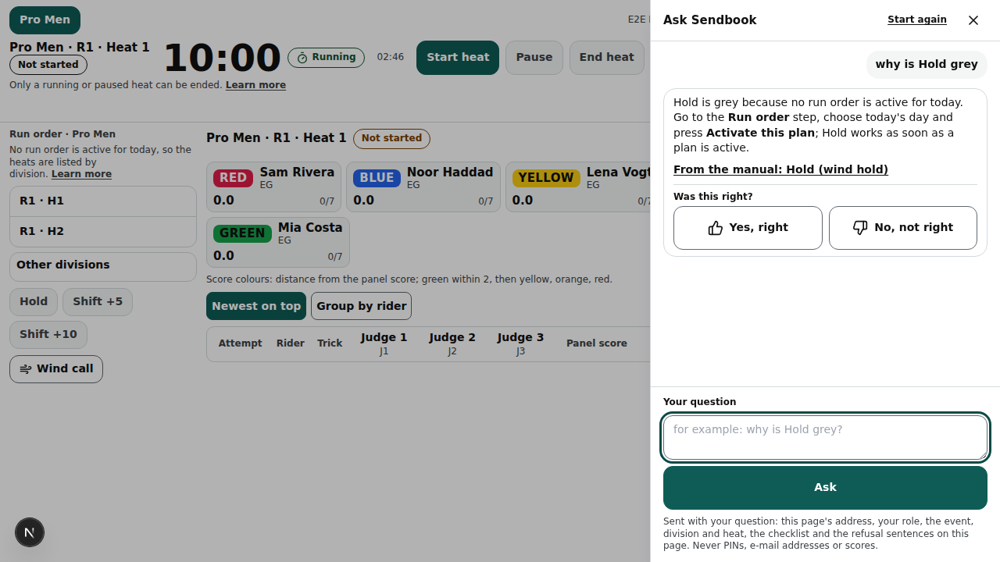
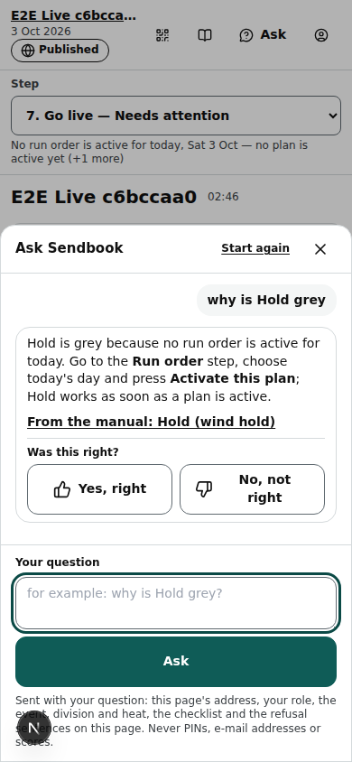

# Ask Sendbook

The assistant in the top bar: ask a question about the screen you are on and get a short answer from this manual, with a link to the page it comes from.

Last checked: 3 Oct 2026 · Product version 0.11.0

## What it is for {#ask-purpose}

**Ask** answers “why is this grey?”, “what does this sentence mean?” and “where do I set…?” questions in a few seconds, without leaving the screen. It reads this manual (the [dependency map](dependencies.md) and the [errors page](errors.md) every time, plus the five pages that match the question best) and what your screen shows, and answers in two to five sentences that name the cause, the step that fixes it and the button to press. It ends with a link to the manual page it used.

It cannot press buttons or change anything, it never sees PINs, e-mail addresses or other judges' scores, and it does not judge tricks. When it is not sure, it says so and points to Help.

*ask-panel-1280.png — “why is Hold grey” asked on a head console with no active run order: the answer names the missing run order and the Run order step, and cites the dependency map.*

*ask-panel-390.png — on a phone the panel is a sheet from the bottom.*

## Where it is {#ask-where}

| Screen | Where the button is |
|---|---|
| Organiser screens (events list, every set-up step, Go live, settings) and the platform owner's /admin | Top bar, **Ask**, next to **Help** (Help opens this manual in a new tab). |
| Head console (laptop and phone) | Top bar, next to the event and seat name. |
| Judge and spotter phones | The slim header, next to **Details**. |

The button is hidden when Ask is off on the server (no `ANTHROPIC_API_KEY`, see [Health](screens/admin-health.md)), for visitors, and on a phone whose seat belongs to another event.

## Controls {#ask-controls}

| Control | What it does |
|---|---|
| **Ask** | Opens the panel: a side panel on a laptop, a sheet from the bottom on a phone. **Esc** or **✕** closes it; the conversation stays until the page is left. |
| **Your question** · **Ask** | Sends the question (Enter sends, Shift+Enter makes a new line). The answer appears word by word. Up to 2 000 characters. |
| “From the manual: ‹page›” | The manual page the answer cites, in a new tab. |
| **Was this right?** · **Yes, right** / **No, not right** | One verdict per answer. Either one saves a Feedback note of the kind **Ask Sendbook** with the question, the answer and the screen's context; the platform owner reads them in Admin → Feedback and the answer and verdict in Admin → Ask log. Press **No, not right** whenever an answer is wrong: that is how the manual and the answers get fixed. |
| **Start again** | Clears the conversation. Each question also sends the last 6 messages of the conversation, so a follow-up (“and on a phone?”) is understood. |

## What it sends {#ask-context}

With every question the panel sends what the screen shows, and nothing else:

- the page's address (without anything after “?”), your role, the event (and the division and heat the screen shows) — the server looks the names up again with your own login, so it never names something you cannot see;
- the Go live readiness checklist and its state, when the screen shows it;
- the refusal sentences on the screen (alerts, field problems, the reason under a grey button, with the button's name) and the last one the screen showed;
- the product version.

Never sent: PINs (any six-digit number is removed), e-mail addresses (removed), scores, other judges' anything. The answer comes from Anthropic's Claude model (Sonnet 5.5; Haiku 4.5 takes over when Sonnet fails before it has written anything).

## Limits {#ask-limits}

| Limit | What happens |
|---|---|
| {#ask-hourly} **30 questions per hour** per person (per login, or per seat's phone) | The 31st gets “You have asked 30 questions in the last hour. Wait a little, or look in the manual at /help.” |
| {#ask-budget} **Monthly budget** per organisation, in input tokens (default 2 000 000) | At the limit Ask answers “Ask is paused for this month — the manual is still at /help” until the 1st of next month (UTC). A soft stop: the question that crosses the limit is still answered. The platform owner changes the budget on the organisation's admin page (**Ask Sendbook this month** → Monthly budget, [setting](settings.md#set-admin-askbudget)); 0 switches Ask off for that organisation. Organisers see this month's use in **Organisation settings**. |

How tokens count: the manual pages that go with every question (about 45 000 tokens) are kept in a cache for a few minutes, and a page read again from the cache costs a tenth, so it counts a tenth. A first question costs about 55 000, a follow-up within minutes about 10 000: the default budget is a few hundred questions a month. The cost estimate of each answer (in US dollars, at Anthropic's list prices) is in the Ask log.

## The Ask log (platform owner) {#ask-log}

Admin → **Ask log** (/admin/ask, the platform owner only; staff and everybody else get “not found”): every question, newest first, with when, who (role and organisation), the page, the question, the answer (open it to read it all), the tokens (in / cached / out), the model, the cost estimate and the verdict. **Search questions and answers** finds a word in either. The line above the table gives this month's questions and cost. Paused (budget) and Hourly limit lines are kept too, with no cost.

## What it depends on {#ask-depends}

| For | Needs |
|---|---|
| The button to show | `ANTHROPIC_API_KEY` on the server (Health shows whether it exists), and a signed-in organiser or platform owner, or a seat of this event joined with its PIN. Visitors and riders: only when `ASK_SENDBOOK_PUBLIC=1` (10 questions per address per hour), which is off. |
| A different model | `ASK_SENDBOOK_MODEL` (default `claude-sonnet-5-5`), `ASK_SENDBOOK_FALLBACK_MODEL` (default `claude-haiku-4-5`). Redeploy after changing. |
| A different hourly limit | `ASK_SENDBOOK_HOURLY_LIMIT` (default 30). |

The instructions the assistant follows are in `docs/manual/ASK-INSTRUCTIONS.md`, the same text as the owner's Claude Project (docs/07 → Sendbook support agent).

## When it goes wrong {#ask-wrong}

| Sentence | What to do |
|---|---|
| “Ask is not switched on: the server has no ANTHROPIC_API_KEY. The manual is at /help.” | Owner: add the key in Vercel and redeploy. |
| “This phone is not connected to a seat of this event. Join again with your PIN.” | Join again on the join page. |
| “No answer this time. Check the connection and ask again; the manual is at /help.” | Ask again; if it repeats, Help has the same answers. |
| An answer that is wrong | **No, not right**. The owner fixes the manual page; the next answer uses it. |

Every sentence with its meaning and fix: [errors page](errors.md), part “Ask Sendbook”.
