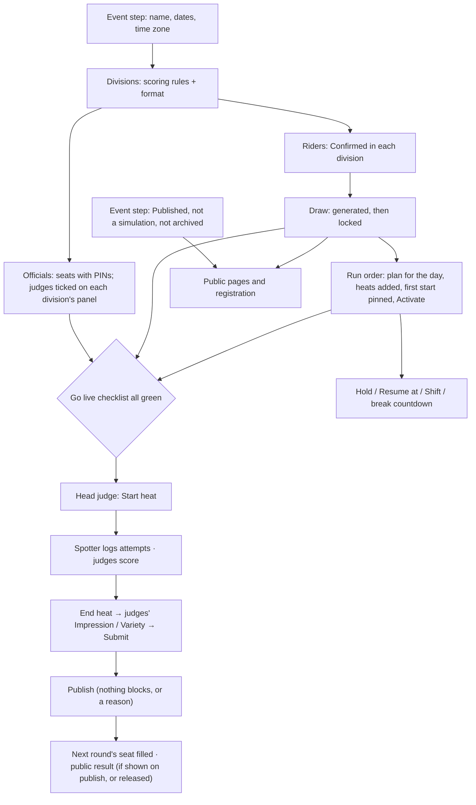

# Dependency map: what must be true first

For every action that can refuse: what must be true before it works, where to fix it, and the sentence the product shows when it is not true (under a grey button, in red, or in a box).

Last checked: 3 Oct 2026 · Product version 0.9.1

**How to use it.** A button that is grey (a dashed frame, with a sentence under it) or an action that answers with a red sentence almost always means one link of the chain below is missing. Find the action in the table, check each condition left to right, fix the first one that is not true. The sentence column is word for word what the product shows; ‹name› is filled in on screen.

## The chain {#dep-chain}

Setup runs top to bottom; every live action needs the boxes above it.

## The map {#dep-map}

| What you want to do | What must be true first | Where to fix it | What the product says when it is not |
|---|---|---|---|
| {#dep-start-heat} **Start a heat** (head console **Start heat**) | 1. The division's draw is **locked**. 2. The division's panel has at least as many judges as its scoring rules need. 3. Every seat of the heat has a rider (no “1st H1” placeholder left). 4. Fewer heats running or paused than “Heats that can run at the same time” (default 1). 5. The heat has not started and is not cancelled. 6. You are the head judge seat or an organiser of the event. If the heat is not the next one in the active run order you are asked once (“Start anyway” / “Don’t start”). | 1. Draw step → **Lock draw**. 2. Officials → Panels: tick judges. 3. Publish the earlier heat that feeds the seat, or place a rider in the Draw step. 4. End the other heat, or Event step → Heats that can run at the same time. 5. Use **Re-run heat** for a cancelled heat. | “Draw for ‹division› is not locked — lock it in the Draw step” · “‹division› needs ‹need› judges on its panel and has ‹have› — add judges in the Officials step” · “A seat in this heat still wait for a rider — finish the earlier heats first, or fill the seat in the Draw step” · “Another heat is already running (‹max› at a time). End it first, or ask the organiser to allow more in the Event step” · grey button: “Only a heat that has not started can be started.” / “A cancelled heat cannot be started. Re-run it instead.” · “Not the next heat in the run order — ‹next› was next” |
| {#dep-hold} **Hold** (wind hold) · when the Hold button is grey — Go live quick actions or the head console | A run order is **active for today** (in the event's time zone) and it is not already on hold. Otherwise the Hold button is grey (dashed frame) with the reason under it. | Run order → choose today's day → **Activate this plan**. | Grey button: “No run order is active for today. Activate one in Run order.” · “The run order is already on hold.” · head console: “No active run order — create one in Run order & timetable.” |
| {#dep-resume-at} **Resume at** (end a hold at a chosen time) | The active run order for today is **on hold**. | Press Hold first; the restart time is typed in the box. | Grey button: “Nothing is on hold.” · “The run order is not on hold.” · “That time is not valid.” |
| {#dep-shift} **Shift +5 / Shift +10** | An active run order for today, **not on hold**, and at least one heat that has not started. | Activate the plan; during a hold use Resume at instead. | Grey button: “The run order is on hold. Resume it first.” · “The run order is on hold: use Resume at instead of Shift.” · “Nothing is left to shift: every heat has started.” |
| {#dep-countdown} **Break countdown** (“Next: ‹heat› · starts in 4:30”, **+1 min**, **Pause break**) on the head console | No heat is running; an active run order for today; a next heat in it; that heat has a start time (the plan's first row is pinned). | Run order: Activate, add the heats, **Pin** the first start. | “No countdown: there is no active run order.” · “No countdown: no heat is left in the run order.” · “No countdown: the next heat has no start time yet.” |
| {#dep-times} **Times on the timetable** (estimates, projected finish, ready call, rider pages) | A plan for that day that is **active**; its first row **pinned**; every heat has a length (from Divisions → Format); rows point at heats that still exist. Times are “not before” the pins and re-flow from real starts and ends. The ready call is the Event step's one setting. | Run order: Pin the first start; Divisions → Format: heat length per round; take out rows with the note “A heat that is no longer in the draw”. | “No finish yet: pin the first start time” · row note “No heat length — set it in Divisions → Format” · row note “This heat is no longer in the draw … Take this row out of the run order” · Go live: “No run order is active for today, ‹day› — the active plan is for ‹day›” |
| {#dep-publish} **Publish** a heat (head console) | The heat has **ended** (End heat, or the clock reached 0:00). Nothing in “Before you publish”: every judge has scored every landed attempt (when the rules require all judges), every judge has given every rider an Impression / Variety score (when required), every judge pressed **Submit** (or the head judge set every gap of that judge to **Absent**: the sheet then counts as submitted), every tie is ordered. Every blocker except a tie can be published past **with a reason**. The division has usable scoring rules. A correction never changes a later heat that has started. | End the heat; ask the judge named in the list; or **Publish with a reason**; **Choose order** for a tie. | Grey button: “Available once the heat has ended.” / “‹n› things to fix first (see Details)” · “‹judge›: score for ‹rider›, attempt ‹n› missing” · “‹judge›: Impression / Variety score for ‹rider› missing” · “‹judge›: sheet not submitted — ‹n› attempts unscored” · “‹names› are tied — choose the order” · “A tie is settled by choosing the order, never by a reason.” · “A judge has not submitted yet. Give a reason to go on without them.” · “This division has no usable scoring rules, so it cannot be published.” |
| {#dep-next-seat} **Next heat's seat filled** with the winner | The feeding heat is **published**. Seats fixed in advance (knockout “By original seeding”, custom or hand-arranged ladders) fill at once; a round that re-seeds from all arrivals (“By their result in the previous round”) deals only when every feeding heat is published. On the **public** ladder a seat fed by a held result keeps its placeholder until the result is released. | Publish the feeding heats; release a held result (head console **Release result**). | Draw step and ladder: “‹rider› · 1st H1 · seat pending” · public ladder shows “1st H1” · head console Start: “A seat in this heat still wait for a rider…” |
| {#dep-reset-event} **Reset event** (Go live → **Reset event…**) | No heat of the event running or paused. Type the event's web address. A reason (5+ characters) if any result was ever public. Each division either has its saved starting copy (locked before its first heat) or can be rebuilt (a later round arranged by hand cannot). Organiser of the event. | End the running heat (head console). | “‹heat› is running. End it first.” · “Type the web address exactly first.” · “Write a reason of at least 5 characters first.” · “A later round was arranged by hand, so its seats cannot be rebuilt from the current draw. Nothing was changed.” |
| {#dep-reset-division} **Reset this division** (Divisions step, on the division's card) | No heat of the event running or paused; the division has heats; a reason if something of the division was public. | End the running heat. | “This division has no heats yet, so there is nothing to reset.” · “‹heat› is running. End it first.” |
| {#dep-reset-heat} **Reset this heat** (head console → **Heat menu**) | The heat has started (ended, under review, cancelled or published, or a re-run heat); no heat running or paused; no later heat that depends on its result has started; a cancelled heat that has its re-run is not reset (reset the re-run). Head judge or organiser. | Reset the later heat first; end the running heat. | “This heat has not started, so there is nothing to reset.” · “A later heat that depends on this result has already started (‹heat›). Reset that heat first, then this one.” · “This heat was cancelled and already re-run. Reset the re-run instead; the cancelled heat stays as it is.” |
| {#dep-clear-times} **Clear actual times** (Run order step) | The plan has actual starts or pins written while the day ran; no heat running. Hand-set pins always stay. | — | Grey button: “There are no actual start times or pins written while the day ran to clear in this run order.” |
| {#dep-rerun} **Re-run heat** (head console) | The heat has started and is not published (running, paused, ended, under review), or it is cancelled after it started; it has not been re-run before. Riders who do not ride again are set to Disqualified or Did not start. | For a published heat: **Re-open** instead. | Grey button: “Re-open the heat instead.” · “This heat has already been re-run.” · “Already re-run as ‹heat›” |
| {#dep-reopen} **Re-open** a published heat | The heat is published; no later heat filled by it has started (to publish again). | Reset or finish the later heat first. | Grey button: “Only a published heat can be re-opened.” · “A later heat has already started, so this correction would change who rides in it. Nothing was changed.” |
| {#dep-public} **Public pages visible** (/e/‹event›, live, results, ladder, rider pages, big screen, registration) | Event step: **Published** ticked; the event is not a **simulation**; the event and its organisation are not **archived**. Heats, ladder and rider pages appear per division only once its draw is **locked**. Results appear when published *and* (“Show results automatically when a heat is published” is on, or the result is released). Live scores only when “Show live scores during a heat” is on (or the head judge's per-heat switch). | Event step (Published, visibility switches); Divisions → More settings → Live screens for one division; head console **Release result**. | “This event isn't public” (404) · “This event is not on the public site.” · “Scores published after the heat.” · “Result to be announced.” · “The ladder for this division has not been published yet.” |
| {#dep-pin} **PIN shown** (Officials → **Show PIN**, the PIN box, printed cards) | The seat was made after PINs were stored; the server has its PIN key; the seat is not switched off. | Officials → **Regenerate PIN** (the old PIN stops working and the seat's phones are signed out; not while its heat runs). Owner: Health → server settings. | “No PIN on file for this seat (it was made before PINs could be shown). Use Regenerate PIN to make a new one.” · “PINs cannot be shown or made because the server has no PIN key…” · Go live: “‹n› seats have no PIN” |
| {#dep-join} **An official joins** (/join or /e/‹event›/join) | The event is not archived (an archived event answers like a wrong PIN; a draft or a simulation event can be joined); the right event code and PIN, or an unused QR card; the seat is active; the browser is not signed in as an organiser. | Officials: Show PIN / Regenerate PIN / Switch on; use a private window on an organiser's laptop. | “That event code or PIN is not recognised…” · “This QR code has already been used or has expired…” · “This browser is signed in as an organiser…” · “✖ This seat has been switched off by the organiser.” |
| {#dep-invite} **Invite an organiser** | A **platform owner** login (/admin → the organisation → **Invite organiser**); a valid e-mail address. The hosted e-mail plan sends only 2 sign-in e-mails per hour; the link works once, for 24 hours. The organiser then sets a password (**Set a password**) and signs in with it. | /admin (owner); untick **Send the sign-in email now** to copy the link yourself; to take access away: **Remove** on the organisation's **Organisers** list. | “That does not look like an email address.” · “The e-mail to ‹email› was not sent: this plan allows only ‹n› sign-in e-mails per hour and that limit is used up…” · “That sign-in link has already been used or has expired: each link works once, for 24 hours…” · organiser: “That email address is not registered as an organiser. Ask the owner to add you.” |
| {#dep-practice} **Practice heat** (head console → More → Practice heat) | The event is a **simulation** event; you are an organiser (not a seat); a heat of it is running; the tab stays open. | Make a simulation (Simulator → Run as simulation, or tick Simulation event before any heat starts); start a heat. | “Start a heat first: the feed plays into the running heat.” · “Practice heats run only on a simulation event.” |
| {#dep-simulator} **Simulator** (Event step → Rehearsal → **Simulate**) | A real event is first copied with **Run as simulation** (only while none of its heats has started); the copy needs every division's draw **locked** and a run order; the panel tab stays open while it plays; the server has its PIN key (fresh PINs). | Lock the copy's draws; keep the tab open; Reset to replay. | “This event has already been run, so it is not a clean starting point. Copy it before its first heat starts, or reset it first.” · “‹n› divisions have no locked draw. The simulator plays locked draws only: lock them on the Draw step.” · “Another tab is playing this simulation.” |
| {#dep-log-attempt} **Log an attempt** (spotter) | The heat is **running** (not paused, time not up); the rider has attempts left (the cap); the phone is the spotter seat (or a judge when “Judges may log attempts too” is on). | Head judge starts / resumes the heat; past the cap only the head judge adds one, with a reason. | “The heat is not running, so nothing can be logged.” · “Paused — logging is off until the head judge resumes.” · “‹label› is out of attempts (‹max› / ‹max›) — that attempt was not logged” |
| {#dep-score} **A judge scores** | The judge's seat is on the division's **panel**; the heat is running or ended and not under review; the sheet is not submitted; the attempt is landed (a crash has nothing to score). The Impression / Variety score opens when the heat ends. | Officials → Panels; head judge reopens a sheet. | “You are not on the panel of a heat that is running.” · “Your sheet is locked. Ask the head judge to reopen it.” · “The head judge has taken this heat into review. Your scores are locked.” · “The Impression / Variety score opens when the heat has ended.” |
| {#dep-rules-change} **Change scoring, format, Rider label or untick a trick block** | No heat of the division has started (then: unlock scoring and format with a reason; the Rider label and ticked blocks stay fixed). | Divisions → **Unlock scoring and format** with a reason. | “Scoring and format are locked because a heat of this division has started. Unlock them with a written reason first.” · “A heat of this division has started: the Rider label cannot be changed any more.” · “A heat has started, so this block cannot be removed any more.” |
| {#dep-draw-change} **Change or regenerate a draw** | The draw is not locked (unlock with a reason); to regenerate, no heat of the division has started; started heats never change. | Draw → **Unlock draw** (reason), change, **Lock draw**. | “The draw is locked. Unlock it (with a reason) to change it.” · “A heat has started, so the draw cannot be regenerated.” |
| {#dep-delete} **Delete an event or division** | Event: platform owner only, no published result (otherwise Archive). Division: no heats. | Archive instead; Reset this division instead. | “This event has published results (‹n›), so it cannot be deleted: results are permanent. Archive it instead.” · “This division has heats, so it cannot be deleted.” |
