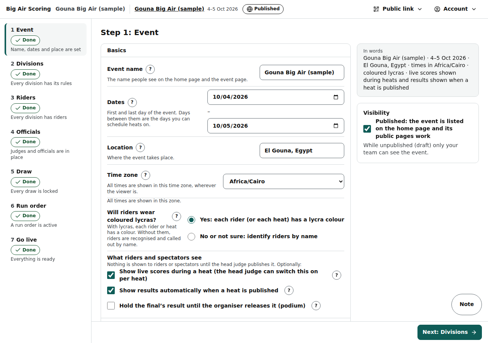
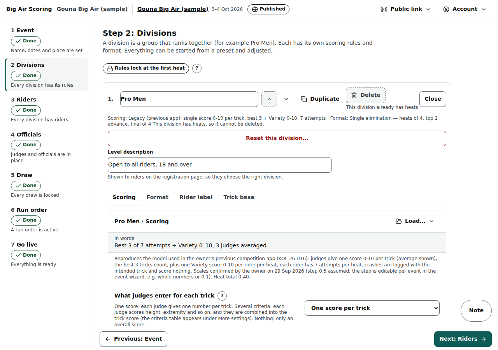
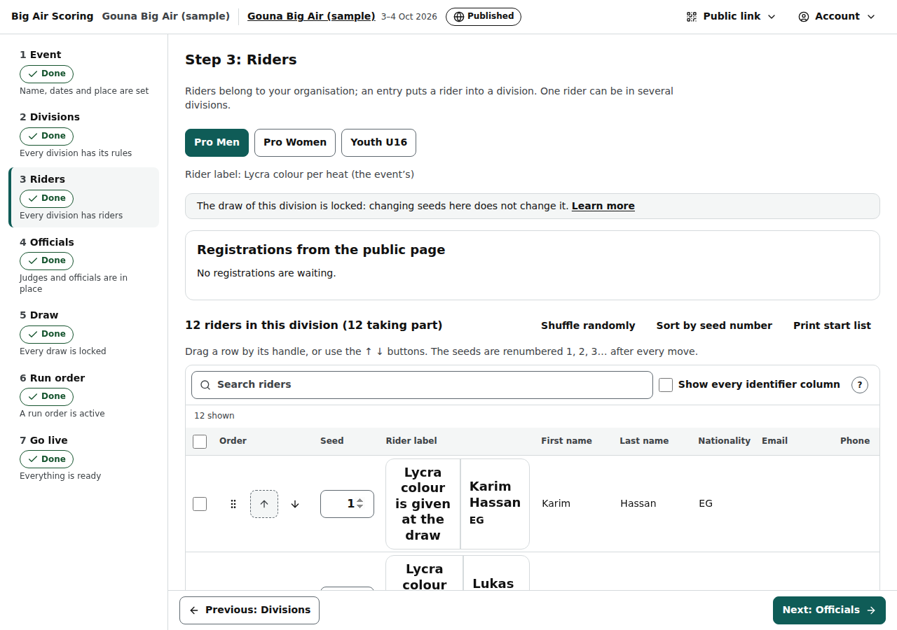
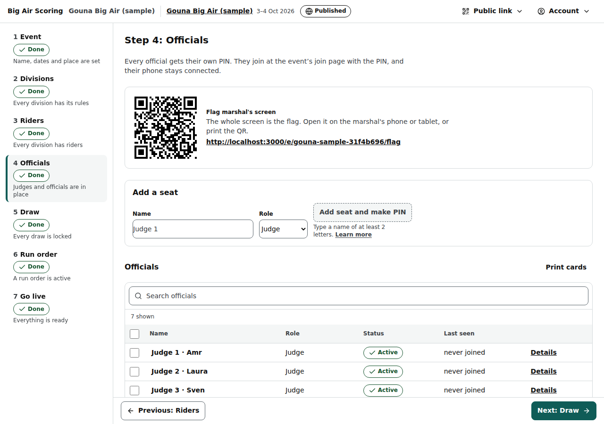
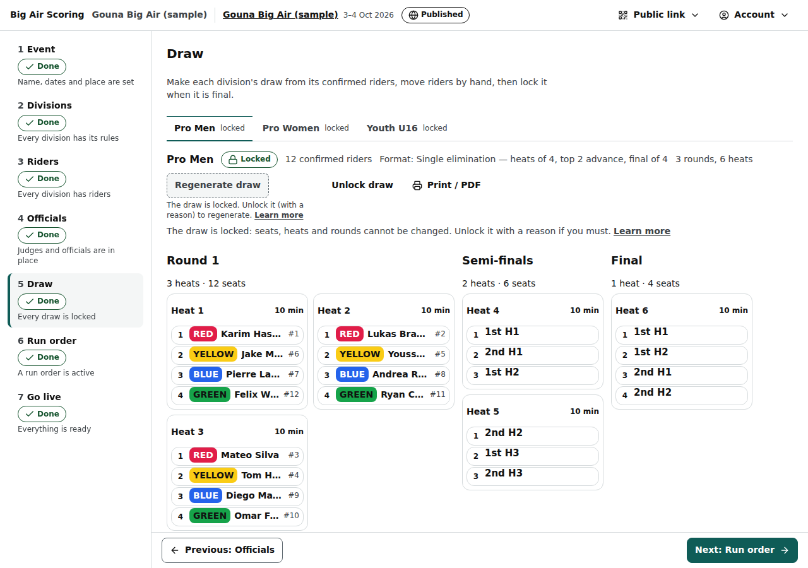
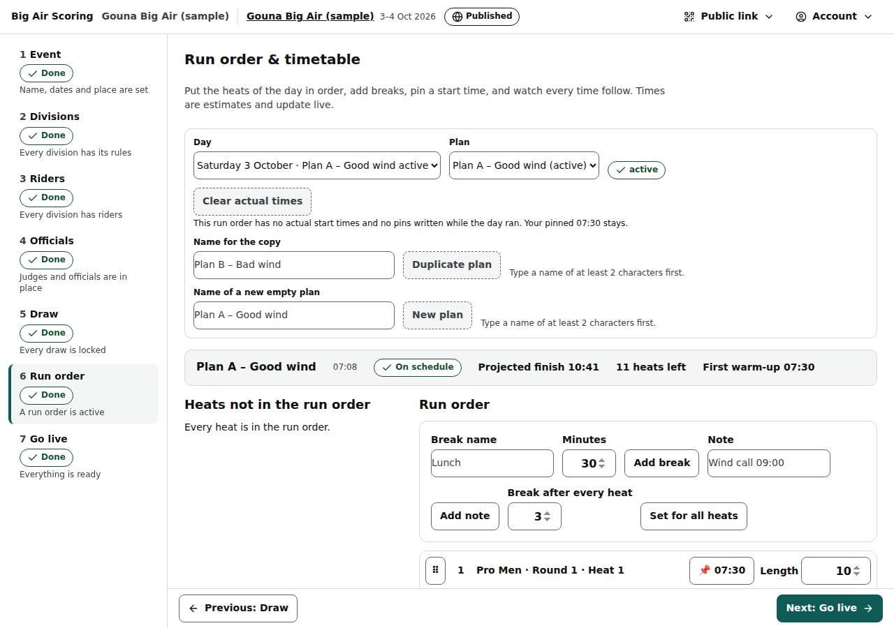
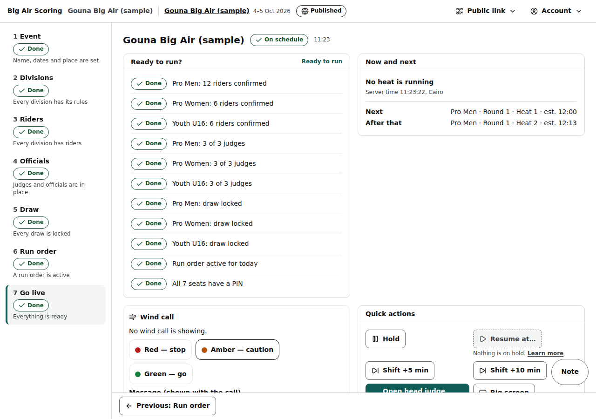

# Quick start: an event in 30 minutes

The seven setup steps in the order the Go live checklist asks for them — Event, Divisions, Riders, Officials, Draw, Run order, Go live — with one screenshot per step.

Last checked: 2 Oct 2026 · Product version 0.9.0

**Before you start.** You need an organiser login: the platform owner invites you, you click the e-mailed link (it works once, for 24 hours) and land in your organisation, then choose a password with **Set a password**. From then on sign in at **/org/login** with your e-mail and password ([Organiser access](screens/organiser-access.md)). A laptop is easiest for setup; every step also works on a phone (the step list becomes a drop-down).

**How the steps work.** Inside an event the left rail lists the seven steps. Each shows **Done**, **Needs attention** or **Not started** and one line saying what is missing. Every step saves on its own; **Previous** and **Next** at the foot move between steps (**Next** on the Event step saves first). Nothing is shown to riders or spectators until you publish the event and the head judge publishes results.

## 1. Event (3 minutes) {#qs-event}

Events → **+ New event**.

1. Type the **Event name**; the **Web address (slug)** fills itself (it becomes …/e/‹slug›). Add the **Location**, the **First day** and **Last day**, and check the **Time zone** (Africa/Cairo for Egypt). All times are shown in this zone.
2. **Rider identification**: answer “Will riders wear coloured lycras?”. Yes: each rider (or each heat) has a Lycra colour. No: riders are called out by name. A preset fills the rest; the preview shows the Rider label every screen will use.
3. Leave the timing defaults unless you know better: **Ready call** 15 minutes, **Heats that can run at the same time** 1.
4. Tick **Published** when you want the public pages and registration to work (you can do it later).
5. **Create event** (or **Save event**), then **Next: Divisions →**.

*org-event-1280.png — the Event step: settings on the left, the “In words” sentence and visibility on the right.*

## 2. Divisions (5 minutes) {#qs-divisions}

A division is a group that ranks together (Pro Men, Pro Women, Youth). Each has its own scoring rules and format.

1. Type a name in **New division name** and press **+ Add division**.
2. **Scoring** tab: choose a scoring preset under **Load…** (for example “KOTA-style: best 3 tricks + impression”), then adjust the Simple dials — tricks that count, attempts per rider, judges on the panel, how their scores combine, the Impression / Variety score. The sentence “In words” says what you set. Press **Save scoring for ‹division›**.
3. **Format** tab: choose a ladder type (Knockout, Knockout with a second chance, …), the riders per heat and how many advance. Type the expected number of riders in **Preview with** and read the preview (“With 14 riders: R1 4 heats of 3–4 → SF 2 heats of 4 → F 1 heat of 4”). Heat lengths, breaks and warm-up are under **‹n› more settings**. Press **Save format for ‹division›**.
4. Repeat for every division (**Duplicate** copies one).

Scoring and format lock when the division's first heat starts. See [Divisions](screens/organiser-divisions.md).

*org-divisions-scoring-1280.png — the Scoring tab: Simple dials, each with a line and a “?”, and the live sentence.*

## 3. Riders (5 minutes) {#qs-riders}

1. Pick the **Division** at the top.
2. Add riders: type a first and last name and press **+ Add rider**; or **Paste or upload a CSV** (columns First, Last, and optionally Nationality, Email, Seed, Bib, Lycra colour, kite details) → **Preview** → **Import ‹n› riders**; or tick riders you already have under **Add from this organisation’s riders**; or approve **Registrations from the public page**.
3. Order them: drag the rows (or use ↑ ↓), type seed numbers and press **Sort by seed number**, or **Shuffle randomly**. The order is the seeding of the draw.
4. Only riders with status **Confirmed** go into the draw.

*org-riders-1280.png — the Riders step: the seeded list with search, the bulk bar and the tools.*

## 4. Officials (5 minutes) {#qs-officials}

1. **Add a seat** for each official: a name (for example “Judge 1” or the person's name) and a role (Judge, Head judge, Spotter, Announcer) → **Add seat and make PIN**. The PIN shows once in a box (copy it, share it on WhatsApp); afterwards it is behind **Show PIN**.
2. **Panels: who scores which division**: tick the judges who score each division. A division needs at least as many judges as its scoring rules say (“Pro Men needs 3 judges, 2 assigned” until it does).
3. Tick **Head judge also scores** on the head judge's seat if they score too.
4. **Print cards** prints one card per official with the event code, the PIN and a QR code that signs the phone in once.

*org-officials-1280.png — the Officials step: the team table, then the PIN, panel and spotter tools per seat.*

## 5. Draw (3 minutes) {#qs-draw}

1. Pick the division tab, press **Generate draw**. The ladder appears with every rider in a seat and their Lycra colour.
2. Move riders by tapping a rider then a seat (or dragging). The checks under the ladder warn, never block.
3. When it is final, **Lock draw**. A heat can only start in a locked draw; locking also keeps the starting copy that Reset goes back to.

*org-draw-1280.png — the Draw step: division tabs, the ladder, the checks.*

## 6. Run order (5 minutes) {#qs-run-order}

1. Pick the **Day**, type a name in **Name of a new empty plan** (for example “Plan A – Good wind”) and press **New plan**.
2. **Add all ‹n›** heats (or add them one by one, or drag them in), in the order they will run. Add breaks (**Add break**: “Lunch”, 45) and notes.
3. **Pin** the first start time (tap the first row's start, type 10:00, **Pin**). Every later time follows: end = start + length, next start = end + break. The projected finish shows at the top.
4. **Activate this plan**. Only an active plan for today drives the live screens, the countdown and Hold / Shift.
5. Optional: **Duplicate plan** for “Plan B – Bad wind”; activate it later in one tap.

*org-run-order-1280.png — the Run order: heats not yet in the order on the left, the timetable on the right.*

## 7. Go live (4 minutes) {#qs-go-live}

The event's dashboard. **Ready to run?** lists, in order: riders confirmed per division, judges per division, draws locked, a run order active for today, a PIN for every seat. Each row that is not green has a **Fix** link to the step that fixes it. When every row is green it says **Ready to run**.

Then: share the **Officials' join page** and the **Public event page** (copy or QR), press **Open head judge console** (new tab) and hand it to the head judge. See [Go live](screens/organiser-go-live.md) and [Event day](event-day.md).

*org-go-live-1280.png — Go live: readiness checklist, Now and next, wind call, quick actions, today's timetable and the share cards.*

## If a row stays red {#qs-red-rows}

| Checklist row | Fix |
|---|---|
| “‹division›: no riders confirmed” | Riders step: add riders, or set them to Confirmed. |
| “‹division›: ‹have› of ‹need› judges” | Officials → Panels: tick more judges for the division (or lower “Judges on the panel” in Divisions → Scoring). |
| “‹division›: choose how it is scored” | Divisions → Scoring tab → choose a preset → Save. |
| “‹division›: no draw yet” / “draw made, not locked yet” | Draw step → Generate draw → Lock draw. |
| “No run order is active for today, ‹day› — the active plan is for ‹day›” | Run order → pick today's day → Activate this plan (the active plan is for another day). |
| “No run order yet” | Run order → New plan → Add all → Pin → Activate. |
| “‹n› seats have no PIN” | Officials → that seat → Regenerate PIN. |

The [dependency map](dependencies.md) lists everything else that must be true before a button works.
