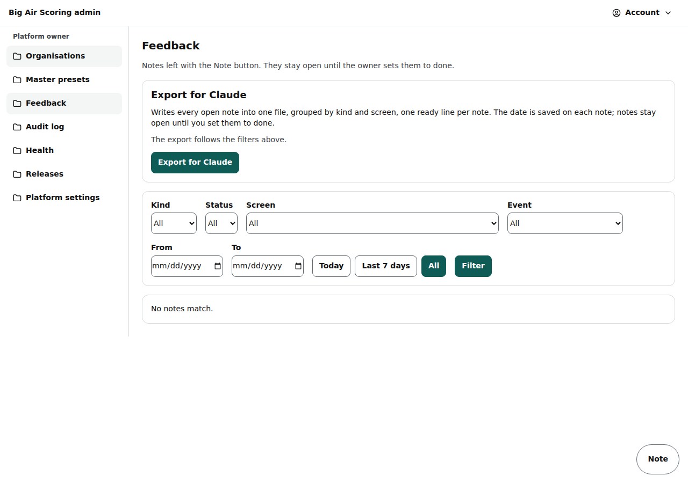

# Admin: feedback and audit log

/admin/feedback (the notes left with the Note button, exported for Claude) and /admin/audit (what happened, who did it and when).

Last checked: 3 Oct 2026 · Product version 0.12.0

## What it is for {#af-purpose}

Collecting what testers and organisers noticed, and tracing every platform action.

*admin-feedback-1280.png — the notes with their filters and the export panel.*

## Controls {#af-controls}

| Control | What it does |
|---|---|
| Filters | **Kind** (Bug, Wording, Layout, New rule, Idea), **Status** (Open, Done), **Screen**, **Event**, **From** / **To** (days of the note) → **Filter**; the quick picks **Today**, **Last 7 days** and **All** set the days at once and keep the other filters. |
| Tick boxes, **Select all**, **Set done**, **Reopen** (owner) | Tick notes (or **Select all** for the filtered list), then **Set done** or **Reopen**. It asks once (“Set 3 notes as done?”) and says how many notes it changed (“3 notes changed”); a note already in that state is not counted. |
| Note rows | Note, kind, status, where (screen, event, division, heat), who, when, exported; **Set as done** / **Reopen**, **Change kind**, the **Screenshot** link. |
| **Export for Claude** | Owner only: writes the notes of the list as filtered (the open ones unless you filter on Done) into one file grouped by kind and screen (each note gets the export date); **Download FEEDBACK.md** or **Copy for Claude**. |
| /admin/audit | **Show**: Platform actions only / Everything, including scoring changes; **Organisation** filter → **Apply**. Columns: when, who, what happened, organisation, details. Nothing can be changed or deleted. |

Organisers see their own team's notes at /org/feedback.

## What it depends on {#af-depends}

A platform owner or staff login; export is owner only.
