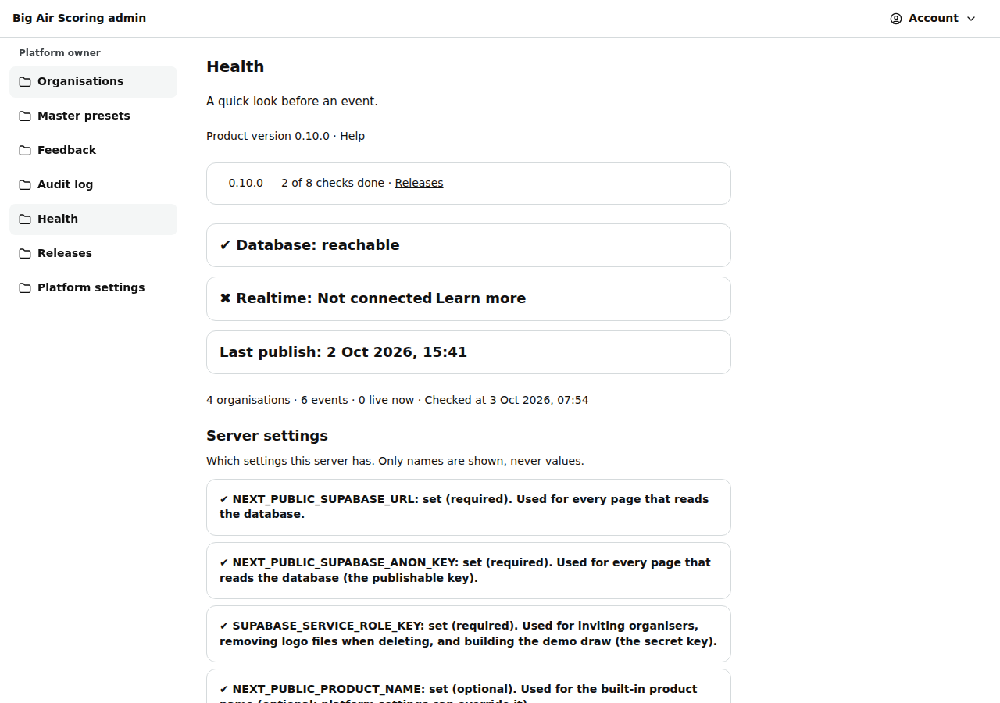

# Admin: health

/admin/health: a quick look before an event — database, realtime, last publish, counts, server settings, product version and its testing.

Last checked: 3 Oct 2026 · Product version 0.10.0

## What it is for {#ah-purpose}

The first page to open the day before and on the morning of the event, and the first page to open when “nothing works”.

*admin-health-1280.png — the health checks and the server settings.*

## What it shows {#ah-controls}

| Line | What it means |
|---|---|
| “Product version ‹version›” · **Help** | The version the manual pages are checked against; the link opens this manual. |
| “‹version› — ‹n› of ‹n› checks done” · **Releases** | How far the current version's “What to test” checks are ticked on [Releases](admin-releases.md); “‹version› — tested” once it is confirmed as tested. The link opens Releases. |
| “Database: reachable” / “Database: not reachable” | Not reachable: the free database pauses after about 7 days idle — open the Supabase dashboard and press Resume. |
| “Realtime: Connected” / “Not connected” | Live updates to phones. Not connected: phones still poll every few seconds; not blocking. |
| “Last publish: ‹when›” | The last published heat anywhere. |
| “‹n› organisations · ‹n› events · ‹n› live now” | Counts. |
| **Server settings** | Each setting the server needs, by name only (never the value): set / MISSING, required / optional, and what it is used for. A missing required one breaks that part (for example the PIN key: PINs cannot be shown or made). |
| “Platform settings: readable” | Or “could not be read, so the built-in values are in use”. |
| **Check again** | Runs the checks again. Opening this page also removes expired reset copies (older than 30 days). |

## What it depends on {#ah-depends}

A platform owner or staff login.
