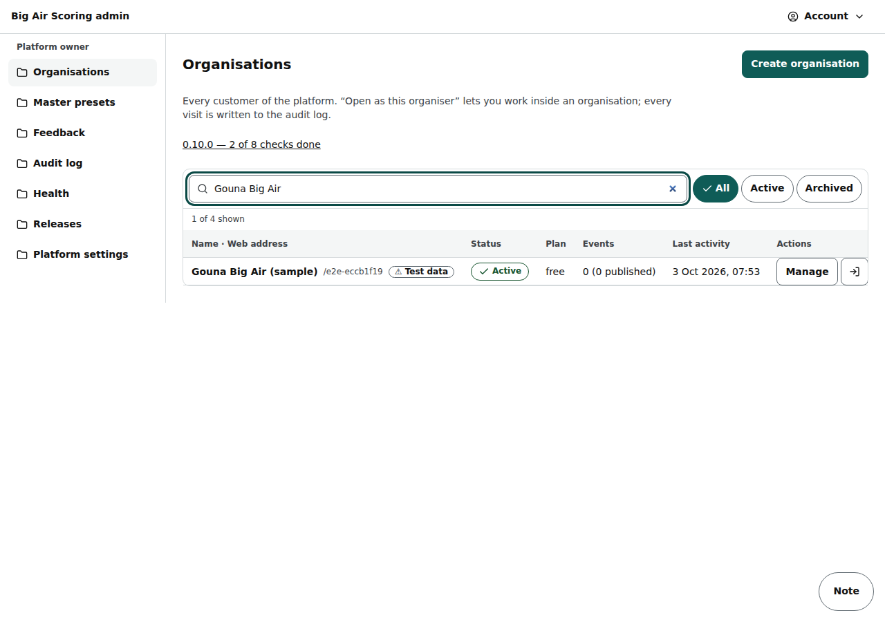

# Admin: organisations

/admin (platform owner and staff): every customer organisation, opening one as its organiser, creating organisations, inviting their first organiser, moving, archiving and deleting.

Last checked: 2 Oct 2026 · Product version 0.9.0

## What it is for {#ao-purpose}

The platform owner's control room. /admin answers “This page doesn't exist” to anybody who is not a platform owner or staff. Staff can look; changes need the owner (“Only platform owners can do this. You can look, but not change it.”).

*admin-organisations-1280.png — the organisations table, filtered.*

## Controls {#ao-controls}

| Control | What it does |
|---|---|
| Table | Name, web address, status, plan, events (“4 (2 published)”), last activity; **Search organisations**, **Status** filter; “Test data” labels organisations left by the browser tests. |
| Row: **Manage**, **Open as this organiser**, menu (**Rename**, **Archive** / **Restore**, **Delete**, **Invite organiser**) | Opening as an organiser shows the slim strip “Viewing as ‹organisation›” with **Back to admin**; every visit is in the audit log. |
| **Create organisation** | Name, web address (slug, for /o/‹slug›), default time zone, logo. |
| Organisation page: **Organisers** | Who can sign in, with role and since when. |
| **Invite first organiser** | Email; **Send the sign-in email now** (untick it when email is not working: you get a link to copy). The hosted plan sends only about two sign-in emails per hour. *Being built — check after Polish 1 merges* (organiser access). |
| **Events** | The organisation's events; **Move event to another organisation** (not while a heat runs; riders matched by email or copied); delete / archive an event. |
| **Archive organisation** / **Restore organisation** | Hidden from the public site; nothing deleted. |
| **Delete organisation permanently** | Type the web address; only while no result was published. |
| **Demo data** → **Create demo organisation** | Builds “Demo Cup” (fictional riders, officials, draw) when no demo exists; hidden on a project with DEMO_SEED_DISABLED. Its PINs are public: development only. |
| **Events** → **Restore results from ‹date›** | After an event Reset, the 30-day copy can be restored by the owner ([Resets and undo](../resets-and-undo.md#ru-restore)). |

## What it depends on {#ao-depends}

A platform owner or staff login (`npm run bootstrap:platform-admin`). Email limits of the hosting plan for invitations.
