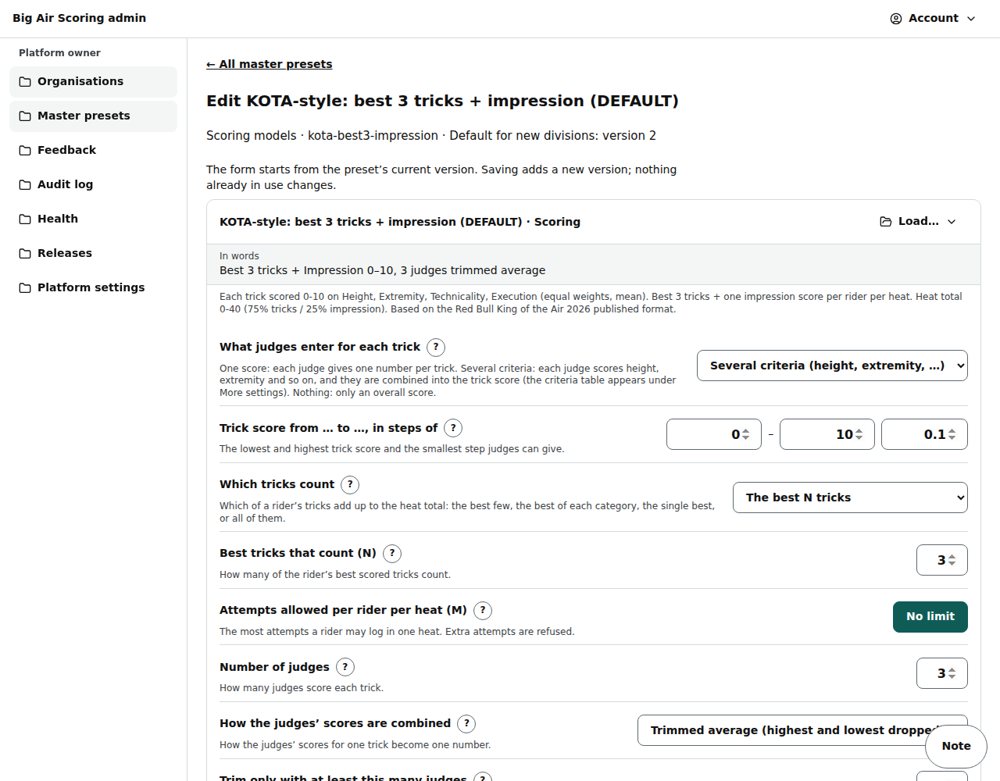

# Admin: master presets

/admin/presets: the built-in scoring models, formats, trick base and identification schemes that every customer can use.

Last checked: 4 Oct 2026 · Product version 0.17.0

## What it is for {#ap-purpose}

Changing a built-in preset for everybody. Editing never changes an existing version: it saves a new **draft** version; **Publish to all customers** makes a draft the default for new divisions. Divisions that already exist keep their version.

*admin-presets-1280.png — the presets by kind, with their default and draft versions.*

## Controls {#ap-controls}

| Control | What it does |
|---|---|
| Kinds | Scoring models, Format templates, Trick base, Identification schemes. |
| **Open the trick base** | The trick base has its own form editor: [Admin: trick base](admin-trick-base.md). The button says how many proposals from events are waiting. |
| **Edit ‹preset›** | (Scoring models, formats, identification schemes.) The versions table (version, Published / Draft / Default, created) and the **Preset JSON** box (it starts from the latest version). |
| **Save as new version** | Checks the JSON against its schema (“That preset is not valid: …”) and saves a draft. Staff can save drafts (not of the trick base). |
| **Publish to all customers** | Owner only: “Make version ‹n› the default for new divisions? Existing divisions keep their version.” An older version cannot be published over a newer default. |

## Managing built-in scoring and format presets {#ap-manage}

For **Scoring models** and **Format templates** the page is a list, one card per preset, with its name, key, newest version and tags (**DEFAULT**, **Retired**, **Draft**). No JSON needed.

*admin-presets-1280.png — the lists with Add a preset, Edit, Rename, Set as DEFAULT, Retire and Delete.*

| Control | What it does |
|---|---|
| **Add a preset** | Opens the **same Simple / More settings form** organisers see on the Divisions step, empty: use **Load…** to start from a built-in preset, change what you want, type a **Name** and press **Save**. The owner's save is published at once (staff save a draft). |
| **Edit** | The same form, starting from the newest version. **Save** adds a **new version**; a division that loaded an earlier version is unchanged. Under **Advanced: import or export as JSON** the versions table and the JSON box stay as before. |
| **Rename** | Changes the name of every version (owner). |
| **Retire** / **Restore** | Retire: hidden from every new event and every Load… menu; divisions already using it keep their copy and nothing live changes. Restore brings it back. The DEFAULT cannot be retired. |
| **Set as DEFAULT** | One built-in of each kind is the DEFAULT: it is always offered and can be neither hidden by an organisation nor retired (“The DEFAULT preset cannot be retired, hidden or deleted. Set another preset as DEFAULT first.”). Setting another preset moves the DEFAULT. |
| **Delete** | **Yes, delete** removes the preset for good. Refused while any division of any event still points at a version of it: “This preset cannot be deleted: a division still uses it (Pro Men in Arrow Big Air). Retire it instead.” |
| **Save as built-in** | On any division's scoring or format settings while you are opened as an organisation, next to **Save as preset…**: type a name, press it, and the settings become a built-in preset. |

*admin-preset-form-1280.png — Edit uses the organisers' own form, with a Name and Save at the bottom.*

## What it depends on {#ap-depends}

`npm run seed:presets` loads the files in `presets/` into the database (idempotent, versioned). Without published presets the demo cannot be built and the trick base is missing. After the first run the seed leaves the trick base alone: it is edited in /admin.
