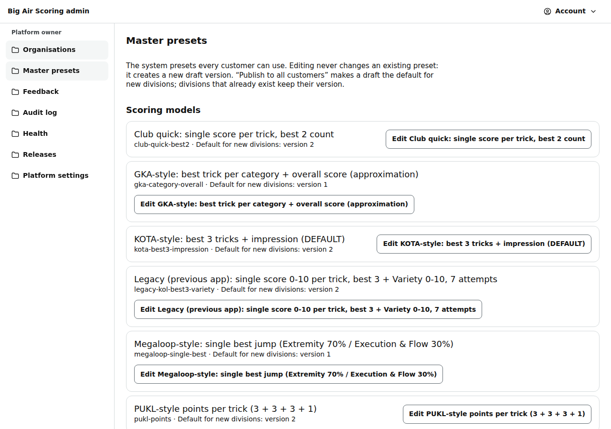

# Admin: master presets

/admin/presets: the built-in scoring models, formats, trick vocabulary and identification schemes that every customer can use.

Last checked: 2 Oct 2026 · Product version 0.9.0

## What it is for {#ap-purpose}

Changing a built-in preset for everybody. Editing never changes an existing version: it saves a new **draft** version; **Publish to all customers** makes a draft the default for new divisions. Divisions that already exist keep their version.

*admin-presets-1280.png — the presets by kind, with their default and draft versions.*

## Controls {#ap-controls}

| Control | What it does |
|---|---|
| Kinds | Scoring models, Format templates, Trick vocabulary, Identification schemes. |
| **Edit ‹preset›** | The versions table (version, Published / Draft / Default, created) and the **Preset JSON** box (it starts from the latest version). |
| **Save as new version** | Checks the JSON against its schema (“That preset is not valid: …”) and saves a draft. Staff can save drafts. |
| **Publish to all customers** | Owner only: “Make version ‹n› the default for new divisions? Existing divisions keep their version.” An older version cannot be published over a newer default. |

## What it depends on {#ap-depends}

`npm run seed:presets` loads the files in `presets/` into the database (idempotent, versioned). Without published presets the demo cannot be built and the trick base is missing.
