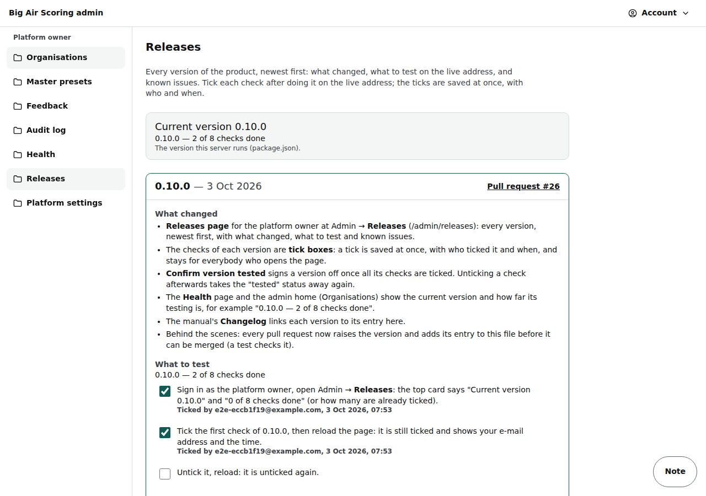

# Admin: releases

/admin/releases (platform owner and staff): every product version newest first, with what changed, what to test on the live address, known issues, and the tick boxes that sign a version off.

Last checked: 3 Oct 2026 · Product version 0.10.0

## What it is for {#ar-purpose}

After every merge, the platform owner opens this page on the live address, does the current version's checks (about 15 minutes), ticks each one, and presses **Confirm version tested**. The Health page and the admin home then show the version as tested. The page is built from the file `docs/RELEASES.md` in the repository; the ticks are stored in the database, with who ticked and when.

*admin-releases-1280.png — the current version with its checks, two of them ticked.*

## What it shows {#ar-controls}

| Part | What it does |
|---|---|
| “Current version ‹version›” | The version this server runs (`version` in `package.json`), with how far its testing is: “‹version› — ‹n› of ‹n› checks done”, “‹version› — tested · Tested by ‹who› on ‹when›”, or “‹version› — no entry in the releases file” (the pull request forgot its entry: the test `npm test` should have stopped it). |
| One card per version | Heading “‹version› — ‹date›” and a link to its **Pull request #‹n›** on GitHub; **What changed**, **What to test**, **Known issues**. The current version has a teal frame; a tested version shows a “Done” pill. |
| A check's tick box | Saved at once (no Save button). Under a ticked check: “Ticked by ‹who›, ‹when›”. Unticking a check of a version confirmed as tested takes the tested status away. |
| **Confirm version tested** | Grey with “Tick every check first: ‹n› left.” until every check is ticked; then it saves who signed the version off and when. |
| **Earlier versions** | Versions with no checks: they were merged before the releases file existed (pull requests #1–#23). A version that changed no screen says “Nothing to test on the live address: this version changed no screen.” and shows “‹version› — nothing to test on the live address” on Health. |

Only the platform owner ticks and confirms a version as tested; staff see the page and the ticks without tick boxes they can change (“Only platform owners can do this. You can look, but not change it.”). Every tick, untick and sign-off is in the [audit log](admin-feedback.md) (“Release check ticked”, “Release check unticked”, “Version confirmed as tested”).

## The rule for every pull request {#releases-rule}

Every pull request, before it is ready to merge:

1. raises `version` in `package.json`: a fix raises the last number (0.10.0 → 0.10.1), a feature the middle one (0.10.1 → 0.11.0);
2. adds its entry at the top of `docs/RELEASES.md`: version, date, `PR: #‹number›`, **What changed** in plain words, **What to test** as 3 to 8 checks a non-developer can do on the live address in 15 minutes (`- [ ] ` lines), **Known issues**. A pull request that changes no screen (tests only, docs only) still raises the version and adds its entry, and may write the single line “Nothing to test on the live address.” instead of checks;
3. adds the matching [changelog](../changelog.md) entry with its “Release entry” link.

`npm test` fails when `package.json`'s version has no entry, when an entry is incomplete, or when the current version has neither 3 to 8 checks nor “Nothing to test on the live address.”

A check's tick belongs to its words: changing the words of a check later makes it a new check that needs a new tick.

## What it depends on {#ar-depends}

A platform owner login (staff: read only). The database must have the release tables (migration `20261013100000_release_tracker.sql`); without them the page says “The ticks could not be loaded, so every check shows as not done. Reload the page.”

## When something goes wrong {#ar-wrong}

| Sentence | What to do |
|---|---|
| “Tick every check of this version before confirming it as tested.” | A check was unticked in another window: reload and tick it. |
| “That check is not in the releases file any more. Reload the page.” | The file changed (a new deploy) since the page was opened: reload. |
| “The ticks could not be loaded, so every check shows as not done. Reload the page.” | The database did not answer (paused free project: see [Health](admin-health.md)). |
