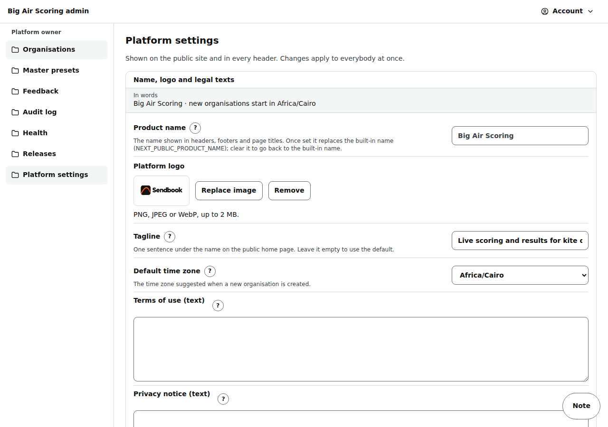

# Admin: platform settings

/admin/settings (owner only): the product name, logo, tagline, default time zone and the legal texts, for everybody at once.

Last checked: 2 Oct 2026 · Product version 0.9.0

## What it is for {#as-purpose}

What every visitor sees in headers, footers, page titles and the home page.

*admin-settings-1280.png — Name, logo and legal texts.*

## Controls {#as-controls}

| Control | What it does |
|---|---|
| **Product name** | Replaces the built-in name (NEXT_PUBLIC_PRODUCT_NAME) everywhere; clear it to go back. |
| **Platform logo** | On the public home page. |
| **Tagline** | One sentence under the name on the home page. |
| **Default time zone** | Suggested for new organisations. |
| **Terms of use (text)**, **Privacy notice (text)** | Shown on /legal; the footer links to it when one is filled in. |
| **Save platform settings** | Staff can look; only owners save (“Only platform owners can save these settings.”). |

Every setting with its “?” text is in [Settings](../settings.md#settings-platform).

## What it depends on {#as-depends}

A platform owner login. If the settings cannot be read, the site uses the built-in values (Health says so).
