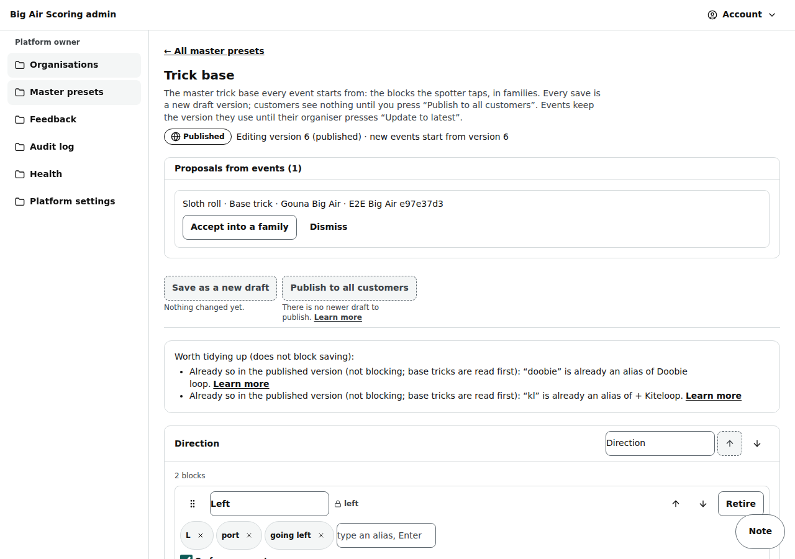
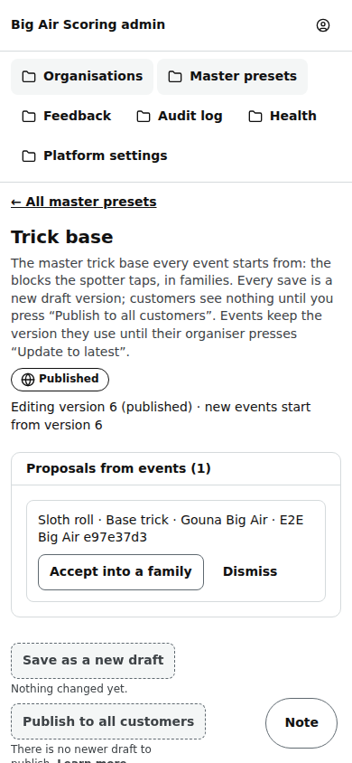
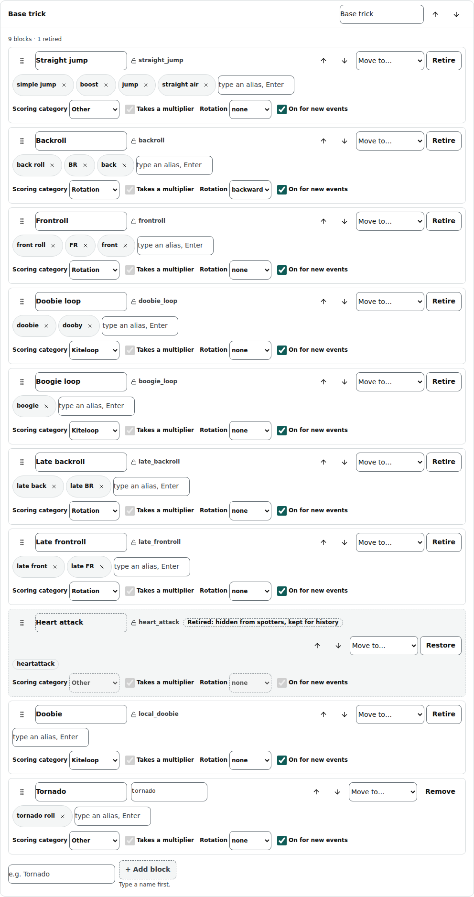
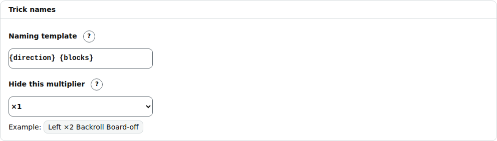
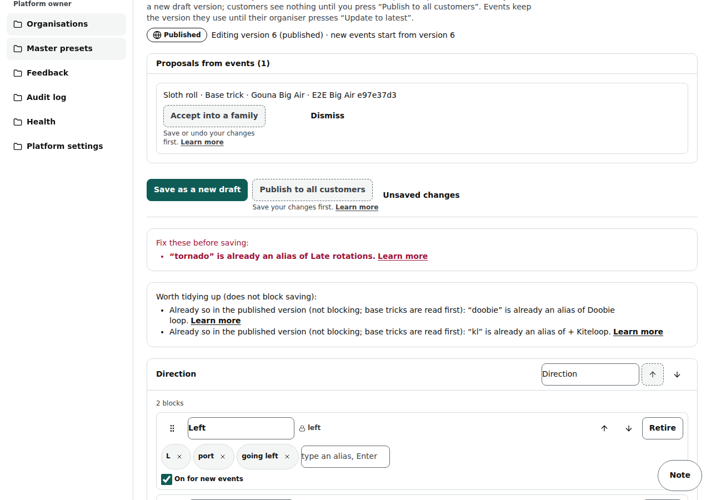
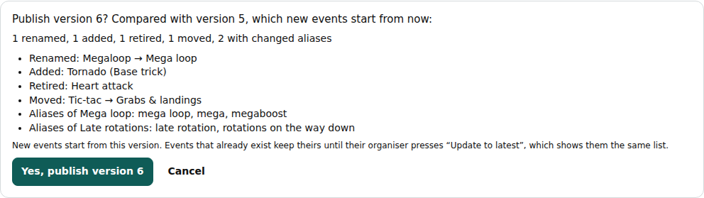
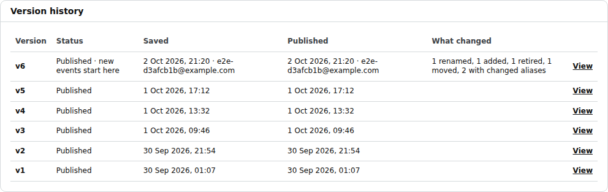
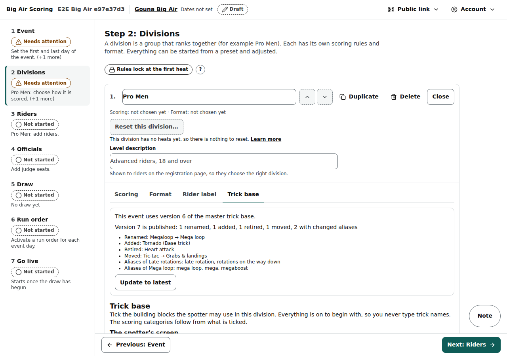

# Admin: trick base

/admin/presets/trick-base (Admin → **Master presets** → **Open the trick base**): the master trick base every event starts from, edited as a form, with its versions and the blocks events propose. The older addresses /admin/tricks and /admin/presets/trick-vocabulary/big-air-vocabulary lead here.

Last checked: 2 Oct 2026 · Product version 0.9.0

## What it is for {#at-purpose}

The trick base is the list of building blocks a spotter taps to log a trick (Left, ×2, Backroll, Board-off…), in families that only organise the spotter's screen: **Direction**, **Multiplier**, **Base trick**, **Add-ons**, **Grabs & landings**, plus any family you add. Here the platform owner renames blocks, adds aliases (the words typed or spoken text is read by), adds, moves, retires and restores blocks, and decides the category order and how trick names are written, without touching JSON.

Nothing reaches customers until you publish it:

1. Every **Save as a new draft** makes a new version (a draft). Customers do not see drafts.
2. **Publish to all customers** first shows what changed, in words (“3 renamed, 1 added, 1 retired”), and then makes that version the one **new events** start from.
3. **Existing events keep the version they use.** Their organiser sees the same list on Divisions → **Trick base** and presses **Update to latest** when it suits them (not while a heat is running).

Staff (platform staff) see everything but cannot change it: “Only platform owners can change the trick base. You can look, but not change it.”

*admin-trick-base-1280.png — the top of the editor: the version being edited, the proposals from events, Save and Publish, the words worth tidying up, and the first family.*

*admin-trick-base-390.png — the same on a phone.*

## A family and its blocks {#at-blocks}

One card per family. Each block is a row:

| Part of the row | What it does |
|---|---|
| ⠿ (drag) | Drag the block to another place in its family or into another family. The arrows and **Move to…** do the same with taps. |
| Name | The block's name, as the spotter and every screen show it. Renaming changes the name only: the key stays, so existing events and stored attempts keep working. |
| Key (🔒 key) | The block's identity. Editable for a new block until it is first published; then it is locked (“This key is in a published version, so it can no longer change (events and stored tricks use it).”). |
| Aliases | Words that mean this block in typed or spoken text, each in its own small box. Type one and press Enter to add it; × removes it. One word may belong to one block only. |
| **Scoring category** | The category the block gives a trick (from the category list below). Base tricks need one; other blocks may have **No category**. |
| **Takes a multiplier** | The block can carry ×2, ×3… (as Late rotations does). Base tricks always take one. |
| **Rotation** | backward / forward / none. Information only: nothing is scored from it. |
| **On for new events** | Off: the block starts unticked in a division until the organiser ticks it. |
| ↑ ↓ | One place up or down in the family. |
| **Move to…** | Into another family (Direction and Multiplier keep their own blocks). The block still builds tricks the same way; a block shown in another family says “(behaves as Add-ons)” when that is how it is stored. |
| **Retire** / **Restore** | Retire hides a published block from new events and from spotters but keeps it for history (tricks already logged keep their names). A published block is never deleted. |
| **Remove** | Only for a block that was never published. |

Under each family: **+ Add block** (type the name, then add aliases on its row). Each card's header renames the family, moves it up or down, and **Remove this empty family** for a family you added. **+ Add a family** sits under the last card; a block added to your own family behaves like an add-on.

*admin-trick-base-family-1280.png — Base trick: Megaloop renamed “Mega loop” with the alias “megaboost”, a new block “Tornado” with its key still editable, Heart attack retired.*

## Category precedence and trick names {#at-naming}

- **Category precedence**: a list you reorder with ↑ ↓. “When a trick has blocks of several categories, it counts in the highest one on this list.” The categories themselves come with the scoring rules and cannot be added here.
- **Naming template**: where the direction and the blocks go in a trick's name, `{direction}` and `{blocks}` in any order. The default `{direction} {blocks}` writes “Left ×2 Backroll Board-off”; `{blocks} {direction}` writes “×2 Backroll Board-off Left”.
- **Hide this multiplier**: the multiplier that is not written (×1 by default), or **Always write it**.
- **Example**: worked out from the form as you type.

*admin-trick-base-naming-1280.png — the naming template, the hidden multiplier and the live example.*

## Saving: checked in words {#at-save}

**Save as a new draft** checks the whole trick base first and lists every problem, one sentence each, under “Fix these before saving:”. For example:

- ““loop” is already an alias of Kiteloop.” (a word may belong to one block only); ““tornado” is already an alias of Late rotations.” when a new block is named like another block's alias.
- “Two blocks use the key “‹key›”: ‹block› and ‹block›. Each key must be unique.”
- “A block in ‹family› has no name.”
- “‹block› has the category “‹category›”, which is not in the category list.”
- “Heart attack is in a published version: retire it instead of removing it.”

Words two blocks already shared in the published version are listed under “Worth tidying up (does not block saving)” instead: the reader already settles them (base tricks are read first). On 2 Oct 2026 there are two: “KL” (Kiteloop and + Kiteloop) and “doobie” (an alias of Doobie loop and the name of the block Doobie).

*admin-trick-base-validation-1280.png — the new block Tornado clashes with the alias “tornado” of Late rotations; removing that alias fixes it.*

If someone else saved a newer version while you were editing: “Someone saved a newer version while you were editing. Reload the page; your changes were not saved.”

## Publishing and the version history {#at-publish}

**Publish to all customers** is available when the newest version is a draft and there are no unsaved changes. It shows the difference from the version new events start from now, with one line per change, and asks “Yes, publish version ‹n›”.

*admin-trick-base-publish-1280.png — “1 renamed, 1 added, 1 retired, 1 moved, 2 with changed aliases”, one line each.*

**Version history**: every version, its status (Draft, Published, or “Published · new events start here”), who saved it and when, who published it and when, and what changed. **View** opens any version read only (“Viewing version ‹n› (read only)”, **← Back to the newest version**).

*admin-trick-base-history-1280.png — who published what and when.*

## Proposals from events {#at-proposals}

An organiser who misses a block adds it in Divisions → Trick base → **+ Add block**: it is used at once in that event and proposed here, at the top of the page (“Proposals from events (‹n›)”). Owner only:

| Control | What it does |
|---|---|
| **Accept into a family** | Edit its **Name** and **Aliases**, choose the **Family** (and the category), then **Accept into ‹family›**. It goes into a new draft and reaches customers with the next **Publish to all customers**. The block keeps its key, so the event's own block and the master one are the same block. Save or undo your own edits first (“Save or undo your changes first.”). |
| **Dismiss** | A reason is optional, then **Dismiss with this reason**. The block stays in that event only, and the organiser sees “not added to the master base: ‹reason›” next to it. |

## Advanced: edit as JSON {#at-json}

The fold at the bottom holds the same trick base as one JSON file: **Use this JSON** puts it into the form (nothing is saved until **Save as a new draft**), **Export** downloads it, **Import a file** reads a .json file into the box. The same checks apply when you save.

## On the organiser's side {#at-event}

Divisions → **Trick base** says “This event uses version ‹n› of the master trick base.” When a newer version is published it adds “Version ‹m› is published: ‹what changed›”, one line per change, and **Update to latest** (“Move this event from version ‹n› to version ‹m›? Every division of the event changes at once. Tricks already logged keep their names.”). Refused while a heat is running or paused. See [Divisions](organiser-divisions.md).

*org-divisions-trickbase-1280.png — an event on version 5 with version 6 published.*

## What it depends on {#at-depends}

- A trick base must exist in the database. A new project gets the file `presets/tricks/big-air-vocabulary.json` with `npm run seed:presets`; after that the seed leaves the trick base alone (“skipped … managed in /admin”), so it can never publish the file over your edits.
- Only a platform owner saves, publishes, accepts or dismisses.
