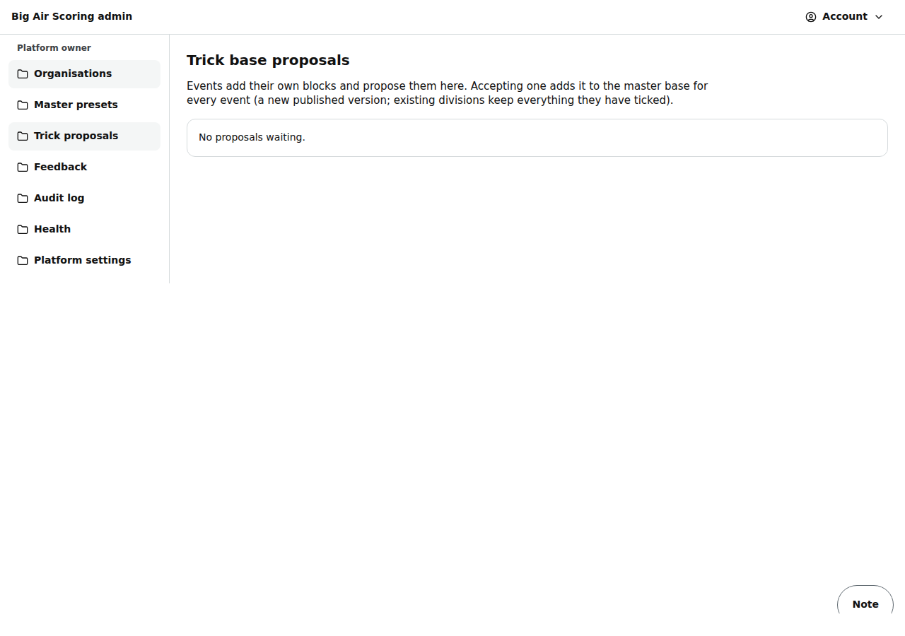

# Admin: trick base (proposals)

/admin/tricks: blocks that events added to their own trick base and proposed for the master base. *Being built — check after Polish 1 merges* (Polish 1 builds an admin trick base editor; on `main` today this page holds only the proposals).

Last checked: 2 Oct 2026 · Product version 0.9.0

## What it is for {#at-purpose}

An organiser adds a missing block (for example a new grab) in Divisions → Trick base → **+ Add block**; it is used at once in that event and proposed here. Accepting it adds it to the master base for every event as a new published version of the vocabulary; existing divisions keep what they ticked.

*admin-tricks-1280.png — the proposals table.*

## Controls {#at-controls}

| Control | What it does |
|---|---|
| Table | Block, family, event, organisation. “No proposals waiting.” when empty. |
| **Accept into the master base** | Owner only: “Add ‹block› to the master trick base for all events?” → **Yes, add it**. Refused when the master base already has that name in that family. |
| **Not now** | Dismisses the proposal; the block stays in that event. |

## What it depends on {#at-depends}

The master trick vocabulary must be published (`npm run seed:presets`); otherwise Divisions → Trick base says “The master trick base could not be found. Ask the owner to seed the presets.”
