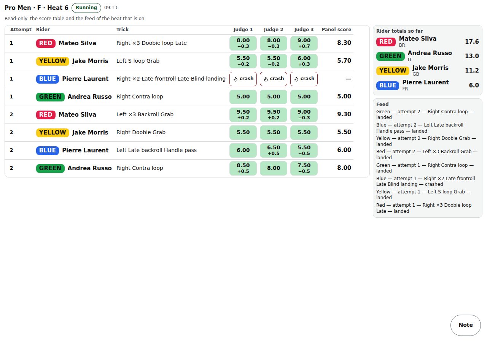

# Announcer view

The announcer's read-only screen: the score table and the trick feed of the heat that is on (/head/‹event›?mode=announcer, or an announcer seat's PIN).

Last checked: 3 Oct 2026 · Product version 0.13.0

## What it is for {#an-purpose}

The speaker reads totals, counted tricks and the feed aloud. Nothing can be changed here (“Read-only: the score table and the feed of the heat that is on.”).

*announcer-1280.png — the heat on, its score table and feed.*

## Controls {#an-controls}

| Control | What it does |
|---|---|
| Flag strip and cues | With the Flags on, a **flag strip** at the top and, under it, a text cue for each change: “Yellow — one minute to the start of ‹heat›”, “Green — ‹heat› is running”, “Red — ‹heat› finished” ([Flags](flags.md)). |
| Heat header | The heat that is on, its timer and the time now. |
| Score table | As the head judge's table, read-only. An announcer seat sees the judge columns by tag (“J1”), not by name. |
| **Feed** | “‹rider› — attempt ‹n› — ‹trick› — landed / crashed”, newest first. |

With no heat on: “No heat to show yet.”

## What it depends on {#an-depends}

An announcer seat (Officials → Add a seat → Announcer) and its PIN, or an organiser's login with ?mode=announcer. Known gap (Phase 6 notes): the rider's sponsor is not shown, because it is not stored where this view reads.
