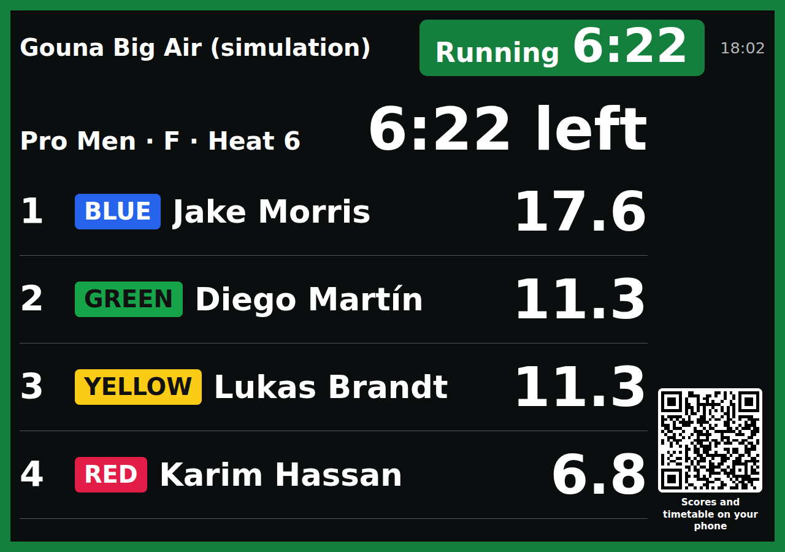
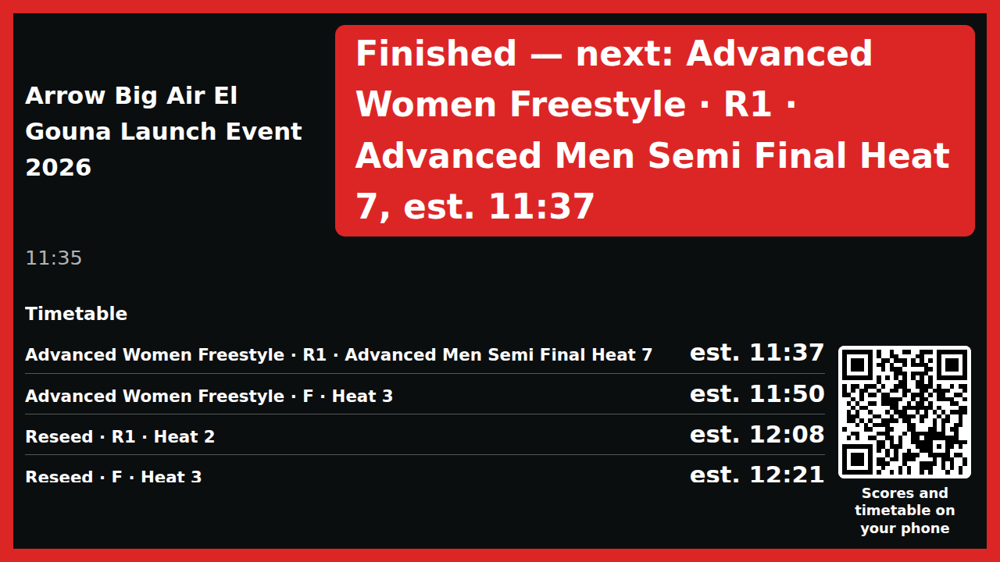
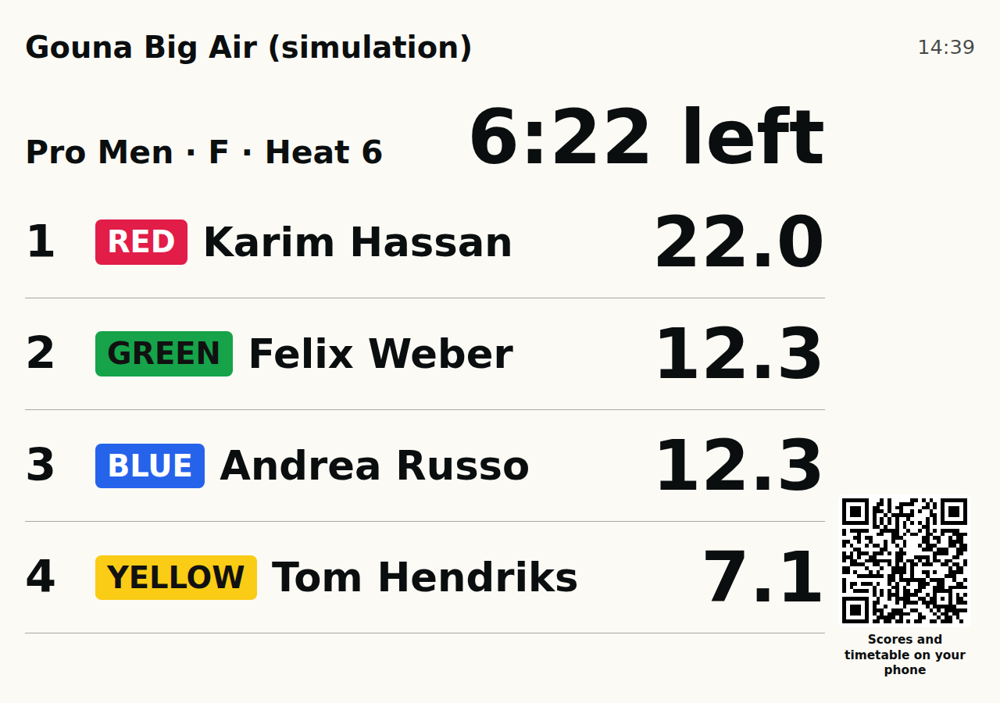
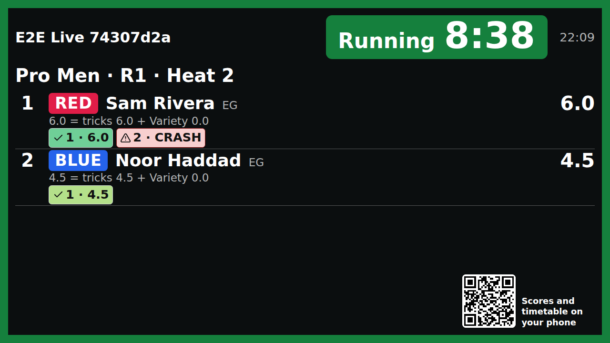
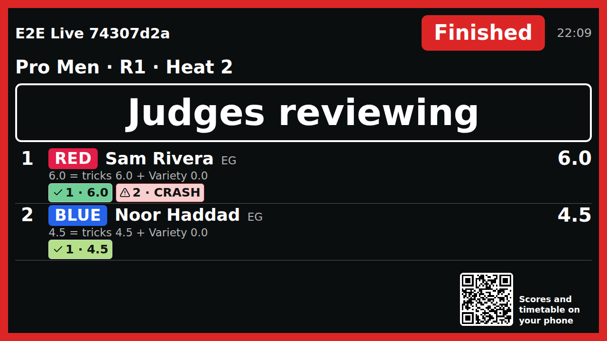
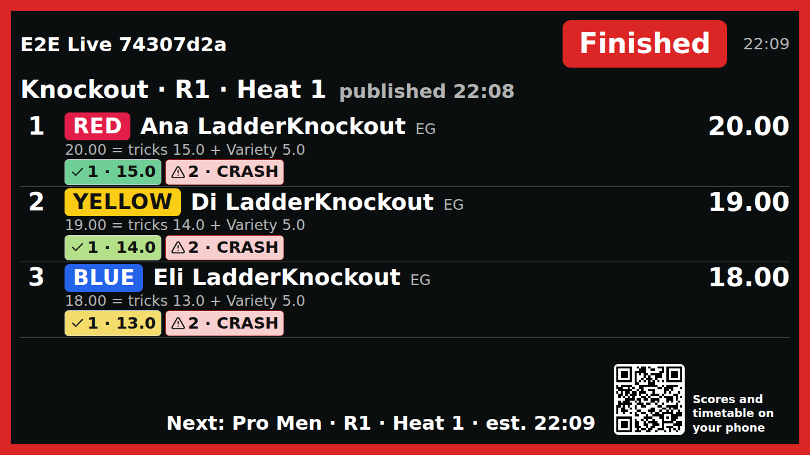
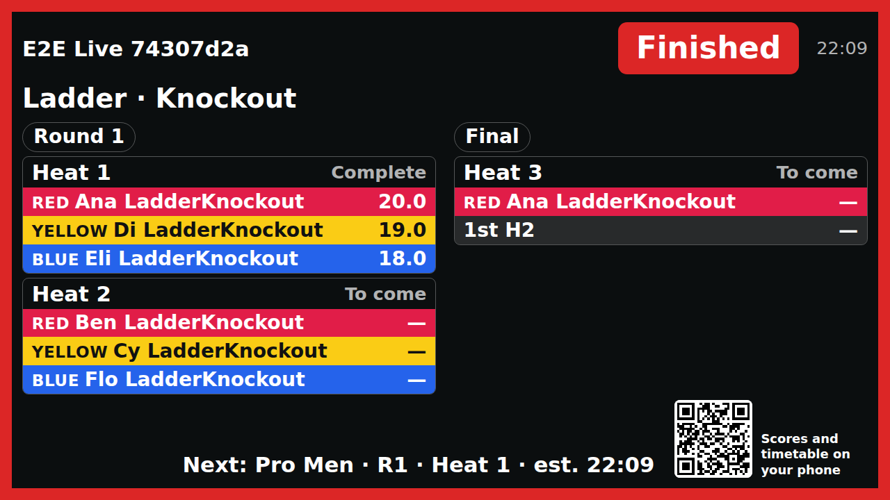
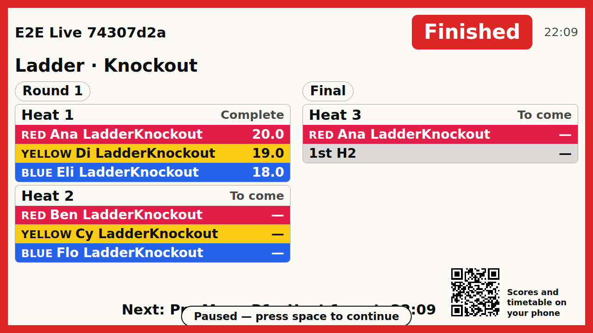
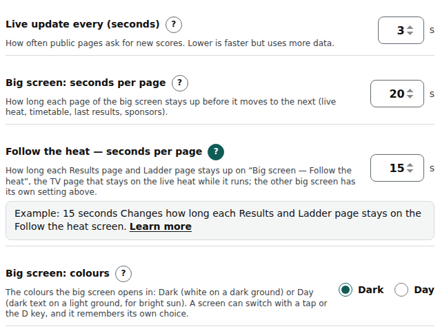
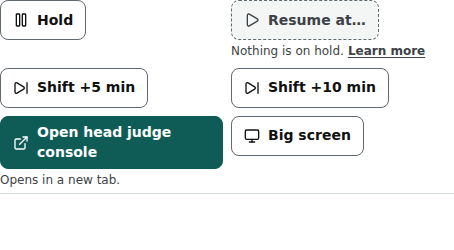

# Big screen

/screen/‹event›: the beach screen — Dark (white on dark) or Day (dark on light), large digits, pages that rotate by themselves.

Last checked: 4 Oct 2026 · Product version 0.15.0

## What it is for {#bs-purpose}

A laptop connected to a TV or projector on the beach. Open it from Go live → **Big screen** (new tab), press F11 for full screen.

*big-screen-1280.png — the live-heat page of the big screen.*

## Pages and keys {#bs-controls}

| Page / key | What it does |
|---|---|
| **Flag frame** | With the Flags on, a coloured **frame** runs around the whole screen in the flag's colour, and the state's word and countdown are large in the header (for example “Running 7:42”, “Finished — next: ‹heat›, est. ‹time›”). It shows in both Day and Dark colours and does not hide the Day / Dark button. See [Flags](flags.md). |
| **Live heat** | The heat on the water with its clock and riders (at most four per page) and their totals when live scores are allowed; otherwise “Scores published after the heat.”; with nothing on: “Waiting for the next heat”. |
| **Timetable** | Up next and the day's rows (six at most), “Times are estimates and update live.” |
| **Latest result** | The last published (and released) heat. |
| **Podium** | Once a final is released; riders who share a place all show. |
| Sponsors | “Thank you to our sponsors” with the logos. |
| **No Note button** | The Note button is never on a big screen, whoever is signed in on that browser: it is a clean screen for the TV. |
| QR code | “Scores and timetable on your phone”: opens the public event page. |
| Wind banner | The wind call, when set and switched on. |
| **The header** | Nothing on the big screen is ever cut with “…”: text wraps (or the page is scaled down a little, never below about half size) instead. The heat's flag pill always shows the whole heat name (division · round · heat and its time) and takes its room first; the event name takes the rest and wraps onto a second line when it must, never smaller than 2% of the screen width (readable from 10 metres). The same rule holds on every page (live heat, timetable, latest result, podium, sponsors) and on the [Flag view](flags.md). |
| **Day / Dark colours** | A quiet button appears in the bottom left corner (a strip of its own: it never covers text) when you move the mouse or tap the screen, and goes away again after three seconds, so the screen stays clean. On a laptop the key **D** switches without showing it. The browser remembers its own choice; until it has chosen, the screen opens in the event's default (Event step → **Big screen: colours**, Dark unless you change it). Day keeps sunlight contrast: dark text on a light ground, the same sizes, and the Lycra labels and the wind banner keep their own solid colours. |
| Rotation | Every “Big screen: seconds per page” (Event step, default 20). **Space** pauses (“Paused — press space to continue”); the **number keys** jump to a page. Nothing animates. |

*big-screen-long-name-1280.png — a 40-character event name and a 30-character heat name: the pill shows the whole heat name, the event name wraps, nothing ends in “…”.*

*big-screen-day-1280.png — the same live-heat page in Day colours.*

## Follow the heat {#bs-follow}

/screen/‹event›/follow: **Big screen — Follow the heat**, a second big-screen address next to the one above, made only for a TV or a projector on the beach (never a phone). The first big screen and its rotation stay exactly as described above. Open it from Go live → **Big screen — Follow the heat** (new tab) and press **F** (or F11) for full screen. No login, nothing to click: it is a clean screen with no Note button, no feedback button, no navigation bar and no install or cookie prompt.

It always shows one of three things, chosen by what the head judge does:

| When | What the screen shows |
|---|---|
| **A heat is armed or running** (from the yellow of the pre-start, through the green and the last minute, until the head judge presses **End heat**) | The live heat only, no rotation between heats: the heat's name, the **flag frame** and the state's word with the time (“Running 14:50”), which is the **only clock** on the screen, and every rider drawn as on the public [Live](public-live.md) tab: place, Rider label with its Lycra colour (written out too), the total, the formula line in words (the total, what the tricks add up to and the Impression / Variety score, as on the public Live tab) and each attempt as a box in order (✓ 1 · 4.73; a crash shows CRASH), arriving as the judges' scores land. These show only when the event allows live scores (Event step → live scores); otherwise the riders are listed with “Scores published after the heat.” A heat whose riders do not fit at this size is split across two pages that simply rotate (every “Follow the heat — seconds per page”), never shrunk. |
| **The heat has ended and is not published yet** | The same heat, with a large **Judges reviewing** line. It does not jump back to older results while everyone is waiting for this one. |
| **Everything else:** the heat is published, or nothing is armed or running (between heats, a break, a hold, before the first heat, after the last) | It alternates **Results** and **Ladder**, one page every “Follow the heat — seconds per page” (default 15). The order is Result (the heat just published) → Ladder → Result (the one before) → Ladder → Result (two before) → Ladder … through today's published heats, then back to the newest. When a new heat is published the walk starts again from it. |

*follow-live-1280.png — a heat on the water: the flag frame with the time (the only clock), riders with their Lycra colours, live totals, formula lines and each trick's score.*

*follow-reviewing-1280.png — after End heat, until Publish.*

**A Results page** names its heat and when it was published (“Pro Men · R1 · Heat 6 · published 14:20”) and shows the full result exactly as the [public Results page](public-results.md) does — it is made from the same pieces, so the two cannot disagree: every rider's row with the place, the Rider label, the total, the formula in words (the Impression / Variety score under its name) and every attempt's score in its box (counted attempts highlighted, crashes shown as CRASH, uncounted attempts shown as on the public page, in the attempt-box mode the event uses). Only the panel's scores are shown, never a single judge's scores, and only heats that are published and released: a heat that is not published, under review or held back never appears (the final follows the same release rule as the public pages). The type is large enough to read from 10 metres on a 1920 × 1080 screen and is never made smaller to fit: a heat with more riders or attempts than fit on one page is split across pages that simply rotate (there is no “page 1 of 2” counter).

*follow-results-1280.png — a Results page: every attempt of every rider.*

**A Ladder page** is the division's ladder with the winners already moved into their next seats, drawn large. A ladder that does not fit at that size is shown in pages, round by round, as part of the rotation, never shrunk. Each Results page is followed by the ladder of its heat's division; a division without a ladder has Results only. With nothing published today the screen shows the ladders alone.

*follow-ladder-1280.png — the Ladder page.*

**The bottom line.** During the rotation one thin line at the bottom reads “Next: ‹heat name› · est. ‹time›”, from the run order (no “est.” when the time is fixed, no time while the run order is on hold).

**The moment the next heat is armed** the screen jumps straight to the live heat, in the middle of the rotation, without waiting for the page timer. It asks the server twice a second; with the 3-second shared copy of the public pages (see [Public event pages](public-event.md)) the jump follows within a few seconds on the live address.

| Key / control | What it does |
|---|---|
| **Space** | Pauses the walk (“Paused — press space to continue”) and resumes it. |
| **F** | Full screen on and off. |
| **D**, or the quiet button that appears in the bottom left corner when you move the mouse | **Day** (dark text on a light ground) and **Dark** (white on dark). Remembered by the browser; until it has chosen, the event's default (Event step → **Big screen: colours**). The button sits in a corner of its own and never covers text. |
| The small time, the QR code | The time now in the event's time zone (top right); the QR opens the public event page (bottom right corner). |

*follow-day-1280.png — Day colours.*

*follow-dark-1280.png — Dark colours.*

**No text is ever cut with “…”** here: headings, heat names, rider names and the Next line fit the width or wrap onto a second line.

**If the connection drops** the screen keeps the last good page and shows a small **Reconnecting** label in the header; it never goes blank and never shows an error page, and it carries on by itself when the connection is back. A simulation event is shown only to its own organiser (through **View as**), like the public pages.

The setting is on the Event step, behind **More settings**, beside “Big screen: seconds per page” (which controls the first big screen only):

*follow-event-setting-1280.png — **Follow the heat — seconds per page** (5 to 120, default 15) with its “?”; Go live has the shortcut.*

*follow-go-live-shortcut-1280.png — Go live: **Big screen — Follow the heat** beside **Big screen**.*

## What it depends on {#bs-depends}

The event must be public (as the [event page](public-event.md#pe-depends)); live totals need live scores allowed; the podium needs the final released.
