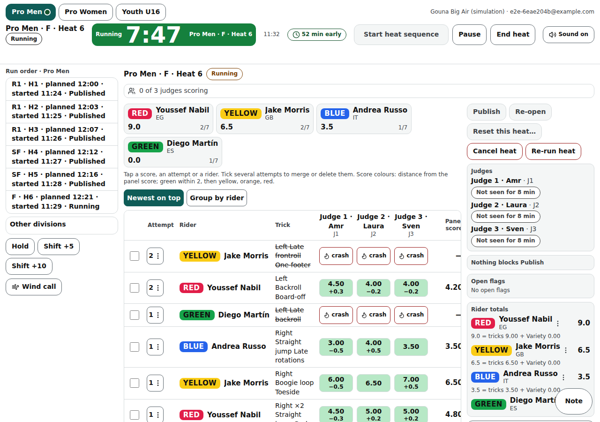
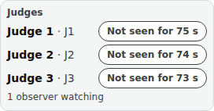

# Head judge console on a laptop

The head judge's working screen at /head/‹event› on a laptop or tablet (1280 px and wider): division tabs, the heat's timer and buttons, the run order with times, the break countdown, the live score table, Publish and everything around it.

Last checked: 4 Oct 2026 · Product version 0.14.1

## What it is for {#cl-purpose}

The head judge (the head judge seat, or an organiser of the event — an organiser acts as head judge when the event has no head seat) starts and ends heats, watches every judge's score come in, corrects what needs correcting with a reason, and publishes. Nothing reaches riders or spectators before Publish unless the visibility settings allow it. Everything changed here is written to the audit log.

*console-laptop-1280.png — top bar with division tabs and the 48 px timer; run order on the left; the riders strip and score table in the middle; Publish and the checks on the right.*

## The top bar {#cl-top-bar}

| Control | What it does |
|---|---|
| Division tabs | One division at a time (remembered on this device). A live dot with its word shows another division whose heat is running or paused; **On now: ‹heat›** jumps to it. |
| Heat name and timer | The selected heat; time left from the server's clock (every phone shows the same time). |
| **Start heat** / **Pause** / **Resume** / **End heat** | The heat's clock. Starting a heat that is not next in the active run order asks once: “Not the next heat in the run order — ‹heat› was next” → **Start anyway** / **Don’t start**. A grey button says why under it (“Only a heat that has not started can be started.”, “Only a running heat can be paused.”…). In a simulation, a heat the simulator's **Pause** or **Stop** holds says **Paused by the simulator**; **Resume** here, or Resume on the simulator panel, starts it again. |
| **Start heat sequence** (flags on) with **Pre-start:** | With the Flags on (the default) **Start heat** is called **Start heat sequence**, the one primary button: it raises the **yellow** flag and the heat starts **by itself** at 0:00 of the pre-start, with a horn. The length is a setting you pick before pressing it, in a box labelled **Pre-start:** beside the button: the event's default (already selected), **Other…** (type **1:30** or whole minutes, 0:10 to 15:00) or **Start now** (no yellow). The chosen one has a tick. With the Flags off nothing changes: **Start heat**. See [Flags and the start heat sequence](flags.md). |
| **Start now** / **+1 min** / **Pause** / **Abort** (during the yellow) | **Start now**: green at once. **+1 min**: one more minute on the yellow, as often as needed, on every screen within a second, written to the audit log; it never changes the heat length. **Pause** freezes the countdown (red, **Paused**), **Resume** carries on; **Abort**: back to red, the heat not started. You keep all of them at every moment of the yellow. |
| Flag strip | The heat's timer is the **flag strip** (flags on): filled with the flag's colour, with the state's words (Running, Last minute, Finished — next: ‹heat›, est. ‹time›, Paused, Hold), the countdown and the heat name. |
| **Sound on** | Beeps once at 1:00 and twice at time up (after one tap, as phones require); with the flags on it sounds the **horns** instead: one at green, one at the last minute, two at red, one at resume. The timer never depends on sound. |
| Break countdown | Between heats: “Next: ‹heat› · starts in 4:30” (end of the last heat + break + warm-up), **+1 min** (this break one minute longer, rounded up to the next whole minute), **Pause break** (holds the run order, freezes the countdown), **Resume**. When the time has passed: “ready to start · 0:45 late”. Nothing starts by itself. |
| Drift badge and time now | “On schedule” / “6 min late” / “4 min early”, and HH:MM in the event's time zone. |

## The left column {#cl-left}

| Control | What it does |
|---|---|
| **Run order · ‹division›** | One line per heat: “R1 · H2 · planned 14:05 · started 14:11 · Ended”, or “R1 · H3 · est. 14:35”; **Next** shows the next heat. Tap a line to select the heat. **Other divisions** folds the rest. |
| **Hold**, **Resume at** (+ restart time), **Shift +5**, **Shift +10** | The same run-order actions as Go live; also usable between heats. |
| **Wind call** | Opens the wind-call panel (red / amber / green, message, Set, Clear). |
| **Download results**, **Open printable results** | Under the wind call, on the laptop console only (not on a phone, not for judges, spotters, announcers or observers, not on a practice event). The spreadsheet and the printable page of every published heat; pressing them changes nothing for the officials, even during a heat. The draft box and the backup are the organiser's, on [Go live](organiser-go-live.md). See [Exporting results and backups](../exporting.md). |

## The middle: riders and the score table {#cl-middle}

| Control | What it does |
|---|---|
| **Review bar** (directly under the heat's name, above the rider cards, full width) | From **End heat** until **Publish**: **amber** “Waiting for 2 of 4 judges: ‹Judge 2›, ‹Judge 4›” (tap a name: that judge's sheet opens, where you can **Save and submit** or set the judge to **Absent**); **red** “Blocked: ‹the first thing that blocks Publish, in the Publish list's own words›” (“+‹n› more”) with **Fix** and **Absent** (and **Choose order** for a tie); **green** “All 4 judges submitted — ready to publish”. While the heat is running it is a quiet line without colour: “3 of 4 judges scoring”. It follows the console's own refresh. The Publish button's blocker sentence is unchanged; the bar shows the same text earlier. |
| **Riders in this heat** | Each rider's Rider label, running total and attempts used / allowed (5/7). |
| **Impression** card (its name is the Event step's **Name of the impression score**, for example **Variety**) | Beside the rider cards, in the same row, once the heat has ended (not for a division whose scoring has no separate score): a **heading** in the same style and size as the console's other section headings (**Riders**, the table's header), left-aligned above the grid, then one column per judge (the same short names and J-numbers as the table) and a **Panel** column, one row per rider with the Lycra block and name. Cells are coloured by distance from the panel mean like the trick scores (with the difference written in), “—” where a judge has not given it, “Absent” where the judge was set to Absent; tap a cell to correct it (the judge's sheet opens on that rider). It never pushes the table down: the card is always given its own room beside the rider cards (the rider cards shrink or wrap, never the card), so at 1280 px and wider it stays a card with 3, 4 and 5 riders; it takes tighter spacing first, then smaller digits down to the table's smallest text, and only when even that does not fit (six or more riders, a narrow window) it is one **Impression** button that opens the same grid as a pop-over. There is no Impression row in the attempt table. |
| Score table | One row per attempt (rider, trick, panel score, one column per judge headed by the seat's name with “J1” under it). **Newest on top** or **Group by rider** (remembered). Cell words: a score; “missing” (grey: not scored yet); “missed” (the judge did not see it, left out of the average); “absent”; “outlier” (amber); “crash”; “deleted” (struck through); “possible duplicate”. Each judge's cell is coloured by its distance from the panel score (green within the tolerance, then yellow, orange, red). |
| Tap a score | **Edit score** with a **Reason (required)**. |
| Attempt menu | **Delete**, **Merge duplicate** (keeps the first logged attempt), **Edit attempt**, **Add attempt** (past the attempt cap only with a reason: “That rider has used every attempt. Adding one more is saved with your reason.”), judge absent for this attempt. |
| Tick boxes | Select several attempts → **Merge** or **Delete**. |
| Rider menu | **DNS (did not start)**, **DNF (did not finish)**, **DSQ (disqualified)**, **Interference**, **Clear status**, **Take back interference**. |
| **More** | The **Live scores** switch of the heat (**Follow division** / **Live** / **Not live**: whether spectators see this heat live), **Hold result back** for a published heat, the agreement report (“‹judge›: 0.4 from the panel score on average, 1 outlier”) with **Hide agreement report**, the **Audit log** of the heat, theme and size, and the **Practice heat** panel on a simulation event. |
| **Flag-out** | When the format has one: “At ‹n› min the lowest ‹n› riders are flagged out.” → **Flag out…**. |

## The right column {#cl-right}

| Control | What it does |
|---|---|
| **Publish** | Opens “Publish ‹heat›”: “Publish this result? The ladder fills the next heats' seats with it.” Grey until the heat has ended, or while something blocks it (“‹n› things to fix first (see Details)”). **Publish with a reason** goes past blockers (not past a tie). Publishing again after Re-open writes the next version. |
| **Release result** (beside **Publish**) | Only when the heat's result is held back (a held final, published but not yet shown to the public): **Release result** shows it to the public at once, no question asked. While it cannot yet be released (the heat is under correction) it reads **Result held**, greyed, with the reason under it. It does not appear for a heat that is not held. |
| **Before you publish** | What blocks Publish, each line naming the judge and the exact thing: “‹judge›: score for ‹rider›, attempt ‹n› missing”, “‹judge›: Impression / Variety score for ‹rider› missing”, “‹judge›: sheet not submitted — 3 attempts unscored” (or “— every score is in”), “‹names› are tied — choose the order” (**Choose order**). **Fix** on a line opens that judge's cell of that attempt, that judge's Impression / Variety score of that rider, or points at the judge in **Judges**. The Publish dialog shows the same lines with the same **Fix**. In the cell or the Impression / Variety score, **Judge absent for this attempt** / **Judge absent for this rider** sets the judge to Absent: not counted, not missing. When every gap of a judge who never pressed Submit is set to Absent, that judge's sheet counts as submitted and Publish needs no reason. |
| **Re-open** | Takes a published result back to review; spectators keep the old result until you publish again. |
| **Cancel heat** | With a reason (“for example: kite tangle”). |
| **Re-run heat** | Cancels the heat and creates “H‹n›R” next in the run order with the same riders, seats, Lycras and timing; riders who do not ride again are Disqualified or Did not start (ranked last). Also on a cancelled heat, once (“Already re-run as H1R”). |
| **Reset this heat…** (a visible button immediately before **Cancel heat**) | Back to not started with the same riders; what it held is kept for the audit, and any start heat sequence it had is cleared (the flag shows red / Stopped and the console shows **Start heat sequence** again). Same confirmation and reason as before. There is no heat menu any more: this was its only item. While any heat of the event is in its start sequence (the yellow up, running or paused) **Reset this heat**, Reset this division, Reset event and Clear actual times are refused: “Abort the start sequence first.” (with **Learn more**); press **Abort**, then reset. Nothing is changed by the refusal, and a reset never leaves a heat armed, so nothing starts by itself afterwards. See [Resets and undo](../resets-and-undo.md#ru-heat). |
| **Judges** | Each judge: Live, “Not seen for 40 s”, “Not connected” (who has submitted is the review bar's job). Under them, “‹n› observers watching” when [observers](observer.md) have their view open (seen in the last 75 seconds); observers are never listed as judges. |
| **Open flags** | Judges' flags (“That was a crash”, “That was a landing”, “Wrong rider”, “Duplicate”, “Other”) with **Resolve**. |
| **Impression / Variety scores** | After the heat has ended, one block per judge: “all in” or “3 missing”, and each rider with **done 7.50**, **missing** or **Absent**, so you see at a glance what holds the panel back. **Enter ‹judge›'s sheet** opens that judge's sheet: every rider in a list, the pad for the one selected; a score (or **Judge absent for this rider**) moves on to the next rider who has nothing yet. **Save ‹n› riders** saves them all at once with one reason; **Save and submit ‹judge›'s sheet** also submits the sheet for the judge (every rider needs a score or Absent first). |
| **Rider totals** and **Ties** | Provisional totals with the formula in words; how each tie is broken. |
| **Public** | **Release result** / **Hold result back…** for a held result (the final when “Hold the final’s result” is on, or every result when results are not shown on publish). |

*console-observers-1280.png — the Judges box with “1 observer watching”.*

## What it depends on {#cl-depends}

A locked draw, a big-enough panel and filled seats to start ([dependency map](../dependencies.md#dep-start-heat)); an active run order for today for the countdown, Hold and Shift ([dependency map](../dependencies.md#dep-countdown)); the judges' scores and sheets to publish ([dependency map](../dependencies.md#dep-publish)). Sign in as the head seat (PIN) or as an organiser. The phone version is [Head console on a phone](console-phone.md).
