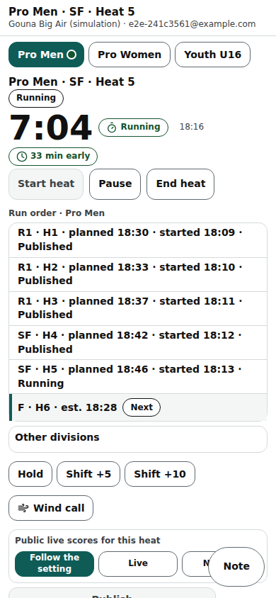

# Head judge console on a phone

The head judge's /head/‹event› page on a phone: the same controls as the laptop console in one column, and a Score tab when the head judge also scores.

Last checked: 3 Oct 2026 · Product version 0.13.0

## What it is for {#cp-purpose}

Running heats from the beach without a laptop. The score table needs a wider screen (“The score table is for a tablet or laptop. The controls, totals and what blocks Publish are here.”); everything else is here.

*console-phone-390.png — the Control tab: division selector, heat buttons, run order, Details.*

## Controls {#cp-controls}

| Control | What it does |
|---|---|
| **Score** / **Control** tabs | Only when the head judge also scores (“Head judge also scores” in Officials): **Score** is exactly a judge's queue ([Judge](judge.md)); **Control** holds the controls. Otherwise the page is just the controls. |
| Division selector | The same divisions as the laptop's tabs, remembered on the device. |
| **Review bar** | At the top of the **Control** tab, under the heat's header, from **End heat** until **Publish**: amber “Waiting for 2 of 4 judges: …” (tap a name to open that judge's sheet: **Save and submit** or **Absent**), red “Blocked: …” with **Fix** and **Absent**, green “All 4 judges submitted — ready to publish”; a quiet “3 of 4 judges scoring” while the heat is on. |
| **Impression** card | A block under the heat buttons, open by default once the heat has ended (not for a division without an Impression / Variety scale): one column per judge and a **Panel** column, one row per rider, outlier colours like the trick scores; tap a cell to correct it. |
| **Release result** | Beside **Publish**, only when the heat's result is held back. |
| Flag strip | The timer is the **flag strip** (flags on): the flag's colour, the state's words, the countdown and the heat name ([Flags](flags.md)). |
| Heat buttons | **Start heat sequence** (**Start heat** when the Flags are off) with the pre-start choice beside it (the event's default, **2:00**, **Start now**); during the yellow **Start now** and **Abort**; **Pause**, **Resume**, **End heat**, **Hold (wind)**, **Resume at** (restart time), **Shift +5**, **Shift +10**, **Cancel heat**, **Re-run heat**, **Publish**, **Re-open**, and the **Live scores: Public / Hidden** pill beside Publish (one tap changes whether spectators see this heat live; “Division default” under it means the heat follows the division's setting). A grey button says why under it. There is no timer reset: use Cancel heat (with a reason) or Re-run heat. |
| Run order | Pick a heat; lines show planned, started and estimated times. |
| **Details** / **Hide details** | **Rider totals** (with the formula and attempts used), **What blocks Publish** (with **Choose order** for a tie). |
| Screen settings | Daylight / Dark, Normal / Large, on this phone only. |
| Practice heat | On a simulation event, for an organiser: the practice feed ([Simulator](simulator.md)). |

## What it depends on {#cp-depends}

As the [laptop console](console-laptop.md#cl-depends). The head judge joins with their PIN on the join page; an organiser opens it from Go live → **Open head judge console**.
