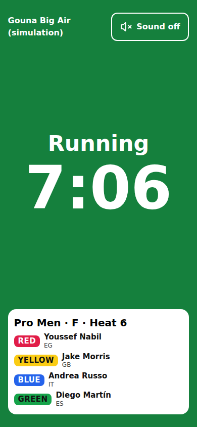

# Flags and the start heat sequence

How the clock drives the flags: the four colours, the start heat sequence on the head judge's console, the flag strip on every live screen, the flag marshal's screen (/e/‹event›/flag), the horns, and what **Abort** does.

Last checked: 5 Oct 2026 · Product version 0.17.0

## Why it exists {#fl-purpose}

On a Big Air beach the riders ride to flags and horns, not to a phone. The system already had the clock; with **Flags** on, the clock drives the flags. The flag marshal, who may be out of shouting distance or behind a barrier, gets a screen that **is** the flag. Flags are **on by default for every event** (Event step → **Flags**).

## What each colour means {#fl-colours}

| Flag | Default colour | What is happening | What the strip says |
|---|---|---|---|
| **Before start** | Yellow | The start heat sequence is running: the pre-start countdown (default 1:00). The heat has not started. | “Before start” and the countdown |
| **Running** | Green | The heat clock is running. Judges and spotters can score and log. | “Running” and the time left |
| **Last minute** | Yellow | The last part of the heat (default 1:00 left). One horn when it begins. | “Last minute” and the time left |
| **Stopped or paused** | Red | No heat is running. The words say which: **Finished — next: ‹heat›, est. ‹time›** (0:00 reached or the heat has ended), **Paused**, **Hold — times update when we resume** (wind hold between heats), or “Next: ‹heat›” between heats and before the first heat of the day. | The words above; no countdown |

The colours, the words of the first three states and the lengths are set per event (see [the Flags card](#fl-settings)). The words are always on the strip: colour is never the only signal. Text is black on yellow, white on green and red.

## The start heat sequence {#fl-sequence}

On the head judge's console (laptop and phone) **Start heat** becomes **Start heat sequence** when flags are on. It is the one primary button. Next to it, in a box of its own labelled **Pre-start:**, is the setting you pick **before** pressing it: the event's default (1:00, already selected), **Other…** and **Start now** (which skips the yellow). The selected choice has a tick and a heavier border. **Other…** opens a small field: type a length as minutes and seconds (**1:30**) or as whole minutes (**2**), from **0:10** to **15:00**; anything else is refused with “The pre-start has to be between 0:10 and 15:00. Type it as minutes and seconds (1:30) or as whole minutes (2).” The typed length becomes the selected choice (it shows as, for example, **1:30**) and stays selected for the next heat until you pick another.

1. Press **Start heat sequence**. The flag goes **yellow** with the pre-start countdown. The console shows **Start now**, **+1 min**, **Pause** and **Abort** instead.
2. At **0:00 of the pre-start the heat starts by itself**: green, the heat clock starts, one horn. This does not depend on any phone staying awake: the database stores the moment the sequence was armed and the pre-start length, and every screen works the state out from the server's clock. A console that reloads, or a judge who opens the page late, sees the right colour at once. The heat's start time is exactly that moment.
3. During the yellow the head judge keeps control at every moment. **Start now** makes it green at once. **+1 min** adds exactly 60 seconds to what is left of the pre-start, as often as needed: at 0:40 it becomes 1:40, and every screen, the Flag view included, shows the new time within a second. The audit log has one line per press. It never changes the heat length or the last-minute setting. **Pause** freezes the countdown wherever it is (the flag is red with the word **Paused**; no horn) and **Resume** carries on from the same time (back to yellow, no horn). **Abort** puts the flag back to **red** and the heat back to “not started”; the audit log keeps the abort and the time. Judges' queues and spotters' loggers open at **green**, not at the yellow.
4. When the time left reaches the last-minute length: **yellow** again, one horn.
5. At **0:00**: **red** with the word **Finished**, two horns. The flag goes red at 0:00 even before the head judge presses **End heat**; **End heat** itself stays manual and unchanged. A jump begun before the horn is still logged and scored as before.
6. **Pause**: red with **Paused**, no horn. **Resume**: back to green or yellow according to the time left (a resume with 20 seconds left is yellow), one horn. A wind **Hold** between heats shows red with **Hold**.

The pre-start time comes out of the gap before the heat. The run order's estimates do not change: a heat's estimated and actual start are the **green** moment.

## +1 min on a running heat: the last minute can move {#fl-plus-one}

The head judge's **+1 min** beside the heat clock adds exactly one minute to the heat time that is left, as often as needed. The last minute is measured from the heat's end, so it **moves with it**: a press inside the last minute puts the flag back to **green** (with no horn) until the new last minute begins, where it goes **yellow** again with its horn, once. The heat ends, with its two horns, at the new 0:00. On a simulation the minute is scaled with the speed (6 seconds at ×10).

## After a heat: the break counts down {#fl-next-heat}

After a heat the red banner keeps its state word (**Finished** or **Stopped**) and adds a second part from the active run order: “Next heat in 3:40 · Advanced · R2 · Heat 12 · est. 14:20”. It counts down the break plus the warm-up to the next heat's planned start, on the head console, the Flag view, the big screens and Follow the heat, to the same second. At 0:00 it stays and reads “Next heat due · Advanced · R2 · Heat 12”; it never starts anything and there is no horn. The head judge's **Break:** group (planned length, **+1 min**, **Other…**) changes the real break in the run order, so every screen counts down to the new 0:00 within a second ([console](console-laptop.md)). With no active run order the banner shows the state word alone, as before.

## The flag strip {#fl-strip}

The clock line of every live screen is the flag strip: same height, filled with the state's colour, showing the state's words, the countdown (pre-start remaining, then heat remaining) and the heat name. It is on the head judge console (laptop and phone), the judge's and spotter's phones, the announcer, the observer's views and the public page's live tab (and the public home page). It never pushes a button off a 390 × 844 phone in Normal size.

On the **big screen** a coloured frame surrounds the content in the state's colour, and the state word and countdown are large in its header, in both Day and Dark colours. The **announcer** also gets a text cue for each change: “Yellow — one minute to the start of ‹heat›”, “Green — ‹heat› is running”, “Yellow — last minute of ‹heat›”, “Red — ‹heat› finished”, “Red — ‹heat› paused”, “Green — ‹heat› resumed”, “Red — the start of ‹heat› is aborted”.

## The flag marshal's screen (Flag view) {#fl-view}

*flags-view-390.png — the whole screen is the flag: the state's word and the countdown, the heat and its riders with their Lycra colours.*

An address per event, **/e/‹event›/flag**, public (the marshal has no login). It is linked from **Go live** and from the **Officials** step as **Flag marshal's screen**, with a QR to print. For a simulation event the simulator's **View as…** has a **Flag view** button.

- The whole screen is the state's colour; the state's word and the countdown fill it (readable from 20 metres in sunlight). Under them: the heat's name and its riders, each with the Rider label (Lycra colour written as text too).
- **Sound on**: one tap, then the horn sounds on every change (iPhones only allow sound after a tap).
- The screen is kept awake while the page is open, and refreshes itself every second.
- **Safety rule:** if the view has had no contact with the server for **10 seconds** the whole screen turns **grey** and says “No connection — check with the head judge”. A stale green is never shown.
- A simulation event answers “This event isn't public” to anyone but its organiser (and its observers), like the other public pages. An observer can open the Flag view; it is read-only for everybody.

## The horns {#fl-horns}

One horn at green, one at the last minute, **two at red (finished)**, one at resume. Nothing at a pause or an abort. They sound only after **Sound on** on the screen that has it (the head console's setting also applies to its strip; the Flag view has its own **Sound on**). Nothing vibrates. With flags off the old beeps (one at 1:00, two at time up) apply as before.

## The Flags card (Event step) {#fl-settings}

Event step → **Flags**:
- **Flags on** (default on). Off: every screen looks exactly as it did before flags: **Start heat** on the console, the plain timer, no frame on the big screen, no marshal's screen. Switching off while a start sequence is up: a heat still in its **yellow** (running or paused) is cancelled and goes back to not started with nothing left armed; a heat whose pre-start is already over is **running** (the start is the server's, not a phone's), so it keeps running from its green moment and only the flag strip is hidden.
- The **word** and the **colour** of each of the four states (before start, running, last minute, stopped or paused). **Finished**, **Paused** and **Hold** are always spelled out; the word of the stopped state shows between heats.
- **Pre-start length** (default 60 seconds) and **Last-minute length** (default 60 seconds).

Each has a “?” saying where it shows. The full table is in [Settings](../settings.md).

## What Abort does {#fl-abort}

Only while the yellow runs: the flag goes red, the heat goes back to “not started” (it is still the next heat and can be started again), nothing is scored, and the audit log has the line “Start heat sequence aborted” with the time. It sounds no horn.

## After Reset this heat {#fl-reset}

**Reset this heat** puts a heat back to “not started” and also clears any start heat sequence it had: the flag shows **red / Stopped** (never “Finished” for the heat that was reset), and the console shows what any not-started heat shows: **Start heat sequence** with its **Pre-start:** choice. A reset heat can be started again; it is never left half-armed.

## The simulator {#fl-sim}

Virtual officials follow the sequence: they log and score only while the heat is **Running** or **Last minute**. The pre-start, the heat clock, the last minute and the break all run at the simulator's speed: at ×10 a 1:00 pre-start lasts 6 seconds and a 1:00 last minute 6 seconds. **Pause** from the simulator or from the console freezes the pre-start like the heat clock (one pause for everything), and the auto-play arms a heat only while it is playing and only when the head judge has not armed it. **Skip to end of heat** fast-forwards the virtual officials (every attempt logged and scored) and then ends the heat (flag red, clock 0:00) and leaves it under review, unpublished; **End heat and publish** ends and publishes it. The scenario **Abort the start** waits for the next yellow and aborts it. See [Simulator](simulator.md).

## What it depends on {#fl-depends}

Flags on (Event step), and for **Start heat sequence** the same as **Start heat** ([dependency map](../dependencies.md#dep-start-sequence)). Refusals, in the usual words with **Learn more** (“Abort the start sequence first.” is the one a reset gives while a heat is in its start sequence): “Another heat is already running or starting (‹max› at a time). End it or abort its start first, or ask the organiser to allow more in the Event step” (the one-heat-at-a-time rule), “No start heat sequence is running for this heat, so there is nothing to abort.”, “The flags are switched off for this event, so there is no start heat sequence. Press Start heat, or switch Flags on in the Event step.”
