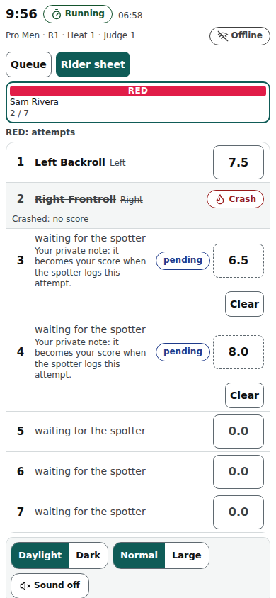

# Judge screen

The judge's phone at /judge/‹event›: a scoring queue during the heat, then the Impression / Variety score for every rider and Submit.

Last checked: 6 Oct 2026 · Product version 0.18.0

## What it is for {#ju-purpose}

Judges watch the water, not the phone. Each attempt the spotter logs arrives as the next card within about a second; one tap scores it and the next card slides in. Scores are sent through a queue on the phone: with no signal they wait (“Pending ‹n›”) and are sent when the signal is back, without duplicates (“Synced”). The screen opens the heat of the judge's panel by itself.

*judge-390.png — the queue card with the Rider label, the score pad, Missed and Flag. (The badge reads “Offline” in this picture only because the browser of the screenshot machine reports no network; on a phone with signal it reads “Synced”.)*

## Controls {#ju-controls}

| Control | What it does |
|---|---|
| Header | Heat and seat name, the slim timer — with the Flags on, the **flag strip** (the flag's colour, its words, the countdown and the heat name; the queue opens at **green**, not at the yellow; [Flags](flags.md)) —  (Running / Paused / Time up / On hold), the connection badge (**Synced**, **Pending ‹n›**, **Offline**, **Failed — tap to retry**), the time now, **Details**. |
| Queue card | The attempt: Rider label (colour word, name), attempt number, trick name, “Repeat — 2nd time · you gave 7.0 before”. A crash needs no score (“Crashed — no score needed”). |
| Score pad | Tap the whole number then the decimal, or type in the small box (greyed “0.0”); **Save**. With criteria (Height, Extremity…) one tab per criterion; the trick score appears when every criterion is set. Values off the scale's step are refused: the pad greys out Save, outlines the box in red and says why under the pad (“That score is not on the 0.1 step. Use 7.2 or 7.3.” with a **Learn more** link to [this page](#ju-pad-step)), and the database refuses them too (“That score is not on the 0.1 step. Use 7.2 or 7.3.”). |
| **Missed** | “I did not see it. No score from me; the panel average uses the others.” |
| **Flag** | “alert the head judge. I still score.” — That was a crash / That was a landing / Wrong rider / Duplicate / Other. |
| History (**Scored**) | Tap a row to correct it (“Correcting attempt ‹n›”, **Back to the queue**). |
| **Details** | Pick a rider: all their attempts, your scores, which tricks count, left / right counts, the counter. |
| Impression step (named by the Event step's **Name of the impression score**: “Variety score”, “Impression score”) | After the heat ends: one score per rider (a summary card above the pad: attempts, landed, crashed, repeats, left / right, landed tricks with your scores), “‹done› / ‹total› riders”, **Submit** (“Submit your scores? You cannot change them afterwards.”). Submit is on when every rider has a score. |
| Sound, theme, size | Sound behind a tap; Daylight / Dark; Normal / Large. |

After Submit, or when the head judge takes the heat into review, scores are locked (“Your sheet is locked. Ask the head judge to reopen it.”); the head judge can reopen one judge's sheet or edit a score with a reason.

## Rider sheet {#ju-rider-sheet}

A second view beside the queue, for the judge who wants to score the jump the moment they see it, without waiting for the spotter. At the top of the scoring screen a switch reads **Queue** / **Rider sheet**. The **Queue** is the default; the choice is remembered on that phone (the head judge's **Score** tab has the same switch and shares the phone's choice). A division that is scored by criteria (Height, Extremity…) stays on the Queue: the sheet types one score per line.

- **The rider cards** (Rider label, name, nationality, attempts used) sit across the top. Tap a rider to see their sheet below.
- **The lines.** Exactly as many numbered lines as the division allows attempts (7 for Arrow), numbered 1, 2, 3… from the start of the heat. With no limit you see the attempts logged plus one empty line ahead. If the head judge adds an attempt past the limit, it gets its own line.
- **Each line** shows the attempt number, the trick (empty — “waiting for the spotter” — until the spotter logs it; then the trick as the spotter named it, with its direction), a **Crash** word when the spotter logged a crash, and a score box you type into with the phone keyboard. The box uses the division's scale and step; a score off the step is refused with the same sentence as the pad (“That score is not on the 0.5 step. Use 7 or 7.5.” with a **Learn more** link to [this page](#ju-pad-step)). There is no Save button: a score that is on the step is saved the moment you type it.
- **Typing before the attempt exists.** A score typed on an empty line is your private note: it shows **pending** and is kept on the server at once, so it survives a phone reload or a dead phone. Nobody else sees your notes except the head judge and an observer; they are never counted, never published and never shown to the public.
- **When the spotter logs.** The attempt takes the rider's lowest-numbered line with no attempt, and your note on that line becomes your score on the attempt at once — **by order of logging, never by the time you typed**. A note typed first for line 3 waits for the third attempt. If the spotter logs a **crash**, that line greys, shows **Crash**, and any note on it is thrown away (judges never score crashes).
- **Changing a score.** Type a new value on any line until you Submit. The console follows; the audit log keeps every change (“J2 changed attempt 3 from 7.0 to 8.5 at 14:21:05”).
- **If the spotter's Undo removes an attempt that had taken your note**, the note goes back to pending on that line: the trick text vanishes from the line and your score stays, shown as pending, until the spotter logs the right attempt. (If a later attempt of the rider has been logged already, nothing moves and the score stays on the removed attempt.)
- **If the head judge clears your note** from the console (your phone was dead, say), the line shows empty again within a second.
- **If the head judge deletes or merges an attempt**, the lines renumber and the notes behind it move up to the next real attempt; the scores on the deleted attempt go as they always do.
- **At the end of the heat.** A note that never got an attempt shows **no attempt logged here** with **Clear**. **Submit** is refused while you still hold one (“You still have scores with no attempt: Red, attempt 4. Clear them, then submit.”): the Impression step shows the same sentence with **Open the Rider sheet**. Press **Clear** on each line, then Submit.
- **Mixed views.** Judges on the same heat can use different views, and it makes no difference to the result: the Queue judge scores an attempt when it lands, the Rider-sheet judge may have scored it before. Switching view in the middle of the heat keeps every score and every pending note.

*judge-rider-sheet-390.png — Red's sheet: three attempts logged (the second a crash), a pending note on the next line.*

## A typed score that is off the step {#ju-pad-step}

The pad only produces scores on the step, but the small box accepts typing. A typed score between two steps (7.25 on a 0.1 step) turns the box red, keeps **Save** grey and shows the same sentence the database would give, naming the step and the two nearest allowed scores (“Use 7.2 or 7.3.”). A score outside the scale says so (“That score is outside the scale (0 to 10).”). Type one of the allowed scores, or tap it on the pad. The head judge's score and sheet entry use the same pad and show the same sentence.

## What it depends on {#ju-depends}

The judge's seat must be on the panel of the running heat's division (Officials → Panels): otherwise “You are not on the panel of a heat that is running.” Between heats: “No heat of your panel is running. This screen opens it by itself.” and the next heat with its estimated time. Joining: [Join page](public-join.md). iPhone: add the join page to the Home Screen first and join inside the home-screen app (it keeps its own login and unsent scores).
