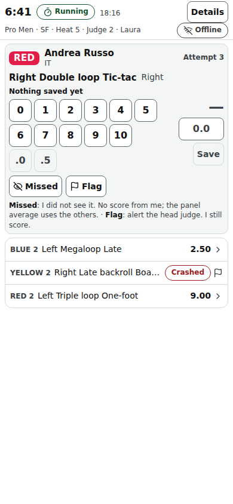

# Judge screen

The judge's phone at /judge/‹event›: a scoring queue during the heat, then the Impression / Variety score for every rider and Submit.

Last checked: 2 Oct 2026 · Product version 0.9.0

## What it is for {#ju-purpose}

Judges watch the water, not the phone. Each attempt the spotter logs arrives as the next card within about a second; one tap scores it and the next card slides in. Scores are sent through a queue on the phone: with no signal they wait (“Pending ‹n›”) and are sent when the signal is back, without duplicates (“Synced”). The screen opens the heat of the judge's panel by itself.

*judge-390.png — the queue card with the Rider label, the score pad, Missed and Flag. (The badge reads “Offline” in this picture only because the browser of the screenshot machine reports no network; on a phone with signal it reads “Synced”.)*

## Controls {#ju-controls}

| Control | What it does |
|---|---|
| Header | Heat and seat name, the slim timer (Running / Paused / Time up / On hold), the connection badge (**Synced**, **Pending ‹n›**, **Offline**, **Failed — tap to retry**), the time now, **Details**. |
| Queue card | The attempt: Rider label (colour word, name), attempt number, trick name, “Repeat — 2nd time · you gave 7.0 before”. A crash needs no score (“Crashed — no score needed”). |
| Score pad | Tap the whole number then the decimal, or type in the small box (greyed “0.0”); **Save**. With criteria (Height, Extremity…) one tab per criterion; the trick score appears when every criterion is set. Values off the scale's step are refused. |
| **Missed** | “I did not see it. No score from me; the panel average uses the others.” |
| **Flag** | “alert the head judge. I still score.” — That was a crash / That was a landing / Wrong rider / Duplicate / Other. |
| History (**Scored**) | Tap a row to correct it (“Correcting attempt ‹n›”, **Back to the queue**). |
| **Details** | Pick a rider: all their attempts, your scores, which tricks count, left / right counts, the counter. |
| Impression / Variety step | After the heat ends: one score per rider (a summary card above the pad: attempts, landed, crashed, repeats, left / right, landed tricks with your scores), “‹done› / ‹total› riders”, **Submit** (“Submit your scores? You cannot change them afterwards.”). Submit is on when every rider has a score. |
| Sound, theme, size | Sound behind a tap; Daylight / Dark; Normal / Large. |

After Submit, or when the head judge takes the heat into review, scores are locked (“Your sheet is locked. Ask the head judge to reopen it.”); the head judge can reopen one judge's sheet or edit a score with a reason.

## What it depends on {#ju-depends}

The judge's seat must be on the panel of the running heat's division (Officials → Panels): otherwise “You are not on the panel of a heat that is running.” Between heats: “No heat of your panel is running. This screen opens it by itself.” and the next heat with its estimated time. Joining: [Join page](public-join.md). iPhone: add the join page to the Home Screen first and join inside the home-screen app (it keeps its own login and unsent scores).
