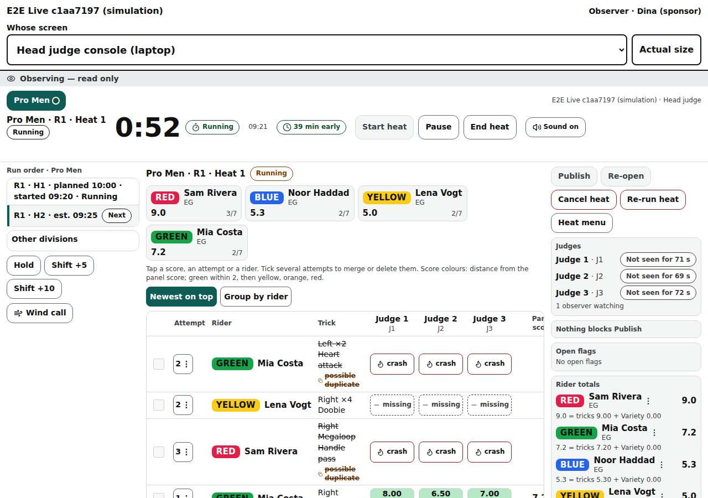
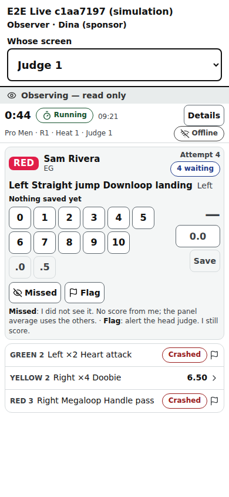
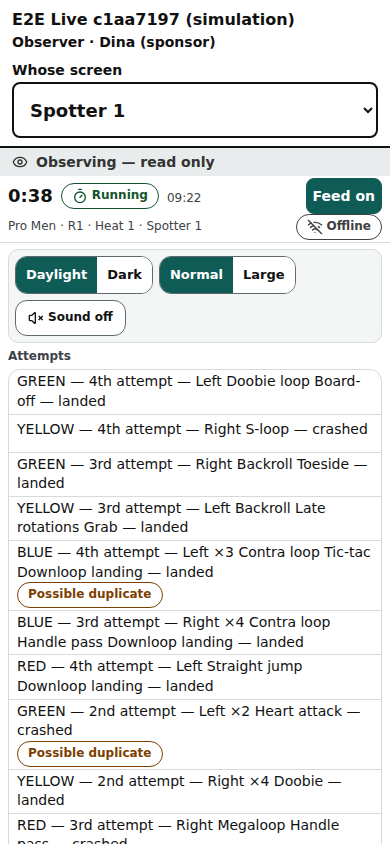

# Observer view

A read-only official's screen (/observe/‹event›): every official's real screen, live, with every control disabled — for a sponsor, an engineer, a trainee head judge, a journalist, or the owner watching a customer's event.

Last checked: 3 Oct 2026 · Product version 0.11.0

## What it is for {#ob-purpose}

An **Observer** seat sees exactly what each official sees, as it happens, and can change nothing. It is made on the [Officials step](organiser-officials.md) like any seat (its own PIN and printable card; as many observers as you like) and joins on the [join page](public-join.md) with its PIN. Observers never count towards a panel, never appear in the head judge's list of judges, are never played by the [simulator](simulator.md), and never show on the public pages.

*observer-head-1280.png — the top bar (whose screen), the “Observing — read only” strip, and the head judge console as the head judge sees it, with every button disabled.*

*observer-judge-390.png — Judge 1's screen: that judge's own scores arrive as they are saved.*

*observer-spotter-390.png — the spotter's screen with its feed of attempts.*

## Controls {#ob-controls}

| Control | What it does |
|---|---|
| **Whose screen** | **Head judge console (laptop)**, **Head judge console (phone)**, **Judge 1 · ‹name›** … one per judge on a panel (in panel order; a head judge who also scores is one of them), **Spotter · ‹name›** for each spotter, **Announcer**, **Big screen**, **Public page**. The choice stays in the address, so a reload keeps it. |
| **Actual size** / **Fit to screen** | For the laptop console and the big screen: drawn at laptop size and shrunk to fit (default), or at full size with scrolling. Phone screens are drawn at phone width. |
| **Observing — read only** | The strip under the bar. Every button, box and choice of the screen below is disabled and no tap reaches it; scrolling works. |
| The screen | The official's real screen, live: the judge's queue with that judge's own scores as they land, the spotter's feed (shown open), the console's table with the outlier colours, the announcer's table, the big screen and the public page (for a simulation, the preview the organiser sees). Each screen shows only what that official's own phone gets: a judge's screen shows that judge's scores only. |

When the organiser switches the seat off or regenerates its PIN, the screen goes at once: “This observer seat was switched off or given a new PIN by the organiser. Ask them for a new PIN to watch again.” with **Join with a PIN**.

## What it depends on {#ob-depends}

An Observer seat (Officials → Add a seat → Role **Observer**) and its PIN, joined on the event's join page. The database refuses every change from an observer seat, whatever the phone sends; the only thing it keeps is “I am here” every 30 seconds, which the head judge sees as “‹n› observers watching” under **Judges** ([Head console on a laptop](console-laptop.md)). **Never give an observer PIN to a judge of the event**: an observer sees every judge's scores. From the simulator, **View as… → Observer** opens this view for the organiser.
