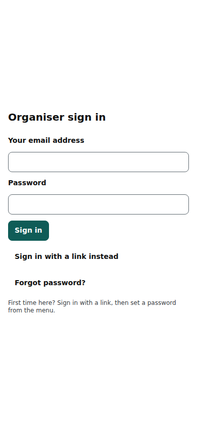
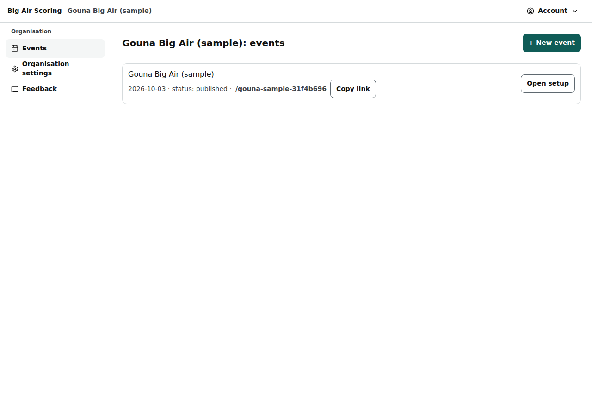

# Organiser access: sign-in, organisations, the events list

How an organiser gets in (invitation, the e-mailed link, a password of their own), how the platform owner removes one, and the organiser's frame: the events list (/org), the organisation switcher, the account menu, Organisation settings and Feedback.

Last checked: 2 Oct 2026 · Product version 0.9.0

## Getting in {#oa-getting-in}

1. **The platform owner invites** the organiser: /admin → the organisation → **Invite organiser** → the organiser's e-mail → **Invite organiser**. The form says how many e-mails the plan allows (“Only 2 sign-in e-mails per hour on this plan.”). The confirmation says “✔ Sign-in email sent to ‹email›.” and “Ask them to click the link today and set a password straight away.” Untick **Send the sign-in email now** to get a link to copy and send yourself (WhatsApp); a link also appears when the e-mail could not be sent. See [Admin: organisations](admin-organisations.md#ao-invite).
2. **The organiser clicks the link** in the e-mail (it works once, for 24 hours, in any browser). It signs them in and lands them in their organisation (a platform owner lands on /admin). A used or old link answers “That sign-in link has already been used or has expired: each link works once, for 24 hours…”.
3. **They set their own password** straight away: **Set a password** (account menu → **Set or change password**), at least the shown number of characters, typed twice → **Save password**. Nobody else ever sets or sees it.
4. **From then on** they sign in at **/org/login** with e-mail and password (**Sign in**). **Forgot password?** e-mails a link that signs them in and opens the page to choose a new password. **Sign in with a link instead** still works, within the e-mail limit.
5. **Removing an organiser**: /admin → the organisation → **Organisers** → **Remove** (platform owner only; not on your own login). “Remove ‹email› from ‹organisation›? Their access ends at once and every phone or computer they are signed in on is signed out. You can invite them again later.” → **Yes, remove**. The login stays, so the same address can be invited again later. Every invitation and removal is in the audit log.

Set a password on the first day: the hosted e-mail plan sends only 2 sign-in e-mails per hour, so the beach must not depend on e-mail.

*org-login-390.png — the sign-in page on a phone: e-mail and password, Forgot password?, Sign in with a link instead.*

## The events list and the frame {#oa-frame}

| Control | What it does |
|---|---|
| Top bar | Product name, **organisation switcher** (when you belong to several), inside an event its name, dates, state and **Public link** (copy, open, QR), and the **account menu**. |
| Account menu | **On this device**: Daylight / Dark and Normal / Large (remembered on this device only); **Note**; **Set or change password**; **Sign out**; inside an event also the links to the events list, Organisation settings and Feedback. |
| **‹organisation›: events** | Your events with dates and state; **Open setup**; **+ New event**. Archived events are hidden behind **Show archived events (‹n›)**. |
| **Organisation settings** | Name, web address (slug), logo, default time zone. Only owners and admins of the organisation can save; others can look (“Only owners and admins can change these settings. You can look, but not save.”). See [Settings](../settings.md#settings-organisation). |
| **Feedback** | The notes your team left with the **Note** button, with filters (kind, status, screen, event). |
| **Note** (floating button) | Leave a note about the screen you are on (type or **Dictate**, optional screenshot, kind: Bug, Wording, Layout, New rule, Idea). The page, event, division, heat and your role are saved with it. |

*org-events-1280.png — the events list.*

## Roles inside an organisation {#oa-roles}

A membership has a role: **owner**, **admin** or **staff** (an invited organiser is made owner of the organisation). Owners and admins may change Organisation settings; every member can set up and run the organisation's events. Platform owners can open any organisation (“Open as this organiser”; a slim strip “Viewing as ‹organisation›” with **Back to admin** shows it, and every visit is in the audit log). See [Roles](../roles.md).

## What it depends on {#oa-depends}

An invitation from the platform owner; the email service for links (or a password); for “Viewing as”, a platform owner or staff login.
