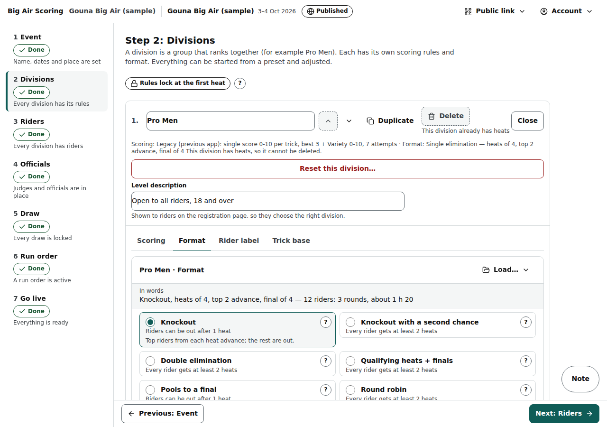
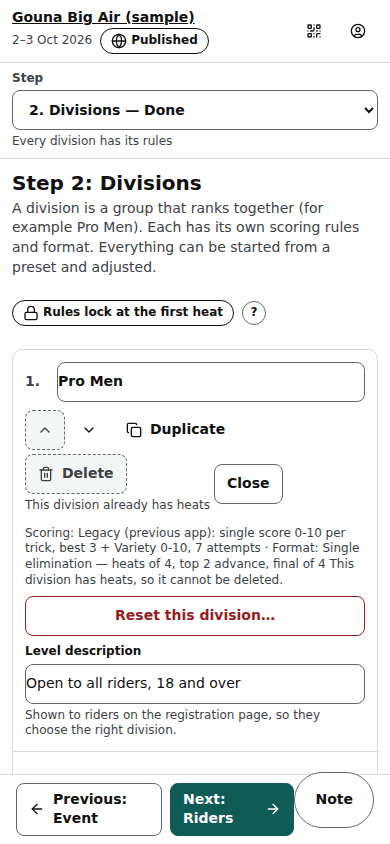

# Organiser: Divisions step

Step 2 of an event (/org/events/‹id›/divisions): the groups that rank together, each with its scoring rules, its format (the ladder), its Rider label and its trick base.

Last checked: 2 Oct 2026 · Product version 0.9.0

## What it is for {#div-purpose}

A division (Pro Men, Pro Women, Youth U16) has its own rules. Each division is a compact card; **Edit scoring & format** opens four tabs: **Scoring**, **Format**, **Rider label**, **Trick base**. Each tab starts from a preset and is adjusted with Simple dials; everything else is under **‹n› more settings**. The pill “Rules lock at the first heat” (with a “?”) reminds you that scoring and format lock when the division's first heat starts.

*org-divisions-scoring-1280.png — the Scoring tab: Load…, the Simple dials, “In words”.*

*org-divisions-format-1280.png — the Format tab: ladder type, the numbers, the preview with the ladder diagram.*

*org-divisions-scoring-390.png — the same tab on a phone.*

## Controls {#div-controls}

| Control | What it does |
|---|---|
| **New division name** + **+ Add division** | Adds a division (at least 2 letters). |
| Division name (on the card) | Rename in place. |
| ↑ ↓ | Order of the divisions everywhere (grey at the top / bottom: “This is already the first division.”). |
| **Duplicate** | Copies the division with its rules as “‹name› (copy)”. |
| **Delete** | Only while the division has no heats (“This division has heats, so it cannot be deleted.”). |
| **Reset this division…** | Puts every heat of the division back to not started and wipes its attempts, scores, results, tie decisions and actual times; the draw goes back to its saved starting copy (or is rebuilt). See [Resets and undo](../resets-and-undo.md#ru-division). |
| **Level description** | Shown to riders on the registration page. |
| **Scoring** tab | **Load…** a preset (built-in or your organisation's), the main dials first — what judges enter for each trick (one score / several criteria / nothing), the trick score's scale, which tricks count and how many (the best N, or the tricks per category), attempts per rider, the number of judges and how their scores are combined (the trimmed average is offered from 5 judges, and “Trim only with at least this many judges” shows only when it is chosen), the Impression / Variety score on or off and its scale — then the live sentence “In words” and **‹n› more settings**: only what is left, grouped under headings (Trick scoring, Judge panel, Counting and heat total, Tie-breakers, Penalties, Height sensor, and **Live screens** at the end). A setting that only applies to a choice shows only when that choice is made: the criteria table and how criteria are combined only for several criteria, the categories only when tricks count per category, the height sensor's details only when it is on. With one score per trick the fold holds 21 settings (it held 53), **Save scoring for ‹division›**, **Discard changes**, **Save as preset…** / **Save as new version of “‹name›”** (only for your own presets), **Export as JSON**, **Import a JSON file…** / **Paste JSON instead**. |
| **Format** tab | **Ladder type** (seven types, each with a “?”: Knockout, Knockout with a second chance, Double elimination, Qualifying heats + finals, Pools to a final, Round robin, Single final), **Load a saved format…**, **Build my own ladder…** (the custom ladder builder with its checker and **Apply to draw**), the numbers the type uses (riders per heat target / minimum / maximum, how many advance, final size, …), **Preview with ‹n› riders** and the ladder diagram (click a round or heat name to rename it), **Timing per round** — the one place for heat timing: an “Every round” line (warm-up, heat length, break after each heat for the whole division), one row per round of the preview (a box you change gives that round its own number, shown as “own length” / “own break”; blank follows the first line), the break after the last heat of a round under it, and **Use the division's numbers for every round**; the preview's time sentence follows at once. These are the starting plan: the run order can still change each heat. **‹n› more settings**, **Save format for ‹division›**, **Save as my format**. |
| **Rider label** tab | Use the event's identification, or (when the Event step allows it) this division's own scheme; **Save this division’s Rider label**. Fixed once a heat of the division started. |
| **Trick base** tab | “This event uses version ‹n› of the master trick base.”; when a newer one is published, what changed in words and **Update to latest** (the whole event moves at once; refused while a heat is running). Tick the building blocks the spotter may use (Direction, Multiplier, Base trick, Add-ons, Grabs & landings, and any family the platform owner added); blocks the owner set off for new events start unticked; retired blocks are not shown; **Tick all**; **+ Add block**; the spotter's screen order (drag ⠿, arrows, **Move to…**, ★ favourite first, **Reset the order**). After the first heat, blocks can be added but a ticked block cannot be unticked. Proposed blocks go to the platform owner's [trick base](admin-trick-base.md#at-proposals); a dismissed one shows the owner's reason. |
| **Unlock scoring and format** | After the first heat: a reason of at least 5 characters, written to the audit log. |

## What it depends on {#div-depends}

The event exists. Built-in presets come from the platform (published master presets). The rest of the setup depends on this step: the Go live checklist asks for scoring rules (“‹division›: choose how it is scored”) and the Draw step needs a format (“Choose a format for this division first (Divisions step, Format tab).”). Settings are listed in [Settings](../settings.md#settings-scoring-simple).
