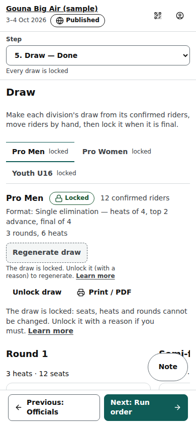

# Organiser: Draw step

Step 5 of an event (/org/events/‹id›/draw): each division's ladder made from its format and its confirmed riders, moved by hand if needed, then locked.

Last checked: 3 Oct 2026 · Product version 0.12.0

## What it is for {#dr-purpose}

The draw puts every confirmed rider in a seat of a Round 1 heat (in seed order, with the seat's Lycra colour when Lycras change every heat) and lays out the later rounds with placeholders such as “1st H1”. **Locking** the draw makes it final: heats can start only in a locked draw, and locking saves the starting copy that a Reset goes back to.

*org-draw-1280.png — division tabs (no draw / draft / locked), the status pill, the toolbar, the ladder, the checks.*

*org-draw-390.png — the ladder on a phone (scrolls sideways inside its box).*

## Controls {#dr-controls}

| Control | What it does |
|---|---|
| Division tabs | One per division, with its state: no draw, draft, locked. |
| **Generate draw** / **Regenerate draw** | Makes the draw from the format and the confirmed riders. Regenerating asks first; when you arranged heats by hand it offers **Regenerate and keep my hand-arranged heats** or **Regenerate and discard my changes**. Refused once a heat has started or while locked. |
| Tap a rider, then a seat (or drag) | Moves the rider (**Move here**) or swaps with the rider there (**Swap with ‹name›**). Every hand change is audited. |
| Seat menu | **Place a rider here**, **This seat waits for…** (a place of an earlier heat), **Clear seat**, **Take seat out**. |
| **+ Seat**, **+ Heat**, **+ Round after**, **Take heat out**, **Take round out** | Change the ladder's shape by hand. |
| Round and heat names | Click to rename (kept when regenerated; used on timetables and public pages). |
| **Lock draw** / **Unlock draw** | Lock when final. Unlock needs a reason of at least 5 characters (written to the log). |
| **Print / PDF** | Opens a printable page (one A4 landscape page per division, in colour, with estimated times) with **Print or save as PDF** and **Export PNG** (a picture to send on WhatsApp). |
| **Checks** | Warnings about the whole ladder (a rider without a seat, a heat of the wrong size). “The checks warn you; they never stop you.” |

## Refusals it can show {#dr-refusals}

Each sentence below appears under the button you pressed, with a **Learn more** link to its row in [Errors](../errors.md).

| Sentence | Meaning and fix |
|---|---|
| “The draw is locked. Unlock it (with a reason) to change it.” ([row](../errors.md#err-draw-errors-locked)) | A locked draw cannot be changed or regenerated. **Unlock draw** with a reason of at least 5 characters, change it, lock again. |
| “A heat has started, so that cannot be changed.” ([row](../errors.md#err-draw-errors-started)) | Started and finished heats never change, and the draw cannot be regenerated. |
| “Choose a format for this division first.” ([row](../errors.md#err-draw-errors-noformat)) | The division has no format: Divisions → Format. |
| “There are no confirmed riders to draw.” ([row](../errors.md#err-draw-errors-noriders)) | Confirm riders in the Riders step first. |
| “There is no draw yet.” ([row](../errors.md#err-draw-errors-nodraw)) | Lock and Unlock need a draw: press **Generate draw**. |
| “Write a reason of at least 5 characters.” ([row](../errors.md#err-draw-errors-reasonrequired)) | **Unlock draw** asks why; the reason goes to the log. |
| “The format cannot make a draw: ‹why›” ([row](../errors.md#err-draw-errors-badformat)) | The format has no ladder for this number of riders: fix it in Divisions → Format. |
| “You are not allowed to change this draw.” ([row](../errors.md#err-draw-errors-notallowed)) | Only organisers of the event change its draw. |
| “That did not work. Nothing was changed.” ([row](../errors.md#err-draw-errors-failed)) | Nothing was saved: try again; if it repeats, see [Troubleshooting](../troubleshooting.md). |

**Learn more targets of this page:** every “?” on the step opens the matching row of [Settings](../settings.md); every refusal above opens its row of [Errors](../errors.md); the dependency of the next seat is explained in the [dependency map](../dependencies.md#dep-next-seat).

## What it depends on {#dr-depends}

The division has a format (Divisions → Format) and at least one **Confirmed** rider (Riders). Started and finished heats never change; once a heat of the division has started the draw cannot be regenerated. A seat fed by an earlier heat is filled when that heat is published ([dependency map](../dependencies.md#dep-next-seat)). The Go live checklist asks for every draw to be locked.
