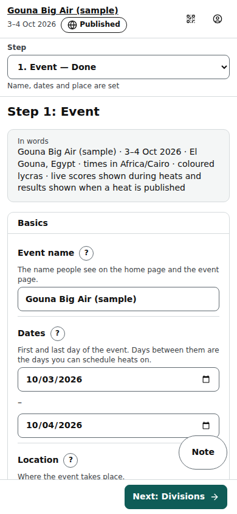
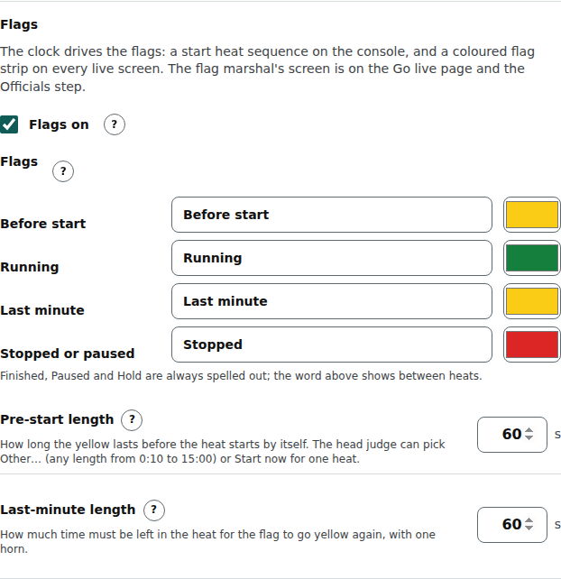

# Organiser: Event step

Step 1 of an event (/org/events/‹id›/event, or **+ New event** on the events list): name, dates, place, time zone, branding, what the public sees, timing, registration, the officials' join details, rehearsal and visibility.

Last checked: 3 Oct 2026 · Product version 0.13.0

## What it is for {#ev-purpose}

Everything that belongs to the whole event rather than one division. Each setting has a “?” that opens one sentence and an example, with a **Learn more** link to its row in [Settings](../settings.md#settings-event). On a laptop the settings are on the left and the “In words” card (a sentence describing the event) and Visibility on the right; on a phone the card comes first. Some settings are folded under **‹n› more settings**; the fold is remembered on the device.

*org-event-1280.png — Event step on a laptop.*

*org-event-390.png — the same step on a phone: the step list is a drop-down at the top.*

*org-event-flags-1280.png — the Flags card (behind More settings): the switch, the four states, the two lengths.*

## Controls {#ev-controls}

| Control | What it does |
|---|---|
| **Event name** | The name on the home page, the event page and every header. |
| **Dates** (First day, Last day) | The days of the event; the run order offers one plan per day between them. |
| **Location** | Shown on the public pages. |
| **Time zone** | Every time on every screen is shown in this zone, wherever the viewer is (Africa/Cairo for Egypt). |
| **Will riders wear coloured lycras?** | Yes: riders are told apart by Lycra colour; No: by name. Opens the Rider identification editor (preset, primary, fallback, call-out, Lycras, bibs, secondary details, kite fields, colour palette, “Allow a different scheme for individual divisions”, **Save as preset**) with a live Rider label preview. See [Settings](../settings.md#settings-identification). |
| **What riders and spectators see** | Three tick boxes: show live scores during a heat; show results automatically when a heat is published; hold the final's result until released (podium). Nothing is public until the head judge publishes unless these allow it. A division can override them (Divisions → More settings → Live screens). |
| **Web address (slug)** | The last part of …/e/‹slug› and the **event code** officials type. Changing it on a published event breaks shared links and QR codes: tick “I understand, change the address” first. **Open the public page in a new tab** and **Copy link** sit next to it. |
| **Branding** | **Event logo** and **Sponsor logos** (name, website, logo, ↑ ↓ to order, **Remove sponsor**, **+ Add sponsor**). PNG, JPEG or WebP, up to 2 MB. |
| **Rehearsal** | **Simulation event (never public)** tick box (only before any heat has started) and the **Simulate** link to the [Simulator](simulator.md). |
| **Public page** | A switch for every tab of the public event page — Home, Live, Results, Ladder, Placings, Rules, one per outside leaderboard, Join — all on by default. Switch a tab off and it disappears from the page; an old link to it lands on the first tab that is left. At least one tab stays on (the last one's switch is grey; Join does not count, because it hides itself while registration is closed). The big screen is not affected. |
| **Scoring settings** | **Name of the impression score**: what the separate score per rider is called on every screen (the console's card heading, the judges' phones, the review bar, the judges' sheets, the public results, the rules text and the big screen). Empty (the default) keeps the name each division's own scoring gives it (**Impression** for most). *Variety* is the other common choice. Up to 24 characters; longer is refused: “Use 24 characters or fewer for the name of the impression score”. |
| **Flags** | A card with **Flags on** (on by default for every event), the **word and colour** of each of the four states (Before start, Running, Last minute, Stopped or paused), **Pre-start length** (60 seconds) and **Last-minute length** (60 seconds). Each “?” says where it shows. Off: every screen looks as it did before flags. See [Flags](flags.md). |
| **Timing and officials** | **Ready call (minutes before the heat)** (default 15; the one place it is set), **Live update every (seconds)** (default 7), **Big screen: seconds per page** (default 20), **Big screen: colours** (Dark or Day; where the big screen opens until a browser chooses for itself; default Dark), **Heats that can run at the same time** (default 1), **Judges may log attempts too**, **Other leaderboards** (up to 6 extra public tabs, **+ Add leaderboard**), **Show the wind-call banner on public pages and the big screen**. |
| **Rider registration** | **Registration** Open / Closed, **Closing day**, **Closing time**, **Most riders per division**, **Message shown when registration is closed**, and the link to the public registration page (it only works once the event is published). |
| **Officials’ join details** | The join address and the **Event code**. Every official has their own PIN (made in the Officials step); there is no event-wide PIN. |
| **Visibility** | **Published: the event is listed on the home page and its public pages work**. Unticked (draft), only your team sees it. |
| **Create event** / **Save event** | Saves the step. “● Unsaved changes” shows until you save. Problems are highlighted (“Some settings need fixing. They are highlighted below.”). |
| **Next: Divisions →** | Saves first, then opens Divisions; stays with the error if the save fails. |
| **Delete or archive this event** | Platform owner only: **Archive event** (hidden everywhere, nothing deleted, **Restore event** brings it back) and **Delete event** (type the web address; only while no result was published). Organisers see “Only platform owners can delete or archive an event here.” |

## What it depends on {#ev-depends}

Nothing: it is the first step. The organisation's default time zone pre-fills new events (Organisation settings). Being **Published** is what makes the public pages, the home-page listing and registration work ([dependency map](../dependencies.md#dep-public)).
