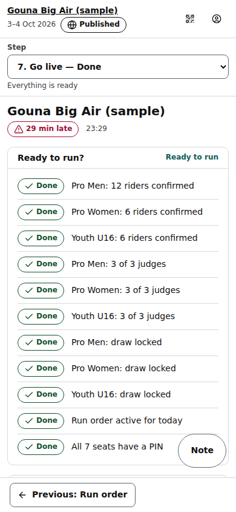

# Organiser: Go live (the event dashboard)

Step 7 of an event and its home (/org/events/‹id›): is the event ready, what is on now and next, the wind call, the quick actions (Hold, Resume at, Shift, head console, big screen, Reset), today's timetable, and the links to share.

Last checked: 2 Oct 2026 · Product version 0.9.0

## What it is for {#gl-purpose}

The start of event day. Read the checklist top to bottom, fix what is red, then run the day from here and from the head judge console. Times use the database's clock, never the device's, so a phone with the wrong time still shows the right numbers. The header shows the drift badge (“On schedule”, “6 min late”, “4 min early”) and the time now in the event's time zone.

*org-go-live-1280.png — Go live on a laptop.*

*org-go-live-390.png — the same dashboard on a phone, one column.*

## Controls {#gl-controls}

| Control | What it does |
|---|---|
| **Ready to run?** | The readiness checklist, in the order you fix things: riders confirmed per division, judges per division (“Pro Men: 2 of 3 judges”), draw locked per division, a run order active for today, a PIN for every seat. Each row not green has **Fix** (opens the step). All green: **Ready to run**. When the active plan is for another day it names both days. |
| **Now and next** | The running heat with its timer (server time with seconds), the next heat and the one after with estimated times; “On hold” during a hold. |
| **Wind call** | Red — stop / Amber — caution / Green — go, an optional message (140 letters), **Set wind call**, **Clear banner**. Shown as a banner on the public pages and the big screen when the Event step's banner switch is on. |
| **Hold** | Puts today's active run order on hold (wind): estimates stop, public pages say “Competition on hold — times will update when we resume.” |
| **Resume at…** | Ends the hold at the time you type (event time zone); everything not started re-flows from it. |
| **Shift +5 min**, **Shift +10 min** | Moves everything that has not started later. |
| **Open head judge console** | The head console in a new tab (an organiser can act as head judge). |
| **Big screen** | /screen/‹event› in a new tab, for the beach screen. |
| **Reset event…** | Wipes everything that happened and puts every ladder back to its locked draw. See [Resets and undo](../resets-and-undo.md#ru-event). |
| **Today’s timetable** | Start, heat, state (done, live, next, est., on hold, pinned, cancelled) and the projected finish; **Open the run order**. |
| **Officials' join page**, **Public event page** | Each with **Copy link**, **Open** and a QR code to show on a phone or print. |
| **Print official cards** | The officials' PIN / QR cards. |

A grey quick action says why under it: “No run order is active for today. Activate one in Run order.”, “The run order is already on hold.”, “Nothing is on hold.”, “The run order is on hold. Resume it first.” ([dependency map](../dependencies.md#dep-hold)).

## What it depends on {#gl-depends}

Everything before it. The checklist mirrors the setup steps ([Quick start](../quick-start.md#qs-go-live)); Hold, Resume at and Shift need a run order active for today; the wind banner needs the Event step's banner switch; the public links work only once the event is published.
