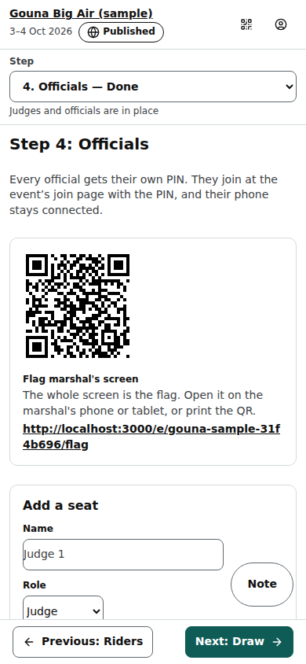
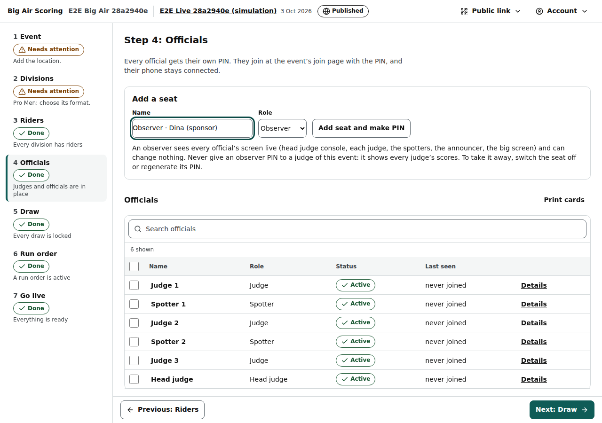

# Organiser: Officials step

Step 4 of an event (/org/events/‹id›/officials): the seats of judges, head judge, spotters, announcer and observers, their PINs and QR cards, which judges score which division, and which riders a spotter calls.

Last checked: 3 Oct 2026 · Product version 0.13.0

## What it is for {#of-purpose}

Every official has their own **seat** with their own 6-digit **PIN**. They join on the event's join page with the event code and the PIN (or by scanning their QR card) and their phone stays connected to the seat. There is no event-wide PIN.

*org-officials-1280.png — the team table, then the PIN, panel and spotter tools per seat.*

*org-officials-390.png — the same step on a phone.*

*org-officials-observer-1280.png — Role Observer chosen, with the sentence that explains it.*

## Controls {#of-controls}

| Control | What it does |
|---|---|
| **Flag marshal's screen** | The address of the Flag view (/e/‹event›/flag) with a **QR to print** (shown when the Flags are on). The marshal needs no login ([Flags](flags.md#fl-view)). |
| **Panels need attention** | Lists each division whose panel is short (“Pro Men needs 3 judges, 2 assigned”), or “✔ Every division has enough judges.” |
| Team table | Name (click to rename), Role, Status (Active / Switched off), Last seen (“just now”, “5 min ago”, “never joined”). **Search officials**; tick boxes with **Switch on**, **Switch off**, **Delete**. |
| **Waiting for approval** | Officials who asked to be added on the join page (“Not on the list? Add your name”): **Approve and make PIN** or **Decline**. |
| **Add a seat** | **Name**, **Role** (Judge, Head judge, Spotter, Announcer, Observer), **Head judge also scores** (for a head judge) → **Add seat and make PIN**. A box shows the PIN once: **Copy PIN**, **Share on WhatsApp** / **Copy message** (event, seat, join address, PIN), and a QR code that works once for this seat. |
| Seat card: **Show PIN** / **Hide PIN** | The seat's PIN. A seat made before PINs were stored says so; use Regenerate. |
| Seat card: **Regenerate PIN** | A new PIN; the old one stops working and the seat's phones are signed out. Not while the seat's heat is running. |
| Seat card: **Print card** / **Print cards** | One card per official: event, seat, role, PIN, join address and a fresh single-use QR code (printing makes the older QR codes stop working; PINs do not change). |
| Seat card: **Switch off** / **Switch on** | A switched-off seat cannot act; its phone shows “This seat has been switched off by the organiser.” |
| Seat card: **Delete seat** | Only for a seat that never gave a score; otherwise switch it off. |
| Role **Observer** | A read-only official ([observer view](observer.md)): sees every official's screen live and changes nothing. It says so under the form: “An observer sees every official’s screen live … Never give an observer PIN to a judge of this event: it shows every judge’s scores. To take it away, switch the seat off or regenerate its PIN.” An observer is never in the panel table and never counts towards a panel; **Regenerate PIN** works for it even while a heat runs. |
| **Panels: who scores which division** | Tick the judges who score each division (“2 of 3 judges”). It warns, never blocks here; but a heat cannot **start** while its division's panel is short. |
| Spotters | **Free: can log any rider** (default) or **Assigned to riders** (pick riders; “Lycra colours they call”). Two spotters can share a division. |

## What it depends on {#of-depends}

The event exists; panels need divisions (“Add a division first.”) and judge seats (“Add judge seats first.”). PINs need the server's PIN key (owner: Health → server settings). The Go live checklist asks for a PIN on every seat and enough judges per division ([dependency map](../dependencies.md#dep-pin)). How officials join: [Join page](public-join.md).
