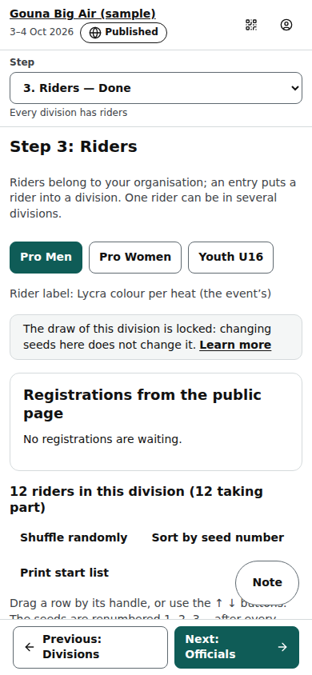

# Organiser: Riders step

Step 3 of an event (/org/events/‹id›/riders): who rides in each division, in seed order, with their identifiers; registrations from the public page; import and print.

Last checked: 2 Oct 2026 · Product version 0.9.0

## What it is for {#ri-purpose}

Riders belong to your organisation; an *entry* puts a rider into a division (one rider can be in several divisions). The list's order is the seeding: the draw deals riders in this order. Only **Confirmed** riders are drawn.

*org-riders-1280.png — the seeded grid: sticky header, search, tick boxes and the bulk bar.*

*org-riders-390.png — the same list on a phone.*

## Controls {#ri-controls}

| Control | What it does |
|---|---|
| **Division** | Which division's riders are shown. “Rider label: ‹scheme› (the event’s / this division’s own)” says how riders are recognised. |
| **Registrations from the public page** | Riders who registered online: **Approve** (becomes Confirmed, gets the next seed) or **Decline** (optional reason for your notes). Declined registrations are listed in their own fold. |
| **Search riders** | Filters the list; drag and ↑ ↓ still move a rider in the whole list. |
| Grid columns | Seed, Rider label, names, nationality, email, phone, sponsor, status, and the identifier columns the division's Rider label uses (Lycra colour, bib, kite, rash guard, photo). **Show every identifier column** shows all of them. Click a cell to edit it; it saves on its own (“Saved”). |
| Status | **Confirmed** (taking part), **Withdrawn**, **No-show**. Removing a rider who already has a seat is refused: set them to Withdrawn. |
| Tick boxes + bulk bar | **Set status** or **Remove from division** for the ticked riders. |
| Drag handle, ↑ ↓ | Move a rider; seeds are renumbered 1, 2, 3… after every move (“Order saved”). |
| **Sort by seed number** | Puts riders in the order of the seed numbers you typed (warns when a seed is used twice). |
| **Shuffle randomly** / **Repeat this shuffle** / **Shuffle code** | A random order with a code; the same code puts everybody back in exactly that order. |
| **Print start list** | One printable page per division (seed, rider, Rider label, nationality, sponsor). |
| **Check these riders** | Warnings only (nothing is blocked): two riders with the same Lycra colour, bib, kite, rash guard or name. |
| **Add a rider by hand** | First and last name (+ the visible identifier fields) → **+ Add rider** (status Confirmed). |
| **Paste or upload a CSV** | Paste rows with a header line or choose a file → **Preview** (nothing saved yet; problems listed per line) → **Import ‹n› riders**. Columns are found by their header: First, Last, Nationality, Email, Phone, Sponsor, Seed, Bib, Lycra colour, Kite brand, Kite model, Kite size, Kite colours, Rash guard colour, Photo URL. A rider with an email you already have is linked, never overwritten. |
| **Add from this organisation’s riders** | Tick riders from earlier events → **Add ‹n› riders**. |

## What it depends on {#ri-depends}

A division must exist (“Add a division first (Step 2), then come back to add riders.”). Once the division's draw is locked, changing seeds here no longer changes the draw (“The draw of this division is locked: changing seeds here does not change it.”); a rider withdrawn after the lock keeps their seat in the stored draw (the head judge sets them to DNS in the heat). Public registration needs the event published and registration open (Event step).
