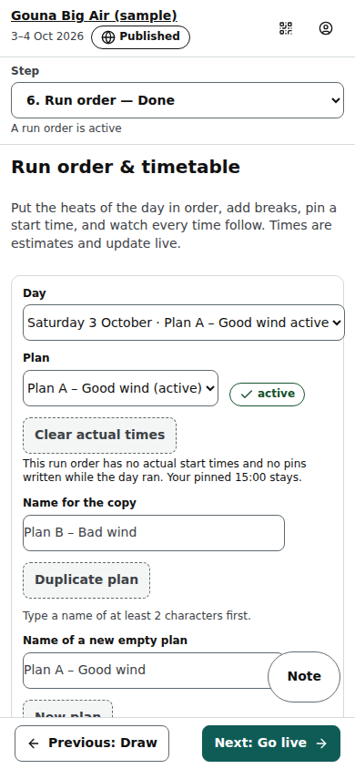

# Organiser: Run order & timetable step

Step 6 of an event (/org/events/‹id›/schedule): the order of the day's heats and breaks, one or more plans per day, the pinned start times, and every time that follows from them.

Last checked: 3 Oct 2026 · Product version 0.12.0

## What it is for {#ro-purpose}

The timetable works like a spreadsheet: a row's end = its start + its length (warm-up shown as its own part before the heat), the next start = that end + the break. A **pin** means “not before this time”. Times are estimates and re-flow live from the real starts and ends of the heats, from Hold, Resume at and Shift. Each day can have several plans (Plan A – Good wind, Plan B – Bad wind); **one** plan per day is **active**, and only the active plan for today drives the head console, the countdown and the public timetable.

*org-run-order-1280.png — plan tools, “Heats not in the run order” on the left, the timetable on the right.*

*org-run-order-390.png — the same step on a phone.*

## Controls {#ro-controls}

| Control | What it does |
|---|---|
| **Day**, **Plan** | Which day and which of its plans you see; the active one is tagged “active”. Each day in the list says “Plan A – Sat 10 Oct active”, “2 plans, none active” or “no plan”. The step opens on today (the Go live checklist's **Fix** for “No run order is active for today” lands here with today chosen). |
| **Create a plan for ‹day›**, **Copy ‹other day›'s plan to ‹day›** | Shown when the chosen day has no plan, never a grey screen. Create starts an empty plan named “Plan A – ‹day›” (change the name first if you like). Copy takes another day's active plan: only the heats that have not yet ended, in their order — never that day's breaks, notes or pins, its actual times or a hold. The page then says “Copied ‹n› heats — add this day's breaks and the first heat's pin”. The first plan of a day is active at once. |
| **Activate this plan** | Makes it the plan of that day (heats that started or finished stay where they are). |
| **New plan** (with **Name of a new empty plan**), **Duplicate plan** (with **Name for the copy**), **Delete plan** | Manage plans. An active plan cannot be deleted. |
| **Heats not in the run order** | **Add** one heat, **Add all ‹n›**, or drag a heat in. |
| Row: drag handle, ↑ ↓, ✕ | Move or take out a row. |
| Row: start time (“Tap to pin a start time”) → **Pin** / **Remove pin** | Pin a “not before” time. Pin at least the first row: without it there is no finish (“No finish yet: pin the first start time”). |
| Row: **Length**, **Break**, warm-up | A row's own length (minutes; any heat that has not started), the break after it, the warm-up before it. |
| **Add break** (**Break name**, **Minutes**), **Add note** | A break row (Lunch, 45) or a note row (“Wind call 09:00”). |
| **Break after every heat** + **Set for all heats** | One break for every heat row. |
| Header | Projected finish, heats left, first warm-up, “On hold since ‹time›”, the drift badge (“On schedule”, “6 min late”), the time now; “Heats already ran on ‹day›” once heats of the plan have real start times. |
| **Live changes** (active plan) | **Hold**, **Resume at** (+ time), **Resume**, **Shift +5**, **Shift +10**: the same server-time actions as Go live and the head console. |
| **Clear actual times** | Clears the plan's actual starts and the pins written while the day ran (Shift, Resume at, +1 min); pins you set by hand stay. When there is nothing of that kind it does not just say “nothing to clear”: it names what stays (“Your pinned 10:05 stays”). Every grey button on this step says why under it or when you point at it (a name of 2 characters, a time, an active plan, a heat that has started). See [Resets and undo](../resets-and-undo.md#ru-clear-times). |
| **Export PDF**, **Export PNG** | The timetable as Division / Session / Warm-up / Start / Duration / End / Break, with “Times are estimates and update live”. |
| Row warnings (⚠) | “No heat length — set it in Divisions → Format”, or “This heat is no longer in the draw … Take this row out of the run order” (the row takes no time). |

## What it depends on {#ro-depends}

Heats exist only after a draw (“There are no heats yet. Make each division's draw first.”). Heat lengths come from Divisions → Format (heat length per round). The ready call is set once in the Event step. The Go live checklist asks for a plan active **for today** in the event's time zone ([dependency map](../dependencies.md#dep-times)).
