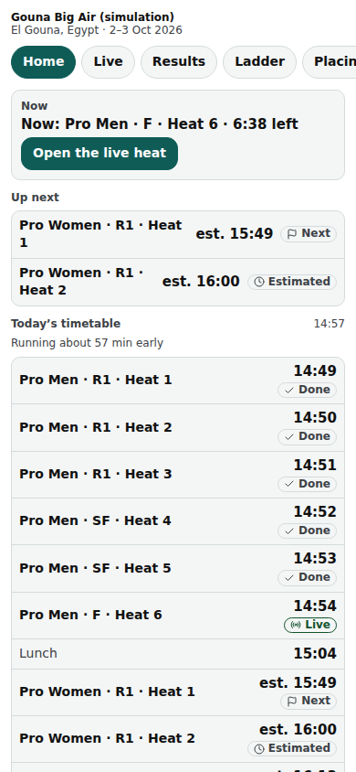
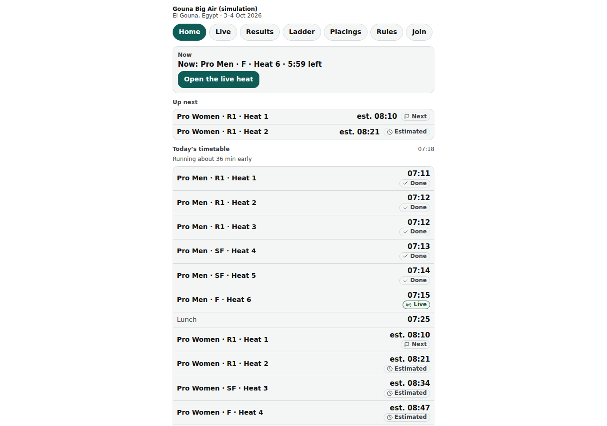

# Public: the event page

An event's public home (/e/‹event›): now, up next, today's timetable, divisions, sponsors and sharing; the tabs to every public page of the event.

Last checked: 2 Oct 2026 · Product version 0.9.0

## What it is for {#pe-purpose}

Riders check when they ride; spectators follow the day. Pages ask the server for fresh data every “Live update” seconds (Event step, default 7) while they are visible. Daylight only (no dark theme on the public site).

*public-event-390.png — the event page on a phone: wind banner, Now, Up next, today's timetable.*

*public-event-1280.png — the same page on a laptop.*

## Controls {#pe-controls}

| Control | What it does |
|---|---|
| Tabs | **Home**, **Live**, **Results**, **Ladder**, **Placings**, **Rules**, **Join**, and one tab per outside leaderboard set in the Event step. |
| Wind banner | “Wind: Red — stop / Amber — caution / Green — go” with the message, when the organiser or head judge set a wind call and the banner switch is on. |
| **Now** | “Now: Pro Men · R1 · Heat 2 · 6:12 left” (the clock from the server's stamps), **Open the live heat**; or “No heat is running right now.” |
| **Up next** | The next two heats with estimated times. |
| **Today’s timetable** | Every row with its state: Done, Live, Next, Estimated, On hold, Pinned (“Not before this time”), Cancelled; “Times are estimates and update live.”; on hold: “Competition on hold — times will update when we resume.”; when the day has slipped: “Running about 6 min late”. A row with no length or whose heat left the draw is hidden. |
| **Divisions** | The event's divisions. |
| **Share this page** | **Share on WhatsApp**, **Copy link**, a QR code to this page. |
| Sponsors | The sponsor strip in the order set in the Event step. |

## What it depends on {#pe-depends}

The event must be published and not a simulation or archived; otherwise “This event isn't public” (status 404, on purpose without saying which reason). The timetable needs an active run order for the day ([dependency map](../dependencies.md#dep-public)). A simulation can be previewed by its own organiser through the Simulator's **View as…** only.
