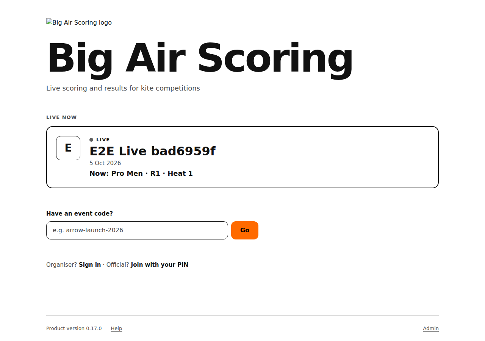
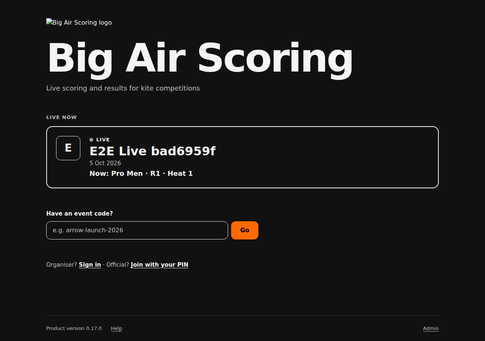
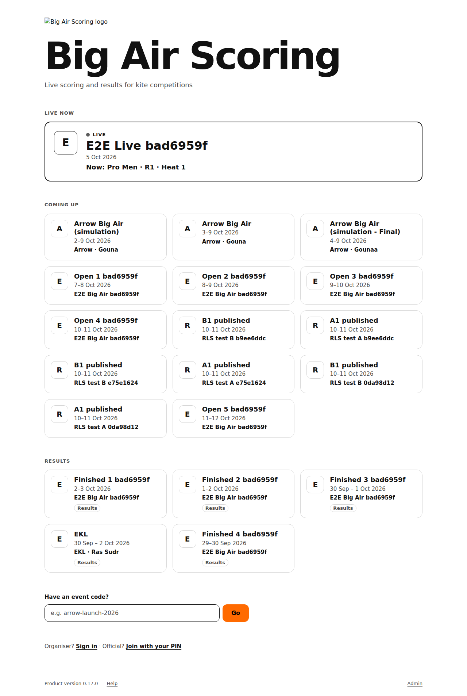
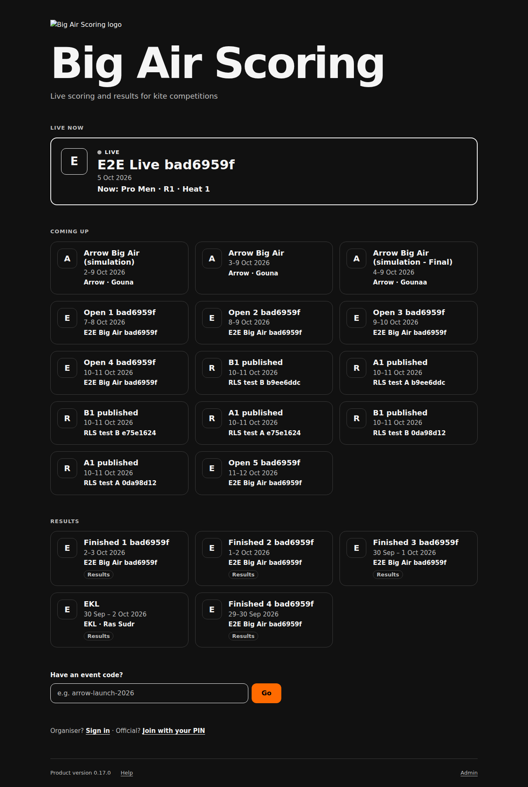
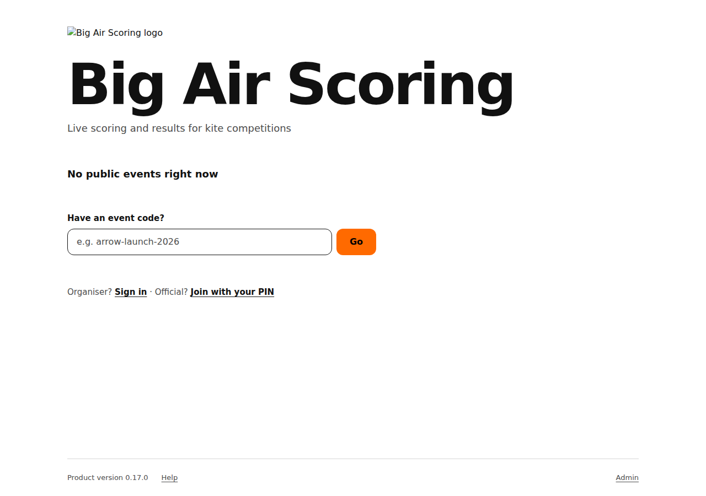
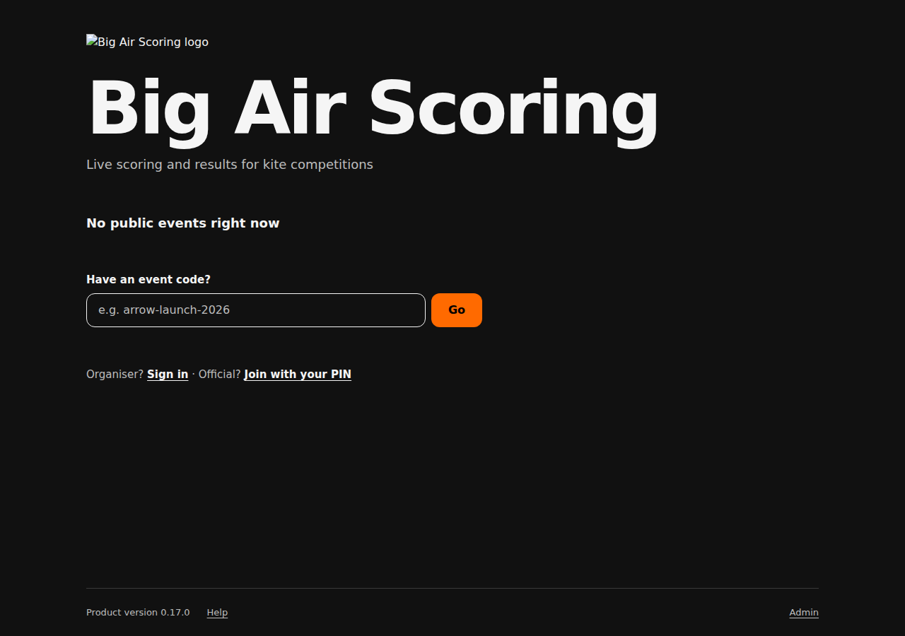
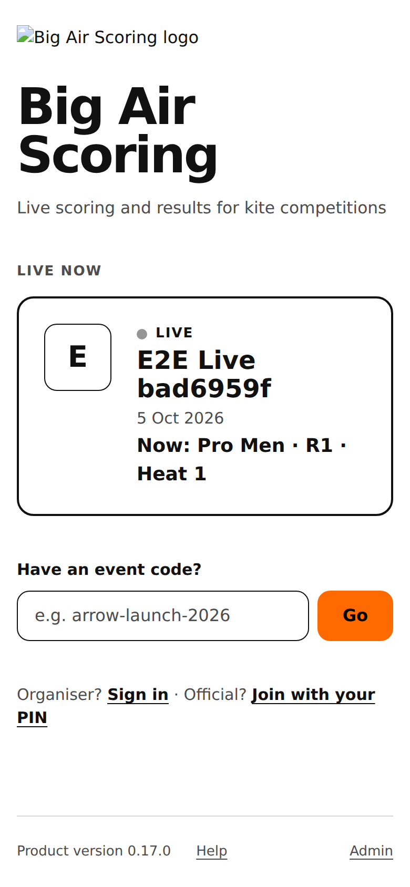

# Public: the home page

The product's home page (/) for riders and spectators: live events, upcoming events, recent results, and a box for an event code.

Last checked: 4 Oct 2026 · Product version 0.17.0

## What it is for {#ph-purpose}

The front door. At the top: the product name large, the tagline on one line; the only accent colour on the page (electric orange) is the **Go** button. Under it, only published, public events: **Live now** first (the first live event is a larger card with a gently pulsing dot and “Now: Pro Men · R1 · Heat 3”), then **Coming up**, then **Results** (a quiet “Results” tag on each finished event). Every card is one tap target that opens the event page. Simulation and archived events never appear. The page follows the phone's light or dark setting.

*public-home-live-light-1280.png — a live event first and larger, then the event code field.*

*public-home-live-dark-1280.png — the same page in dark.*

*public-home-many-light-1280.png — ten events: live, coming up and results.*

*public-home-many-dark-1280.png — the same in dark.*

*public-home-empty-light-1280.png — “No public events right now”, with the event code field under it.*

*public-home-empty-dark-1280.png — the same in dark.*

*public-home-390.png — the home page on a phone (light); public-home-live-dark-390.png is the dark one.*

## Controls {#ph-controls}

| Control | What it does |
|---|---|
| Event cards | Open the event's public page (the whole card is the button). The tile on the left shows the organisation's first letter. |
| **Have an event code?** + **Go** (the orange button) | Opens /e/‹code›; the code is the last part of the event's address (for example arrow-launch-2026). For an event that is not listed. |
| “Organiser? **Sign in** · Official? **Join with your PIN**” | Organiser sign-in (/org/login) and the officials' join page (/join). |
| Footer | The product version, **Help** (this manual), **Legal** (only when the owner wrote terms or a privacy notice) and a small **Admin** link (the platform owner's sign-in, lands on /admin). Nothing else. |

There is no sign-up anywhere on the page.

## What it depends on {#ph-depends}

An event appears when it is published and is neither a simulation nor archived (Event step). The product name, logo and tagline come from Platform settings. If the database cannot be read: “The event list could not be loaded just now. Try again in a minute.”
