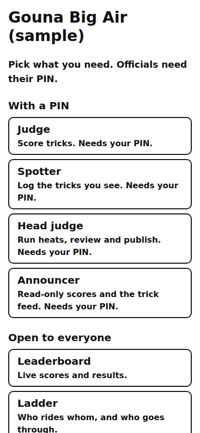
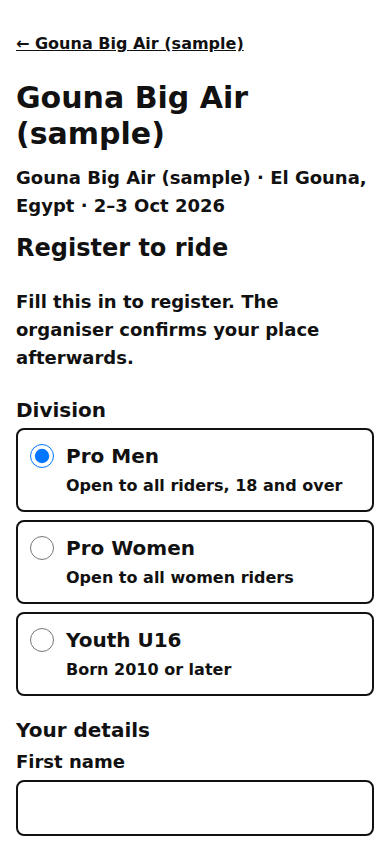

# Public: join and register

The event's **Join** tab (/e/‹event›/join), the officials' join page (/join), the seat page (/seat) and the riders' registration page (/e/‹event›/register).

Last checked: 3 Oct 2026 · Product version 0.11.0

## What it is for {#pj-purpose}

One door for everybody who is not a spectator: officials join with their PIN, riders register.

*public-join-390.png — the role picker: Judge, Spotter, Head judge, Announcer, Observer (with a PIN); Leaderboard, Ladder, Timetable (open to everyone).*

*public-register-390.png — the registration form.*

## Joining as an official {#pj-officials}

| Control | What it does |
|---|---|
| Role cards | Judge, Spotter, Head judge, Announcer, Observer (“Watch every official’s screen, read only.”): “Needs your PIN.” Each card is its own address. |
| **Event code** + **Your 6-digit PIN** → **Join** | On /join both are typed; on /e/‹event›/join only the PIN. The phone is then bound to the seat and goes straight to its screen (judge, spotter, head console, announcer, or the [observer view](observer.md)). |
| QR card | Scanning signs the phone in once (“Joining with your QR code…”). |
| iPhone tip | “tap Share → Add to Home Screen first, then open the app from your home screen and join there. The home-screen app keeps its own login.” |
| **Not on the list? Add your name** | Name, role wanted (Judge, Spotter, Announcer), phone (optional) → **Ask to be added**; the organiser approves and gives a PIN. |
| /seat | “Your seat”: Connected / Not connected, **Open my screen**, or **Join with a PIN**. |

## Registering as a rider {#pj-register}

**Register to ride**: division (with its level description; “— full, ask the organiser” when full), first and last name, email, phone (WhatsApp), nationality, sponsor, WOO ID (optional), gear (kite brand, model, size, colours; rash guard colour), a photo (shrunk on the phone, 2 MB at most), the consent box → **Register**. The organiser confirms the place in the Riders step (“Registered — awaiting confirmation”).

## What it depends on {#pj-depends}

Joining: the right event code and PIN, an active seat, an event that is not archived, and a browser that is not signed in as an organiser ([dependency map](../dependencies.md#dep-join)). Registering: the event published, registration Open and not past its closing day and time, and the division not full (Event step).
