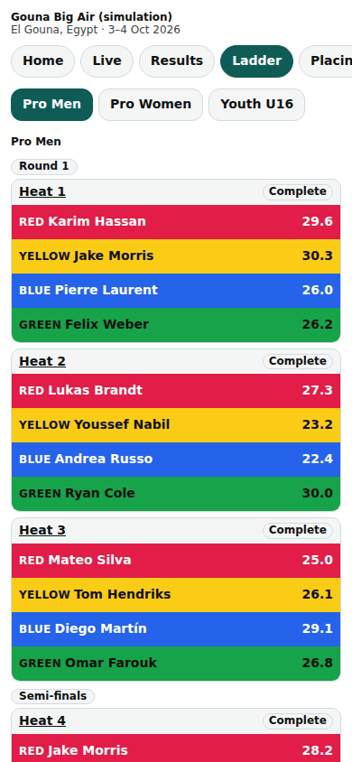
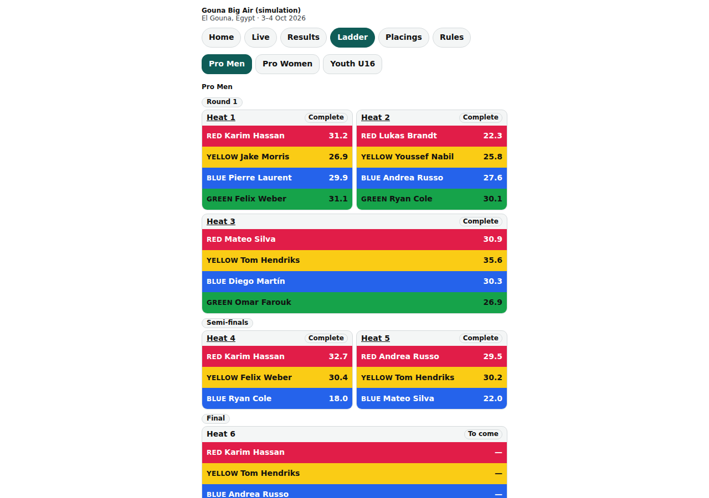

# Public: the ladder

/e/‹event›/ladder: every division's ladder as boxes, riders in their Lycra colour, and who goes through.

Last checked: 2 Oct 2026 · Product version 0.9.0

## What it is for {#pla-purpose}

Riders see who they meet and where the winner goes; spectators follow the bracket.

*public-ladder-390.png — heats as boxes with totals and placeholders.*

*public-ladder-1280.png — the same ladder on a laptop.*

## Controls {#pla-controls}

| Control | What it does |
|---|---|
| Division tabs | One ladder per division. |
| Heat boxes | Complete / Live / To come; riders filled with their Lycra colour (the colour word beside the name) and their totals; “Through to the next round”. |
| Placeholders | “1st H1” until the feeding heat is published (and released); “Ana · 1st H1 · seat pending” when the seat is dealt only after the whole round. |

## What it depends on {#pla-depends}

The division's draw must be locked: “The ladder for this division has not been published yet.” A seat fed by a held result keeps its placeholder until the result is released ([dependency map](../dependencies.md#dep-next-seat)).
