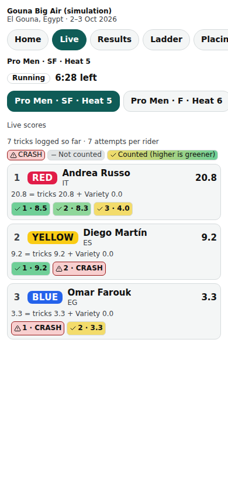

# Public: the live heat

/e/‹event›/live: the heat on the water, its clock, its riders, and — when the division allows it — live totals and attempt boxes.

Last checked: 2 Oct 2026 · Product version 0.9.0

## What it is for {#pl-purpose}

Spectators on the beach follow a heat as it happens.

*public-live-390.png — the live heat with live scores on.*

## Controls {#pl-controls}

| Control | What it does |
|---|---|
| **Heats** picker | Choose a heat (defaults to the one on the water). |
| Clock and state | Running / Paused / “Ended — scores soon” / “Starts soon” / “Waiting for an earlier heat”; time left from the server's stamps, corrected at every poll. |
| Riders | Rider labels (colour word always written). With live scores: running totals and the attempt boxes (“3 tricks logged so far · 7 attempts per rider”). Without: “Scores published after the heat.” |

## What it depends on {#pl-depends}

Live scores show only when the event's “Show live scores during a heat” is on (or the division's own setting, or the head judge's per-heat **Live** switch). Totals come from the same scoring code as the head judge's console; no judge's individual score ever reaches the public. The heat's division needs a locked draw.
