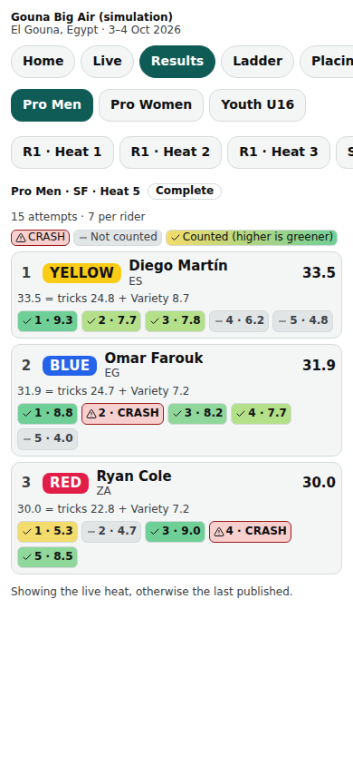
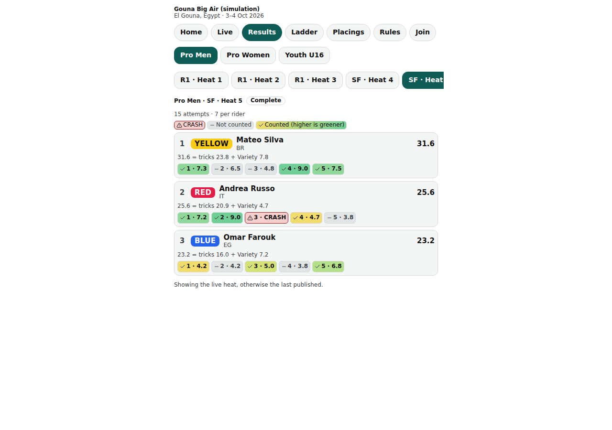
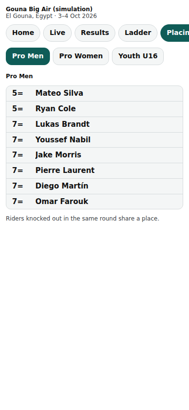

# Public: results and placings

/e/‹event›/results (one tab per heat) and /e/‹event›/placings (final places and the highest jump).

Last checked: 2 Oct 2026 · Product version 0.9.0

## What it is for {#pr-purpose}

The published result of every heat, readable on a phone in the sun, and the division's final placings.

*public-results-390.png — a heat summary: one row per rider, the formula in words and the attempt boxes.*

*public-results-1280.png — the same on a laptop.*

*public-placings-390.png — placings with shared places (“13=”) and the highest jump.*

## Controls {#pr-controls}

| Control | What it does |
|---|---|
| **Divisions** and **Heats** tabs | Pick the heat; it opens on the live heat, otherwise the last published (“Showing the live heat, otherwise the last published.”). |
| Rider rows | Place, Rider label, total and the formula in words (“20.5 = tricks 15.5 + Variety 5.0”; “ + bonus”, “ − penalty” when they apply; a percentage only when the division's “Show scores as % of maximum” is on); DNS, DNF, DSQ. |
| Attempt boxes | In attempt order: crash red with CRASH, not counted grey, counted graded yellow (lowest in the heat) to green (highest), each with an icon or a word. What a box shows is the division setting “What spectators see per attempt”: attempt number + score (default), trick name + score, or scores only. |
| “How to tell the riders apart” | The Lycra colours and how riders are recognised. |
| **Placings** | Final places (riders knocked out in the same round share a place, “13=”), and “Highest jump: ‹h› m — ‹rider› (‹trick›)” when heights are measured. |

“No results have been published yet.” · held result: “Result to be announced.”

## What it depends on {#pr-depends}

A heat appears after the head judge publishes it **and** either “Show results automatically when a heat is published” is on or the result was released ([dependency map](../dependencies.md#dep-public)). A held final shows nothing until **Release result**.
