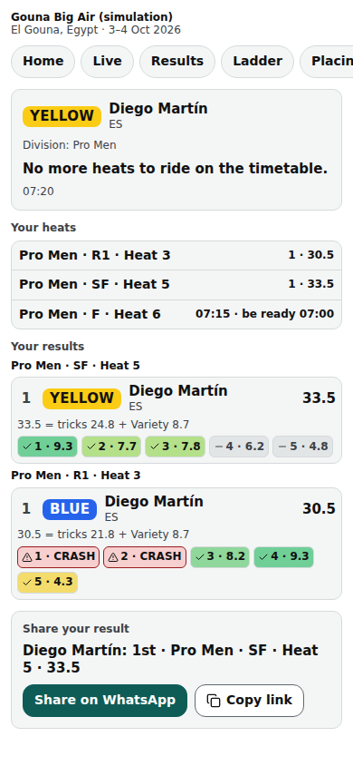

# Public: the rider page

/e/‹event›/riders/‹id›: one rider's next heat with its ready time, their heats and their results.

Last checked: 2 Oct 2026 · Product version 0.9.0

## What it is for {#pri-purpose}

A rider opens their own page (from Results, Ladder or a shared link) and knows when to be ready.

*public-rider-390.png — next heat, be-ready time, heats and results.*

## Controls {#pri-controls}

| Control | What it does |
|---|---|
| Next heat | “Your next heat: ‹heat› — est. 14:35 — be ready 14:20” (the ready call from the Event step), “— time to be announced” without a time, or “No more heats to ride on the timetable.” |
| **Your heats** | Every heat with seat and state (“To come” for a seat not decided yet). |
| **Your results** | Published results; **Share your result**. |
| Rider label | The seat colour of the next heat (with a per-heat Lycra scheme and no heat yet, the name). The time now in the event's time zone. |

## What it depends on {#pri-depends}

The rider must be in a locked draw of a public event: otherwise “This rider is not on the public list.” Times need an active run order with a pinned start.
