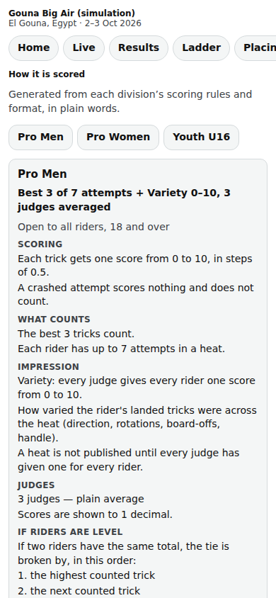

# Public: the rules page

/e/‹event›/rules: how each division is scored and run, written in plain words from its real settings.

Last checked: 2 Oct 2026 · Product version 0.9.0

## What it is for {#pru-purpose}

The rules briefing in writing: riders and coaches read exactly what the judges apply. It is generated, never typed, so it always matches the settings.

*public-rules-390.png — one division's rules in words.*

## What it shows {#pru-controls}

Per division: **Scoring** (one score or criteria, the scale and step), **What counts** (best N, per category, single best…; crashes; weights), **Impression** (its name and scale; “A heat is not published until every judge has given one for every rider.”), **Judges** (how many, how combined), **If riders are level** (the tie-breakers in order), **Penalties and status** (interference, DNS, DSQ, DNF), **Format** (the ladder in a sentence; minimum heats per rider), **Heats**, **How riders move on**, **Telling riders apart** (the Lycra colours, always also written as words). A division whose draw is not locked still appears here.

## What it depends on {#pru-depends}

The event must be public. The text follows Divisions → Scoring and Format; change the settings, and the page changes.
