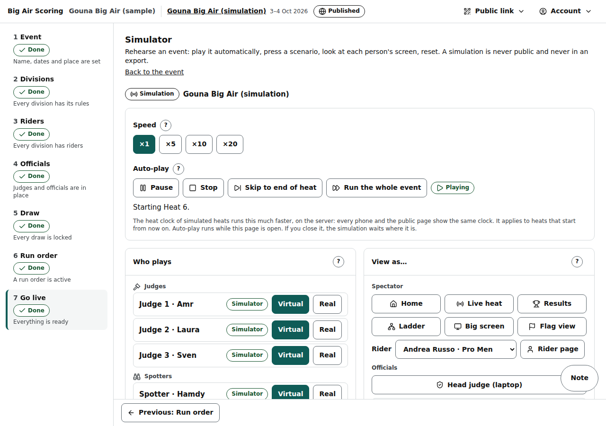
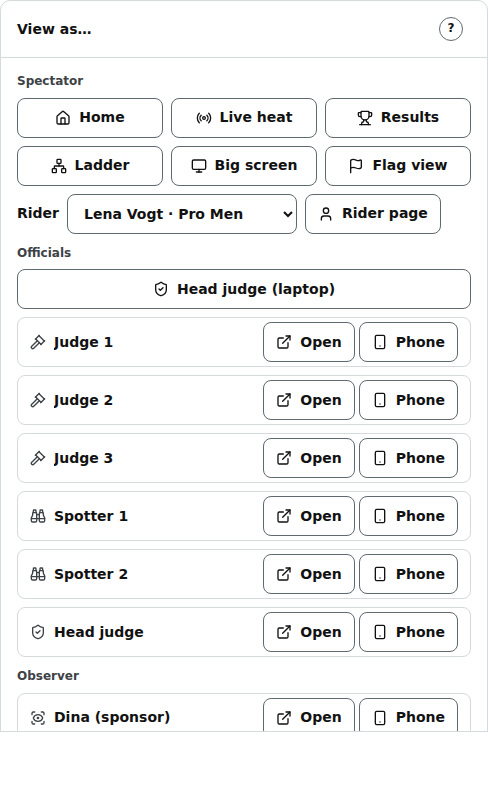

# Simulator

/org/events/‹id›/simulate: rehearse an event — play it automatically at up to ×20, press a scenario, look at each person's screen, reset.

Last checked: 4 Oct 2026 · Product version 0.15.1

## What it is for {#si-purpose}

A rehearsal without riders on the water: virtual spotters log attempts, virtual judges score, the virtual head judge publishes, through exactly the same paths as phones. A simulation is never public and never in an export. Open it from the Event step → **Rehearsal** → **Simulate**.

*simulator-1280.png — speed, auto-play, who plays, behaviour, scenarios, View as, checklist, reset.*

## On a real event {#si-real}

“This is a real event”: **Run as simulation** (with **Name of the copy**) copies the divisions, rules, riders, officials with fresh PINs, locked draws and run order into a new simulation event, then **Open the simulator**. Nothing happens to the real event. Refused once the real event has started heats.

## Controls {#si-controls}

| Control | What it does |
|---|---|
| **Speed** ×1 / ×5 / ×10 / ×20 | Everything that is time is divided by the speed: a heat's length when it starts or its yellow is raised (a 10-minute heat at ×10 lasts 1 minute), the pre-start (1:00 at ×10 is 6 seconds), the last minute (6 seconds) and the break between heats; the virtual officials keep the same pace as the clock. The speed applies from the next heat: a heat already in its yellow or on the water keeps the speed it began with. Every phone and the public page read the shorter times. The button you press looks pressed at once; the server confirms within half a second, and if it refuses the button goes back and the sentence says why. A **Pause** or **Resume** pressed on the head judge's console shows on this panel the moment it is written. |
| **Auto-play**: **Start**, **Pause**, **Resume**, **Stop** | Plays the day in run order. Runs while this tab is open; the line under it says what is happening (“‹heat› is running, 2:10 left.”, “Stopped at a blocker: …”). **Pause** is the same state as the head judge's **Pause** on the console: pressing it on either side pauses the heat clock and the virtual officials, and **Resume** on either side resumes both (each control shows the real state within about a second). **Pause** also pauses the heat on the water (the same pause as the console's): the console says **Paused by the simulator**. **Resume** starts both again (a heat the head judge paused stays paused). **Stop** ends auto-play and leaves the heat paused. |
| **Flags** | With the Flags on the virtual officials follow the start heat sequence: the simulator arms the heat (yellow), the heat starts by itself at the end of the pre-start (at ×10 a 1:00 pre-start lasts 6 seconds), and the virtual spotters and judges log and score only while the heat is Running or Last minute. **Pause** (here or on the console) freezes the yellow like the heat clock, and the auto-play arms a heat only while it is playing and only when the head judge has not armed it. **View as…** has a **Flag view** button ([Flags](flags.md)). |
| **The break** | The auto-play respects the run order's break. After a heat is published it does **not** arm the next heat at once: it waits for that heat's start time on the active run order (end of the last heat + break + warm-up, divided by the speed) and raises the yellow so that the yellow **ends** at that start time, never earlier. A 4-minute break at ×10 with a 1:00 pre-start (6 seconds) raises the yellow 18 seconds after the heat ended. The panel says “Break: ‹heat› starts in ‹time›, as the run order says.”. If the plan says the heat is already due, it is armed at once. The head console's break countdown, the Flag view and **Follow the heat** show the same start. This is the simulator only: on the beach the head judge raises the yellow by hand and nothing starts by itself. |
| **The left rail** | The organiser's left rail works on the simulator page like on every other page: click **Draw**, **Riders** … and that step of the simulation event opens with its name highlighted (the page opens the address itself, so it does not wait behind the panel's own updates). **Back to the event** and **Next** work the same way. |
| **Settings from ‹event› at hh:mm** · **Refresh from event** | The card at the top of the left column says which real event the simulation was copied from and when its settings were copied or last refreshed (in the event's time zone). **Refresh from event** copies the real event's *current* settings (live scores, flags …) and each division's scoring rules, the attempt limit among them, onto the simulation (divisions are matched by name; the draw and the run order are not touched), so the virtual spotters stop at the event's limit. Grey once a heat of the simulation has started: “A heat of this simulation has started, so the settings are kept as they are. Reset the simulation to refresh them.” Not shown on the Demo. |
| **Skip to end of heat** | Fast-forwards the virtual officials to the end of the heat on the water: the virtual spotters log every rider's attempts and the virtual judges score all of them, at once. Then the heat **ends**: its clock reads 0:00, its flag goes red and it waits **under review** for the head judge. It is **not published** (the virtual head judge leaves it alone until someone presses Publish on the console, or **End heat and publish** here); a real person's sheet is waited for. While it works the button reads “Fast-forwarding…”. Grey with “Available while a heat is running.” when there is none; with the auto-play paused: “The auto-play is paused, so there is nothing to fast-forward. Press Resume first.”; in the yellow: “The heat is still in its yellow, so there is nothing to skip yet. Wait for the green, or press Start now.” |
| **End heat and publish** | Ends the heat on the water now with the attempts logged so far; the virtual judges finish their scores and Impression / Variety scores at once and submit; the virtual head judge publishes if nothing blocks (a real person is waited for). Grey with “Available while a heat is running, paused or waiting to be published.” when there is none. |
| **Run the whole event** | Plays every day's active run order in turn — every division, every round — at the speed chosen, until the finals are published, then stops (“The whole event is published …” in the log). A seat set to **Real** and a run order on hold are waited for. **Start** after **Stop** plays the day again; **Resume** after **Pause** carries on in the same mode. |
| **Who plays** | Each judge, spotter and the head judge: **Virtual** (the simulator) or **Real** (a phone joins with the PIN; the simulator leaves the seat alone). Each seat says who holds it now: **Simulator**, **You (View as) · seen 4 s ago**, **A phone (PIN) has this seat**, or **Waiting for a phone**. **Give back to the simulator** (or **Virtual**) gives a seat you or a phone hold back to the simulator at once. **Let go** frees a seat you hold. |
| **How they behave** | Attempts per rider per heat, crashes %, repeated tricks %, judges' scores (Agree / Normal / Disagree), and “One judge…” misses attempts / is offline for a minute / is late. |
| **Scenarios** | Thirteen one-tap buttons (**Abort the start** waits for the next yellow and aborts it; **Rider no-show → walkover** waits for the next 1 v 1 heat that has not started, sets its second rider to Did not start through the console's own function and gives the walkover through the same function as the **Walkover** button — when a person is the head judge it stops after Did not start and leaves the button to them): wind hold and resume, rider no-show, duplicate attempt from two spotters, judge phone dies, tie on total, attempt past the cap, re-open and republish, switch to Plan B, out of attempts, publish hold on the final and release, re-run a heat. A scenario that needs a running heat waits (“Waiting for its moment”). |
| **View as…** | Opens the real screens in a new tab. **Public pages** (home, live heat, results, ladder, big screen, **Big screen — Follow the heat**) and **A rider's page** (pick the rider) — visible to your login only. Officials (head judge laptop / phone, judges, spotters): your sign-in takes that seat, one at a time, and the simulator steps aside for it. Close that tab and the simulator takes the seat back within seconds (a reload keeps it; a tab that goes quiet for 90 seconds, such as a phone that slept, gives it back too). Each seat can show its PIN (**Show PIN** / **Hide PIN**) and a single-use QR code to join from a phone. **Observer**: each Observer seat of the event with **Open** (the [observer view](observer.md) for your sign-in) and **Phone**; without one, “Add an Observer seat on the Officials step to look through an observer’s eyes.” The simulator never plays an observer. |
| **Checklist** | Each scenario ticked once exercised, and the numbers of the run (heats published, attempts, scores, blockers hit); **Open the Feedback notes**. |
| **Reset** | The same Reset as the event's: type the address (the button stays grey until you do: “Type the event's web address first.”) → **Reset to the locked draw**. A Demo with no saved draw shows **Wipe and draw again**. |
| **Delete the simulation** | Removes the copy with everything in it (not the event it was copied from). |

*simulator-viewas-observer-1280.png — View as…, with the Observer row.*

## What it depends on {#si-depends}

A simulation event (a copy made with Run as simulation, or the Demo); every division's draw **locked** (“The simulator plays locked draws only”); a run order; the server's PIN key for fresh PINs; the tab kept open while playing ([dependency map](../dependencies.md#dep-simulator)). The Practice heat on the head console is a simpler feed for simulation events ([dependency map](../dependencies.md#dep-practice)).
