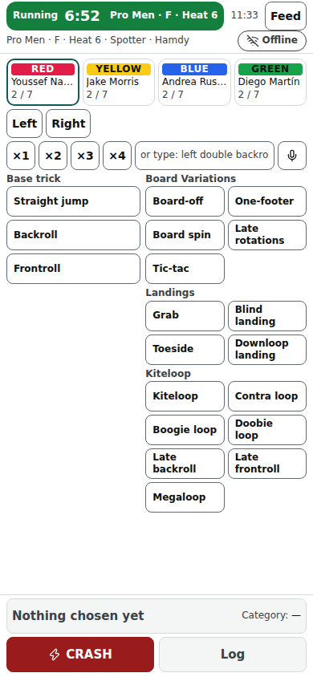

# Spotter screen

The spotter's phone at /spot/‹event›: log every attempt — which rider, which trick, landed or CRASH — the moment it happens.

Last checked: 3 Oct 2026 · Product version 0.13.0

## What it is for {#sp-purpose}

What the spotter logs is what the judges score: each attempt appears on every judge's phone within about a second. The screen opens the running heat by itself and shows the next heat between heats.

*spotter-390.png — riders in one row with attempts used, direction, multipliers, base tricks, add-ons and grabs, CRASH and Log fixed at the bottom. (“Offline”: the browser of the screenshot machine reports no network.)*

## Controls {#sp-controls}

| Control | What it does |
|---|---|
| Header and **flag strip** | The clock line is the **flag strip** (flags on): the flag's colour, the state's words, the countdown and the heat name. The logger opens at **green** (Running), not at the yellow; at the last minute it stays open; at red (Finished) it closes as before. It covers none of the buttons ([Flags](flags.md)). |
| Riders row | One Rider label per rider with attempts used (“5 / 7”). A rider who used every attempt turns grey: “Out of attempts · 7 / 7”, and Log is off for them. Assigned riders first when the spotter is assigned. |
| Direction | Left / Right. |
| Trick builder | Multiplier, base trick, add-ons, grabs & landings, in the order set in Divisions → Trick base; the composed trick name shows above. **Or type the trick** (“left double backroll”) or **Speak** (where the browser has speech recognition); an unknown word is kept as free text for the head judge. |
| **Log** | Logs a landed attempt (“Logged — ‹rider› — attempt ‹n›”). |
| **CRASH** | Asks once: “Log a crash for ‹rider›?” → **Yes, log CRASH**. |
| **Undo** | Takes back the last attempt for 10 seconds; after that “Too late to undo: ask the head judge to delete it.” |
| **Feed** | What has been logged in this heat; “Possible duplicate” when two spotters logged the same rider within the duplicate window. |
| Connection badge | Synced / Pending / Offline / Failed — tap to retry, as on the judge screen. |

## What it depends on {#sp-depends}

The heat must be running (“The heat is not running, so nothing can be logged.”; paused: “Paused — logging is off until the head judge resumes.”). The rider must have attempts left (the division's cap; past the cap only the head judge adds one, with a reason). The trick blocks come from the division's Trick base. Judges can log too when the Event step allows it.
